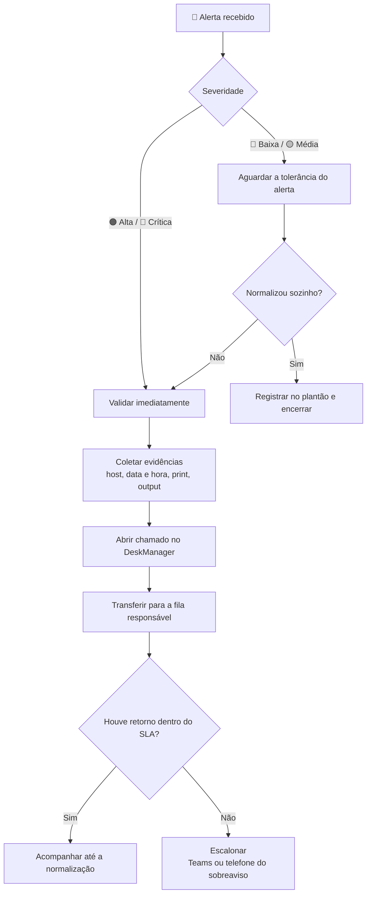
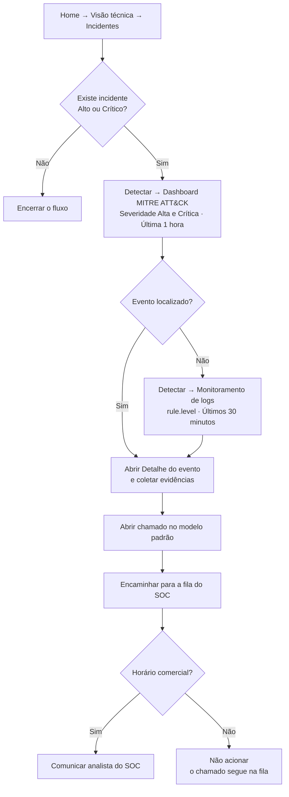
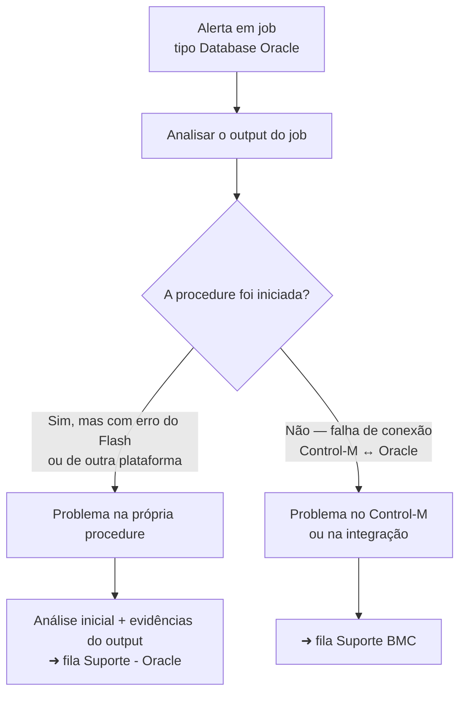

<div class="service1-wrapper">
  <div class="service1-item">
    <a href="https://wiki-noc.prod.cloud.dnxbrasil.com.br/pt-br/vibe/infraestrutura/ge/home/Homologa%C3%A7%C3%A3o#noc" class="service1-button service6">
      <div class="image1-wrapper">
        
      </div>
    </a>
  </div>
</div>

# 📘 Catálogo de Alertas Internos — Monitoramento Zabbix

> **Nota (2026-09-05):** este arquivo é o catálogo original, mantido como
> registro em Markdown. O conteúdo foi importado e estruturado em
> `docs/alerts/*.json` (uma ficha por alerta/regra, casada com o `alert_key`
> real do snapshot Zabbix) e em [docs/escalation_matrix.md](docs/escalation_matrix.md)
> (a matriz de filas/contatos/SLA, sem repetir em cada ficha). Mudanças de
> procedimento devem ir para lá — este arquivo não é mais atualizado pelo
> `reconcile` nem lido pela interface web.

Guia operacional do NOC para **triagem, abertura de chamado e acionamento correto** dos alertas monitorados internamente. Cada categoria traz uma tabela enxuta de ação rápida e um bloco recolhível com a referência técnica completa.

> **Regra de ouro:** nenhum acionamento por Teams ou telefone acontece sem **chamado aberto** e **evidência coletada** (host, horário, print/output). O SLA só começa a contar depois do chamado registrado.
{.is-warning}

---

## ⚡ Fluxo de atendimento



---

## 🎚️ Severidade e tolerância

| Ícone | Severidade | Postura esperada |
| :---: | :--- | :--- |
| 🔴 | **Crítica** | Validar e abrir chamado na hora. Comunicar o plantão. |
| 🟠 | **Alta** | Validar e abrir chamado na hora. |
| 🟡 | **Média** | Respeitar a tolerância do alerta antes de abrir. |
| 🔵 | **Baixa** | Registrar e transferir sem urgência. |

> **Como ler o SLA:** `7 min (5m + 2m)` significa **5 minutos de tolerância** para o alerta se normalizar sozinho **+ 2 minutos** de espera pelo retorno do chamado antes de escalonar pelo Teams. `Imediato` significa abrir o chamado assim que o alerta for validado.
{.is-info}

---

## ☎️ Matriz de acionamento

| Fila / Time | Responsável por | Canal primário | Escalonamento | Horário |
| :--- | :--- | :--- | :--- | :--- |
| **Infraestrutura** | Rede, links, APs, VPN, disco, servidores | DeskManager | Teams — Rafael Sales | A confirmar |
| **SOC** | Incidentes de segurança, ONESecure | DeskManager → fila SOC | Teams (analista) | Acionamento direto **somente em horário comercial** |
| **Suporte Oracle** | Procedures, RH Cloud, cargas e rotinas | DeskManager | — | A confirmar |
| **Suporte BMC** | Control-M e integração Control-M ↔ Oracle | DeskManager | — | A confirmar |
| **Suporte DEV** | Integrações MSMonitor (Grafana / Zabbix API) | DeskManager | — | A confirmar |
| **Sobreaviso MSMonitor** | Coletores e sincronização MSMonitor | Telefone — **Jordy (91) 99165-4121** | — | Plantão |
| **RH** | Benefícios, ativação de colaborador | DeskManager | — | A confirmar |
| **Administrativo** | Pagamentos, centro de custo | DeskManager / E-mail | — | A confirmar |
| **NOC / GE** | Verificação local na fábrica, impressoras | DeskManager (Central de Serviços) | — | 24x7 |
| **Carlos Favacho** | Portal RH Cloud (resposta HTTP) | Teams / DeskManager | — | A confirmar |

> Os campos marcados como **A confirmar** precisam ser validados com cada time e atualizados nesta tabela.
{.is-info}

---

## 🧭 Onde procurar o alerta

| Se o alerta veio de... | Vá para a aba |
| :--- | :--- |
| Wazuh SIEM, Zabbix-Proxy, AP, Fortigate, impressora, Banpará | 🖥️ Infraestrutura & Redes |
| ONESecure | 🔐 Segurança (SOC) |
| Control-M, RH Cloud (rotina / carga) | 💾 Banco de Dados & Oracle |
| RH Cloud (pagamento, benefício, cadastro), Feedz, Portal RH | 🏢 Aplicações & RH |
| MSMonitor, Grafana Integration, Zabbix Integration | 🔗 Monitoramento & Integrações |
| Job Control-M do tipo *Database Oracle* | ☁️ VibeCloud |

---

## 📋 Catálogo por categoria {.tabset}

### 🖥️ Infraestrutura & Redes

<div style="width: 100%; overflow-x: auto;">

| Alerta | Sev. | Host | Ação imediata do operador | Fila / Contato | Escalonar em |
| :--- | :---: | :--- | :--- | :--- | :--- |
| `/: Disk space is critically low` | 🔴 | Zabbix-Proxy | Abrir ou transferir chamado solicitando liberação de espaço. | Infraestrutura · DeskManager | ⏱️ Imediato |
| `sda: Disk read/write responses too high` | 🟠 | Zabbix-Proxy | Abrir chamado. Sem resposta, acionar no Teams. | Infraestrutura · DeskManager → Teams | ⏱️ Imediato |
| `ICMP: Unavailable by ICMP ping` | 🟠 | Impressora HP | Verificar presencialmente na fábrica e abrir chamado. | NOC / GE · Central de Serviços | ⏱️ Imediato |
| `Portas RDP 10.0.20.217 e 10.0.10.25 fora` | 🟠 | Banpará | Validar no MSMonitor/Zabbix e testar com **ping** e **telnet**. | NOC | ⏱️ Imediato |
| `/: Disk space is low (used > 80%)` | 🟡 | Wazuh SIEM | Abrir chamado informando o alerta e o host afetado. | Infraestrutura · DeskManager | ⏱️ Imediato |
| `For passive only agents...` | 🟡 | Wazuh SIEM | Transferir para a Infraestrutura (chamado teste do setor). | NOC / Infra · DeskManager | ⏱️ Imediato |
| `Toner Magenta abaixo de 5%` | 🟡 | Impressora HP | Solicitar substituição e fazer teste de impressão após a troca. | NOC / GE · Central de Serviços | ⏱️ Imediato |
| `High ICMP ping loss` | 🟡 | AP REUNIAO [Ubiquiti] | Abrir chamado. Sem resposta, acionar no Teams. | Infraestrutura · DeskManager → Teams | ⏱️ **7 min** (5m + 2m) |
| `Interface VPNBKP(): Baixo Tráfego` | 🟡 | Proxy [Fortigate] | Abrir chamado. Sem resposta, acionar no Teams. | Infraestrutura · DeskManager → Teams | ⏱️ **7 min** (5m + 2m) |
| `Link down / Ethernet lower speed` | 🟡 | AP | Abrir chamado. Sem resposta, acionar no Teams. | Infraestrutura · DeskManager → Teams | ⏱️ **12 min** (10m + 2m) |

</div>

<details>
<summary>🔍 <strong>Referência técnica — Infraestrutura & Redes</strong></summary>

| Alerta | Descrição | Causa provável | Referência |
| :--- | :--- | :--- | :--- |
| `/: Disk space is critically low` | Espaço da partição raiz em nível crítico. Tende a durar dias até a intervenção. | Crescimento de logs ou arquivos temporários. | Ref: **0726-001673** |
| `sda: Disk read/write responses too high` | Tempo de espera (*await*) muito alto no disco do servidor da fábrica. | Gargalo de I/O no disco. | — |
| `ICMP: Unavailable by ICMP ping` | Impressora inacessível na rede da fábrica. | Equipamento desligado ou falha de rede. | — |
| `Portas RDP 10.0.20.217 e 10.0.10.25 fora` | Afeta acessos da equipe de Crédito/Sustentação (24x7). | Falha de conectividade com o banco. | — |
| `/: Disk space is low (used > 80%)` | Espaço da partição raiz (`/`) acima de 80%. | Geração excessiva de logs pelo firewall. | — |
| `For passive only agents...` | Zabbix Agent parado ou host indisponível. | Falha de rede ou porta **10050** bloqueada. | — |
| `Toner Magenta abaixo de 5%` | Baixa qualidade de impressão por falta de suprimento. | Fim da vida útil do toner. | — |
| `High ICMP ping loss` | Perda de pacotes na comunicação com o AP. | Intermitência wireless (AirOS). | — |
| `Interface VPNBKP(): Baixo Tráfego` | Tráfego abaixo do normal na VPN de backup. | Intermitência IPsec. | — |
| `Link down / Ethernet lower speed` | Queda de link ou degradação na velocidade de negociação. | Falha física de cabo ou porta. | — |

</details>

### 🔐 Segurança (SOC)

<div style="width: 100%; overflow-x: auto;">

| Alerta | Sev. | Host | Ação imediata do operador | Fila / Contato | Escalonar em |
| :--- | :---: | :--- | :--- | :--- | :--- |
| `ONESecure: Ticket aberto [xxxxxx]` | 🟠🔴 | OneSecure | Realizar a **triagem N1** (procedimento abaixo), coletar evidências obrigatórias, abrir chamado e encaminhar para a fila do SOC. | SOC · DeskManager / Teams | ⏱️ No momento do alerta |
| `OneSecure: API Indisponível` | 🟠 | OneSecure | Validar no link de status. Se persistir por mais de 5 min, abrir chamado com evidências e horários. Se for recorrente, pedir ajuste de trigger. | SOC · DeskManager / Teams | ⏱️ **5 min** |

</div>

> 🔗 [Página de Status do SOC](https://wiki-noc.prod.cloud.dnxbrasil.com.br/pt-br/vibe/Seguranca/SOC/Procedimentos/status)

---

#### 🛡️ Procedimento N1 — Triagem de incidentes ONESecure

O N1 atua **somente** em incidentes classificados como **Alto** ou **Crítico**. A investigação aprofundada e as ações de resposta são responsabilidade do **SOC**.

**Escopo do N1:** identificar o incidente → verificar a classificação → localizar o evento → coletar as evidências mínimas → abrir o chamado → encaminhar para a fila do SOC → acionar um analista (somente em horário comercial).



##### Classificação por `rule.level`

| `rule.level` | Classificação | Ação do N1 |
| :---: | :--- | :--- |
| 0 a 6 | 🔵 Baixo | Fora do escopo deste procedimento |
| 7 a 11 | 🟡 Médio | Fora do escopo deste procedimento |
| **12 a 14** | 🟠 **Alto** | **Realizar triagem e escalonar** |
| **15 ou superior** | 🔴 **Crítico** | **Realizar triagem e escalonar** |

##### 1. Identificação inicial

No quadro **Incidentes**, verificar se existem registros classificados como **Alto** ou **Crítico**. Se não houver, não é necessário prosseguir. Havendo, seguir para o módulo **Detectar**.


##### 2. Primeira investigação — Dashboard MITRE ATT&CK

Acessar `Detectar → Dashboard MITRE ATT&CK`.


Aplicar os filtros **Severidade: Alta e Crítica** e **Período: última 1 hora**. O objetivo é localizar o evento correspondente ao incidente identificado em `Home → Visão técnica → Incidentes`.


- **Evento localizado:** selecionar o evento, abrir **Detalhe do evento** e coletar as evidências obrigatórias.
- **Evento não localizado:** seguir para a segunda investigação.


##### 3. Segunda investigação — Monitoramento de logs

Acessar `Detectar → Monitoramento de logs`.


No campo de parâmetros, selecionar `rule.level` e o período **últimos 30 minutos**. Considerar `12 a 14` como Alto e `15+` como Crítico.


##### 4. Evidências obrigatórias

Todas as cinco evidências abaixo são obrigatórias para a abertura do chamado. O campo onde encontrá-las depende de onde o evento foi localizado.

| Evidência | Dashboard MITRE ATT&CK | Monitoramento de logs |
| :--- | :--- | :--- |
| Data e hora | `Timestamp` | `timestamp` |
| Severidade | Classificação do evento / `level (JSON)` | `rule.level` |
| Nome/descrição do alerta | `Regra` | `rule.description` |
| Host/agente afetado | `Agente` | `agent.name` |
| Log/output do alerta | `JSON` | Log/output disponível no registro |


<details>
<summary>📄 <strong>Exemplo de evidência coletada</strong></summary>

```text
Data/Hora:
2026-09-03T12:01:34.858+0000

Severidade:
Crítica — level 15

Alerta:
SSH: Multiple Windows Logon Failures

Host/Agente:
DESKTOP-JGONH05

Log/Output:
Deverá ser coletado o JSON
```

</details>

##### 5. Abertura do chamado

```text
[ONESecure][ALTO/CRÍTICO] <Nome do alerta>

Data/Hora:
<data e hora>

Severidade:
<Alta/Crítica>

Alerta:
<nome/descrição>

Host/Agente:
<host ou agente afetado>

Log/Output:
<log completo/output do alerta>

Origem da evidência:
<Dashboard MITRE ATT&CK / Monitoramento de logs>

Ação do N1:
Realizada triagem inicial no ONESecure.
Chamado encaminhado para a fila do SOC para investigação.
```

Prints da plataforma e outras evidências disponíveis podem ser anexados ao chamado.

##### 6. Encaminhamento ao SOC

- [ ] Conferir se as cinco evidências mínimas foram registradas
- [ ] Encaminhar o chamado para a **fila do SOC**
- [ ] Verificar se o chamado foi corretamente direcionado

##### 7. Acionamento do analista

```text
Incidente [ALTO/CRÍTICO] identificado na ONESecure.

Chamado: <ID do chamado>

O chamado foi encaminhado para a fila do SOC
com as evidências da triagem inicial.
```

> **Fora do horário comercial:** realizar a triagem, coletar as evidências, abrir o chamado e encaminhar para a fila do SOC — **sem acionamento direto ao analista**.
{.is-danger}

### 💾 Banco de Dados & Oracle

<div style="width: 100%; overflow-x: auto;">

| Alerta | Sev. | Host | Ação imediata do operador | Fila / Contato | Escalonar em |
| :--- | :---: | :--- | :--- | :--- | :--- |
| `Job [STP_PROCESSA_PEDIDO] (Ended Not OK)` | 🟠 | Control-M | Informar **ODate**, código do pedido e erro. Verificar instabilidade externa do FLASH. | Suporte Oracle · DeskManager | ⏱️ Imediato |
| `RotinaComFalha` | 🟠 | RH Cloud | Se o erro mudar na reexecução, **não abrir chamado duplicado**: vincular ao existente ou abrir novo apenas se for inédito. | Suporte Oracle · DeskManager | ⏱️ Imediato |
| `CargaComFalha` | 🟠 | RH Cloud | Transferir chamado informando o erro. | Suporte Oracle · DeskManager | ⏱️ Imediato |

</div>

<details>
<summary>🔍 <strong>Referência técnica — Banco de Dados & Oracle</strong></summary>

| Alerta | Descrição | Causa provável |
| :--- | :--- | :--- |
| `Job [STP_PROCESSA_PEDIDO] (Ended Not OK)` | Falha na proc `VIBE_LJ.STP_PROCESSA_PEDIDO` com **Exit Code 20000**. | HTTP 502 / Status 400 retornado pelo provedor FLASH. |
| `RotinaComFalha` | Falha na execução da rotina de RH. | Erros diversos do sistema. |
| `CargaComFalha` | Falha de carga sistêmica. | Erros diversos do sistema. |

</details>

### 🏢 Aplicações & RH

<div style="width: 100%; overflow-x: auto;">

| Alerta | Sev. | Host | Ação imediata do operador | Fila / Contato | Escalonar em |
| :--- | :---: | :--- | :--- | :--- | :--- |
| `PagamentoNegativo` | 🟠 | RH Cloud | Enviar e-mail para o setor e buscar histórico de casos similares. | Administrativo · E-mail | ⏱️ Imediato |
| `PagamentoNãoProcessado` | 🟠 | RH Cloud | Transferir chamado relatando o erro sistêmico. | Administrativo · DeskManager | ⏱️ Imediato |
| `PagamentoNãoConciliado` | 🟠 | RH Cloud | Transferir chamado relatando a divergência. | Administrativo · DeskManager | ⏱️ Imediato |
| `Http Response - Portal RH Cloud` | 🟡 | Ferramentas Int. | Reportar a instabilidade do Portal. | Carlos Favacho · Teams / DeskManager | ⏱️ Imediato |
| `Http response - Feedz` | 🟡 | Ferramentas Int. | Abrir chamado. Sem resposta, acionar no Teams. | Infraestrutura · DeskManager → Teams | ⏱️ Imediato |
| `BenefícioNãoDisponibilizado` | 🟡 | RH Cloud | Criar chamado reportando a falha de integração e transferir. | RH · DeskManager | ⏱️ Imediato |
| `ColaboradorNãoAtivado` | 🟡 | RH Cloud | Transferir chamado informando a **matrícula** afetada. | RH · DeskManager | ⏱️ Imediato |
| `CentroDeCustoIncompleto` | 🔵 | RH Cloud | Transferir chamado para o setor competente. | Administrativo · DeskManager | ⏱️ Imediato |

</div>

<details>
<summary>🔍 <strong>Referência técnica — Aplicações & RH</strong></summary>

| Alerta | Descrição | Causa provável |
| :--- | :--- | :--- |
| `PagamentoNegativo` | Contracheque com saldo negativo. | Erro de cálculo. |
| `PagamentoNãoProcessado` | Falha sistêmica no fluxo de pagamento. | Causa desconhecida. |
| `PagamentoNãoConciliado` | Falha na conciliação dos valores. | Causa desconhecida. |
| `Http Response - Portal RH Cloud` | Erro na resposta HTTP. | Causa não informada. |
| `Http response - Feedz` | Instabilidade na plataforma Feedz. | Falha de conexão externa. |
| `BenefícioNãoDisponibilizado` | Benefício do funcionário não foi disponibilizado. | Causa desconhecida. |
| `ColaboradorNãoAtivado` | Contratação iniciada, mas o perfil segue inativo. | Fluxo de ativação travado. |
| `CentroDeCustoIncompleto` | Colaborador com centro de custo em 0%. | Cadastro incompleto. |

</details>

### 🔗 Monitoramento & Integrações

> **Antes de acionar o sobreaviso:** verifique se já chegou a notificação **"Integração normalizada"**. Só acione o plantão se a falha persistir e o sistema não se recuperar sozinho.
> **Sobreaviso MSMonitor:** Jordy — **(91) 99165-4121**
{.is-warning}

<div style="width: 100%; overflow-x: auto;">

| Alerta | Sev. | Host | Ação imediata do operador | Fila / Contato | Escalonar em |
| :--- | :---: | :--- | :--- | :--- | :--- |
| `Erro na sincronização de integração` | 🟠 | MSMonitor | Aguardar a mensagem de "normalizada". Se persistir, ligar para o plantão. | Sobreaviso MSMonitor · Telefone (Jordy) | ⏱️ Imediato (pós-validação) |
| `STALL` | 🟠 | MSMonitor | Aguardar a recuperação automática. Se persistir, acionar o plantão. | Sobreaviso MSMonitor · Telefone (Jordy) | ⏱️ Imediato (pós-validação) |
| `Connection prematurely closed BEFORE response` | 🟠 | Grafana Integration | Aguardar o tempo limite. Se não normalizar, abrir chamado. | Suporte DEV · DeskManager | ⏱️ **7 min** (5m + 2m) |
| `Falha na conexão ao executar operação` | 🟠 | Zabbix Integration | Aguardar o tempo limite. Se não normalizar, abrir chamado. | Suporte DEV · DeskManager | ⏱️ **7 min** (5m + 2m) |

</div>

<details>
<summary>🔍 <strong>Referência técnica — Monitoramento & Integrações</strong></summary>

| Alerta | Descrição | Causa provável |
| :--- | :--- | :--- |
| `Erro na sincronização de integração` | Erro ao carregar alertas (ex.: `zabb`, id 12). | Falha no `getAlerts` com o Zabbix. |
| `STALL` | Nenhum arquivo de alerta recebido em N verificações. | Coletor parado (ex.: cliente Votorantim). |
| `Connection prematurely closed BEFORE response` | Conexão encerrada com a API do Grafana. | Instabilidade de rede/API. |
| `Falha na conexão ao executar operação` | MSMonitor falhando ao se conectar na API do Zabbix. | Instabilidade de rede/API. |

</details>

<details>
<summary>🖼️ <strong>Exemplos de notificação</strong></summary>


</details>

### ☁️ VibeCloud (jobs Control-M → Oracle)

O Control-M orquestra a execução de algumas procedures do banco de dados Oracle. **Todo job do tipo `Database Oracle` é relacionado ao VibeCloud.**

Em caso de alerta, o operador deve **analisar o output do job** e identificar se a procedure chegou a ser iniciada. É esse ponto que define a fila de destino.



| Situação no output | Interpretação | Fila de destino |
| :--- | :--- | :--- |
| Procedure iniciou, mas apresentou erro relacionado ao **Flash** ou a outra plataforma | Problema na própria procedure, não no Control-M | **Suporte - Oracle** (anexar evidências do output) |
| Falha na conexão entre Control-M e o banco Oracle, ou o Control-M não conseguiu iniciar a procedure | Problema no Control-M ou na integração Control-M ↔ Oracle | **Suporte BMC** |

> O time de Suporte BMC **não possui ação** nos casos em que a procedure iniciou e falhou por erro de plataforma externa.
{.is-info}

---

# ➕ Como adicionar novos itens

Para manter a padronização, navegue até a aba correspondente e insira **duas linhas**: uma na tabela de ação rápida e outra no bloco de referência técnica.

**1. Tabela de ação rápida (6 colunas):**

```markdown
| `Nome do alerta` | 🟠 | Host | Ação imediata do operador | Fila · Canal | ⏱️ SLA |
```

**2. Referência técnica (3 a 4 colunas), dentro do bloco `<details>` da aba:**

```markdown
| `Nome do alerta` | Descrição do alerta | Causa provável | Referência |
```

**Checklist antes de publicar:**

- [ ] Severidade usa o ícone correto (🔴 🟠 🟡 🔵)
- [ ] A fila de destino existe na **Matriz de acionamento**
- [ ] O SLA está no formato `Imediato` ou `X min (Ym + Zm)`
- [ ] A ação descrita é executável pelo N1 sem consulta externa
