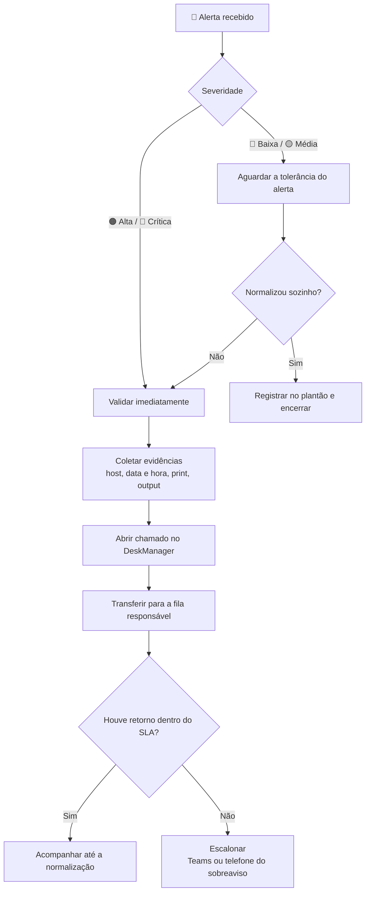

# 📘 Catálogo de Alertas — NOC

Guia operacional para **triagem, abertura de chamado e acionamento correto**
dos alertas monitorados. Cada categoria traz uma tabela de ação rápida, a
referência técnica completa e o procedimento detalhado.

> **Regra de ouro:** nenhum acionamento por Teams ou telefone acontece sem
> **chamado aberto** e **evidência coletada** (host, horário, print/output).
> O SLA só começa a contar depois do chamado registrado.
{.is-warning}

> **Esta página é gerada.** O conteúdo vem das fichas validadas em
> `docs/alerts/` do repositório Zabbix-Wiki — não edite aqui, edite a ficha e
> gere de novo (`python main.py wiki`). Assim a página nunca diverge do que o
> time aprovou, e envelhece junto com o Zabbix em vez de envelhecer sozinha.
{.is-info}

## ⚡ Fluxo de atendimento

## 🎚️ Severidade

| Ícone | Severidade | Postura esperada |
| :---: | :--- | :--- |
| 🔴 | **Crítica** (Disaster) | Validar e abrir chamado na hora. Comunicar o plantão. |
| 🟠 | **Alta** (High) | Validar e abrir chamado na hora. |
| 🟡 | **Média** (Average/Warning) | Respeitar a tolerância do alerta antes de abrir. |
| 🔵 | **Baixa** (Information) | Registrar e transferir sem urgência. |

> **Como ler o SLA:** `7 min` é o tempo de tolerância **mais** a espera pelo
> retorno do chamado antes de escalonar. `Imediato` significa abrir o chamado
> assim que o alerta for validado.
{.is-info}

## ☎️ Matriz de acionamento

| Fila / Time | Canal | Escalonamento | Alertas cobertos |
| :--- | :--- | :--- | ---: |
| **Administrativo** | DeskManager · E-mail | — | 4 |
| **Carlos Favacho** | DeskManager | Carlos Favacho | 1 |
| **Infraestrutura** | DeskManager | Rafael Sales | 7 |
| **NOC** | DeskManager · e-mail para contatos Chubb | Mayara Polonio, Gabriel Chakrian, Jajyta Biadolla, Priscila Costa (Chubb) — copiar João Queiroz (Vibe) | 11 |
| **NOC / GE** | Central de Servicos | — | 5 |
| **NOC / Infra** | DeskManager | — | 1 |
| **RH** | DeskManager | — | 2 |
| **SOC** | DeskManager -> fila SOC | analista SOC · analista SOC (somente horario comercial) | 2 |
| **Sobreaviso MSMonitor** | Telefone | Jordy — (91) 99165-4121 | 2 |
| **Suporte DEV** | DeskManager | — | 2 |
| **Suporte Oracle** | DeskManager | — | 2 |
| **Suporte Oracle (procedure iniciou e falhou) ou Suporte BMC (falha do Control-M/integracao)** | DeskManager | — | 1 |

## 🧭 Onde procurar o alerta

| Categoria | Alertas | Hosts |
| :--- | ---: | :--- |
| Rede / Conectividade | 13 | Chubb - Links de API · Vibe - AP REUNIAO [Ubiquiti] · Vibe - Impressora [HP] · Vibe Crédito Banpará (máquinas) |
| Rede / Interfaces | 1 | Vibe - Proxy [Fortigate] |
| Disco / Filesystem | 2 | Vibe - Wazuh SIEM · Vibe - Zabbix-Proxy |
| Disco / Desempenho de I-O | 1 | Vibe - Zabbix-Proxy |
| Agente Zabbix | 1 | Vibe - MSTracker-vm Hom |
| APIs e checagens web | 3 | Vibe - Ferramentas Internas |
| Segurança e integridade | 2 | ONESecure |
| Jobs e agendamentos | 1 | Control-M server [IN01] |
| Outros | 4 | Vibe - Impressora [HP] |
| Fora do Zabbix | 12 | fora do Zabbix |

## 📋 Catálogo por categoria {.tabset}

### Rede / Conectividade

| Alerta | Sev. | Host | Ação imediata do operador | Fila / Contato | Escalonar em |
| :--- | :---: | :--- | :--- | :--- | :--- |
| API ENEL Token autenticador indisponivel (erro 401) | 🔴 | Chubb - Links de API | Seguir o video de atualizacao manual do token (anexado ao procedimento original) para o passo a passo | NOC | ⏱️ — |
| API ENEL indisponivel (endpoint especifico) | 🟠 | Chubb - Links de API | Analisar o alerta e notificar os contatos da Chubb via e-mail | NOC · e-mail para contatos Chubb | ⏱️ — |
| Alta perda de pacotes ICMP — AP REUNIAO | 🟡 | Vibe - AP REUNIAO [Ubiquiti] | Abrir chamado. Sem resposta, acionar no Teams (Rafael Sales). | Infraestrutura · DeskManager | ⏱️ 5 min |
| Impressora HP inacessivel (ICMP) | 🟡 | Vibe - Impressora [HP] | Verificar presencialmente na fabrica e abrir chamado. | NOC / GE · Central de Servicos | ⏱️ Imediato |
| Porta RDP 10.0.20.217 fora (Banpara) | 🟠 | Vibe Crédito Banpará (máquinas) | Validar no MSMonitor/Zabbix e testar com ping e telnet. | NOC · DeskManager | ⏱️ Imediato |
| Porta RDP 10.0.20.25 fora (Banpara) | 🟠 | Vibe Crédito Banpará (máquinas) | Validar no MSMonitor/Zabbix e testar com ping e telnet. | NOC · DeskManager | ⏱️ Imediato |

🔍 <strong>Referência técnica — Rede / Conectividade</strong>

| Alerta | O que significa | Causa provável | Verificações antes de agir |
| :--- | :--- | :--- | :--- |
| API ENEL Token autenticador indisponivel (erro 401) | Item `autorization.enel.item`, host 'Chubb - Links de API'. Erros 401 nas APIs ENEL estao associados a necessidade de renovar o token de autorizacao, que expira a cada 1 hora pela complexidade da implementacao — NAO e, em si, uma indisponibilidade da API. | Token de autorizacao expirado (renovacao necessaria a cada 1h). | Priorizar a atualizacao do token ANTES de tratar como incidente · Acessar o link do Zabbix do host Chubb (filtro latest.view, hostids=10705) · Selecionar o host, clicar em atualizar, recarregar a pagina e verificar a ultima checagem · Atualizar cada estado individualmente |
| API ENEL indisponivel (endpoint especifico) | Item `services.<endpoint>.<regiao>.[Bearer]`, host 'Chubb - Links de API'. Endpoints monitorados: adesao/subscription (CE), faturamento/invoice (SP), customer-address (CE), request-history (RJ). | Indisponibilidade do lado ENEL (externa) ou falha de token/autenticacao (ver ficha propria de token). | Primeiro descartar o caso do token vencido (ver ficha 'API ENEL Token autenticador indisponivel') · Validar a indisponibilidade diretamente, se possivel |
| Alta perda de pacotes ICMP — AP REUNIAO | Perda de pacotes na comunicacao com o AP. | Intermitencia wireless (AirOS). | — |
| Impressora HP inacessivel (ICMP) | Impressora inacessivel na rede da fabrica. | Equipamento desligado ou falha de rede. | Verificar presencialmente na fabrica |
| Porta RDP 10.0.20.217 fora (Banpara) | Porta RDP inacessivel — afeta acessos da equipe de Credito/Sustentacao (24x7). | Falha de conectividade com o banco. | Validar no MSMonitor/Zabbix · Testar com ping · Testar com telnet na porta |
| Porta RDP 10.0.20.25 fora (Banpara) | Porta RDP inacessivel — afeta acessos da equipe de Credito/Sustentacao (24x7). | Falha de conectividade com o banco. | Validar no MSMonitor/Zabbix · Testar com ping · Testar com telnet na porta |

#### Procedimentos

##### 🔴 API ENEL Token autenticador indisponivel (erro 401)

Distinguir falha real de token de autenticacao vencido antes de abrir incidente.

**Sintomas:**
* 'API ENEL Token autenticador Indisponivel'
* Erros 401 nas chamadas as APIs ENEL

**Verificações antes de agir:**
* Priorizar a atualizacao do token ANTES de tratar como incidente
* Acessar o link do Zabbix do host Chubb (filtro latest.view, hostids=10705)
* Selecionar o host, clicar em atualizar, recarregar a pagina e verificar a ultima checagem
* Atualizar cada estado individualmente

**Ações:**
* Seguir o video de atualizacao manual do token (anexado ao procedimento original) para o passo a passo
* Somente apos seguir esse procedimento e os alertas permanecerem, considerar o incidente confirmado

**Riscos e ressalvas:**
* Se os alertas normalizarem apos a atualizacao do token, tratava-se de limitacao da ENEL, NAO de incidente -- nao abrir chamado para esse caso

**Critério de resolução:** Alertas normalizam apos a atualizacao do token. Se persistirem apos o procedimento, aí sim e incidente confirmado e deve seguir para o fluxo padrao de 'API ENEL Indisponivel'.

**Observações:** Manual 'Control-M SaaS Chubb' colado pelo usuario em 2026-09-06. Video de referencia citado na fonte original ('atualizacao-manual-token-enel.mp4', anexado pela Vanessa no chamado) -- verificar se o link continua acessivel antes de divulgar.

##### 🟠 API ENEL indisponivel (endpoint especifico)

Validar indisponibilidade real de um endpoint ENEL e notificar os contatos da Chubb.

**Cobre 8 alertas:**
* `ENEL API Adesão(Subscription) CE Indisponível`
* `ENEL API Adesão(Subscription) CE Indisponível a Mais de 2hs`
* `ENEL API Customer-address CE Indisponível`
* `ENEL API Customer-address CE Indisponível a Mais de 2hs`
* `ENEL API Faturamento(Invoice) SP Indisponível`
* `ENEL API Faturamento(Invoice) SP Indisponível a Mais de 2hs`
* `ENEL API Request-history Indisponível`
* `Todas as APIs sem dados`

**Sintomas:**
* 'ENEL API Adesao(Subscription) CE Indisponivel' (+ variante 'a Mais de 2hs')
* 'ENEL API Faturamento(Invoice) SP Indisponivel' (+ variante 'a Mais de 2hs')
* 'ENEL API Customer-address CE Indisponivel' (+ variante 'a Mais de 2hs')
* 'ENEL API Request-history Indisponivel'
* 'Todas as APIs sem dados'

**Verificações antes de agir:**
* Primeiro descartar o caso do token vencido (ver ficha 'API ENEL Token autenticador indisponivel')
* Validar a indisponibilidade diretamente, se possivel

**Ações:**
* Analisar o alerta e notificar os contatos da Chubb via e-mail

**Riscos e ressalvas:**
* 'a Mais de 2hs' e uma segunda severidade do MESMO endpoint (o par avisar/agir do Zabbix) -- nao tratar como incidente novo, e o mesmo caso escalado por tempo

**Critério de resolução:** Endpoint volta a responder normalmente.

**Observações:** Manual 'Control-M SaaS Chubb' colado pelo usuario em 2026-09-06. Contatos em docs/escalation_matrix.md, secao Chubb.

##### 🟡 Alta perda de pacotes ICMP — AP REUNIAO

**Sintomas:**
* 'Ubiquiti AirOS: High ICMP ping loss' no host Vibe - AP REUNIAO Ubiquiti

**Ações:**
* Abrir chamado. Sem resposta, acionar no Teams (Rafael Sales).

**Critério de resolução:** Perda de pacotes volta ao normal.

**Observações:** Severidade: Media. SLA: 7 min (5m tolerancia + 2m espera de retorno do chamado). Ver docs/escalation_matrix.md para a matriz completa de filas, contatos e horarios. Fluxo geral: validar severidade -> respeitar tolerancia (se media/baixa) -> coletar evidencias (host, data/hora, print/output) -> abrir chamado no DeskManager -> transferir para a fila -> se nao houver retorno dentro do SLA, escalar por Teams/telefone do sobreaviso.

##### 🟡 Impressora HP inacessivel (ICMP)

**Sintomas:**
* 'ICMP: Unavailable by ICMP ping' no host Vibe - Impressora HP

**Verificações antes de agir:**
* Verificar presencialmente na fabrica

**Ações:**
* Verificar presencialmente na fabrica e abrir chamado.

**Critério de resolução:** Impressora volta a responder ao ping.

**Observações:** Severidade: Alta. SLA: Imediato. Horario: NOC/GE atende 24x7. Ver docs/escalation_matrix.md para a matriz completa de filas, contatos e horarios. Fluxo geral: validar severidade -> respeitar tolerancia (se media/baixa) -> coletar evidencias (host, data/hora, print/output) -> abrir chamado no DeskManager -> transferir para a fila -> se nao houver retorno dentro do SLA, escalar por Teams/telefone do sobreaviso.

##### 🟠 Porta RDP 10.0.20.217 fora (Banpara)

**Sintomas:**
* 'Porta RDP 10.0.20.217 fora' no host Vibe Credito Banpara

**Verificações antes de agir:**
* Validar no MSMonitor/Zabbix
* Testar com ping
* Testar com telnet na porta

**Ações:**
* Validar no MSMonitor/Zabbix e testar com ping e telnet.

**Critério de resolução:** Porta volta a responder no teste de telnet.

**Observações:** Severidade: Alta. SLA: Imediato. Ver docs/escalation_matrix.md para a matriz completa de filas, contatos e horarios. Fluxo geral: validar severidade -> respeitar tolerancia (se media/baixa) -> coletar evidencias (host, data/hora, print/output) -> abrir chamado no DeskManager -> transferir para a fila -> se nao houver retorno dentro do SLA, escalar por Teams/telefone do sobreaviso.

##### 🟠 Porta RDP 10.0.20.25 fora (Banpara)

**Sintomas:**
* 'Porta RDP 10.0.20.25 fora' no host Vibe Credito Banpara

**Verificações antes de agir:**
* Validar no MSMonitor/Zabbix
* Testar com ping
* Testar com telnet na porta

**Ações:**
* Validar no MSMonitor/Zabbix e testar com ping e telnet.

**Critério de resolução:** Porta volta a responder no teste de telnet.

**Observações:** [DIVERGENCIA COM A FONTE] No catalogo original o segundo IP era 10.0.10.25 -- no ambiente coletado hoje o alerta real e para 10.0.20.25. Confirme qual IP e o correto. Severidade: Alta. SLA: Imediato. Ver docs/escalation_matrix.md para a matriz completa de filas, contatos e horarios. Fluxo geral: validar severidade -> respeitar tolerancia (se media/baixa) -> coletar evidencias (host, data/hora, print/output) -> abrir chamado no DeskManager -> transferir para a fila -> se nao houver retorno dentro do SLA, escalar por Teams/telefone do sobreaviso.

### Rede / Interfaces

| Alerta | Sev. | Host | Ação imediata do operador | Fila / Contato | Escalonar em |
| :--- | :---: | :--- | :--- | :--- | :--- |
| VPNBKP com baixo trafego (Proxy Fortigate) | 🟡 | Vibe - Proxy [Fortigate] | Abrir chamado. Sem resposta, acionar no Teams (Rafael Sales). | Infraestrutura · DeskManager | ⏱️ 5 min |

🔍 <strong>Referência técnica — Rede / Interfaces</strong>

| Alerta | O que significa | Causa provável | Verificações antes de agir |
| :--- | :--- | :--- | :--- |
| VPNBKP com baixo trafego (Proxy Fortigate) | Trafego abaixo do normal na VPN de backup. | Intermitencia IPsec. | — |

#### Procedimentos

##### 🟡 VPNBKP com baixo trafego (Proxy Fortigate)

**Sintomas:**
* 'Interface VPNBKP(): Baixo Trafego' no host Vibe - Proxy Fortigate

**Ações:**
* Abrir chamado. Sem resposta, acionar no Teams (Rafael Sales).

**Critério de resolução:** Trafego da VPN de backup volta ao patamar normal.

**Observações:** Severidade: Media. SLA: 7 min (5m + 2m). SLA MAIS ESPECIFICO que o da regra 'Rede / Interfaces' do grupo Ativos de Rede (12 min) -- esta ficha prevalece para esta interface especifica. Ver docs/escalation_matrix.md para a matriz completa de filas, contatos e horarios. Fluxo geral: validar severidade -> respeitar tolerancia (se media/baixa) -> coletar evidencias (host, data/hora, print/output) -> abrir chamado no DeskManager -> transferir para a fila -> se nao houver retorno dentro do SLA, escalar por Teams/telefone do sobreaviso.

### Disco / Filesystem

| Alerta | Sev. | Host | Ação imediata do operador | Fila / Contato | Escalonar em |
| :--- | :---: | :--- | :--- | :--- | :--- |
| Disco (/) acima de 80% no Wazuh SIEM | 🟡 | Vibe - Wazuh SIEM | Abrir chamado informando o alerta e o host afetado. | Infraestrutura · DeskManager | ⏱️ Imediato |
| Disco critico (/) no Zabbix-Proxy | 🟡 | Vibe - Zabbix-Proxy | Abrir ou transferir chamado solicitando liberacao de espaco. | Infraestrutura · DeskManager | ⏱️ Imediato |

🔍 <strong>Referência técnica — Disco / Filesystem</strong>

| Alerta | O que significa | Causa provável | Verificações antes de agir |
| :--- | :--- | :--- | :--- |
| Disco (/) acima de 80% no Wazuh SIEM | Espaco da particao raiz (/) acima de 80%. | Geracao excessiva de logs pelo firewall. | Checar volume de logs recentes no SIEM |
| Disco critico (/) no Zabbix-Proxy | Espaco da particao raiz em nivel critico. Tende a durar dias ate a intervencao. | Crescimento de logs ou arquivos temporarios. | Confirmar o percentual livre atual no host |

#### Procedimentos

##### 🟡 Disco (/) acima de 80% no Wazuh SIEM

**Sintomas:**
* '/: Disk space is low (used > 80%)' no host Vibe - Wazuh SIEM

**Verificações antes de agir:**
* Checar volume de logs recentes no SIEM

**Ações:**
* Abrir chamado informando o alerta e o host afetado.

**Critério de resolução:** Uso volta a ficar abaixo de 80%.

**Observações:** Severidade: Media. SLA: Imediato. Ver docs/escalation_matrix.md para a matriz completa de filas, contatos e horarios. Fluxo geral: validar severidade -> respeitar tolerancia (se media/baixa) -> coletar evidencias (host, data/hora, print/output) -> abrir chamado no DeskManager -> transferir para a fila -> se nao houver retorno dentro do SLA, escalar por Teams/telefone do sobreaviso.

##### 🟡 Disco critico (/) no Zabbix-Proxy

**Sintomas:**
* '/: Disk space is critically low' no host Vibe - Zabbix-Proxy

**Verificações antes de agir:**
* Confirmar o percentual livre atual no host

**Ações:**
* Abrir ou transferir chamado solicitando liberacao de espaco.

**Critério de resolução:** Espaco livre volta a ficar acima do limite critico configurado no trigger.

**Observações:** Severidade: Critica. SLA: Imediato. Ref. chamado 0726-001673 (caso anterior). Ver docs/escalation_matrix.md para a matriz completa de filas, contatos e horarios. Fluxo geral: validar severidade -> respeitar tolerancia (se media/baixa) -> coletar evidencias (host, data/hora, print/output) -> abrir chamado no DeskManager -> transferir para a fila -> se nao houver retorno dentro do SLA, escalar por Teams/telefone do sobreaviso.

### Disco / Desempenho de I-O

| Alerta | Sev. | Host | Ação imediata do operador | Fila / Contato | Escalonar em |
| :--- | :---: | :--- | :--- | :--- | :--- |
| Disco (sda) com tempo de resposta alto no Zabbix-Proxy | 🟡 | Vibe - Zabbix-Proxy | Abrir chamado. Sem resposta, acionar no Teams (Rafael Sales). | Infraestrutura · DeskManager | ⏱️ Imediato |

🔍 <strong>Referência técnica — Disco / Desempenho de I-O</strong>

| Alerta | O que significa | Causa provável | Verificações antes de agir |
| :--- | :--- | :--- | :--- |
| Disco (sda) com tempo de resposta alto no Zabbix-Proxy | Tempo de espera (await) muito alto no disco do servidor. | Gargalo de I/O no disco. | Verificar uso de I/O e processos consumindo disco no host |

#### Procedimentos

##### 🟡 Disco (sda) com tempo de resposta alto no Zabbix-Proxy

**Sintomas:**
* 'sda: Disk read/write request responses are too high' no host Vibe - Zabbix-Proxy

**Verificações antes de agir:**
* Verificar uso de I/O e processos consumindo disco no host

**Ações:**
* Abrir chamado. Sem resposta, acionar no Teams (Rafael Sales).

**Critério de resolução:** Tempo de resposta do disco volta ao normal.

**Observações:** Severidade: Alta. SLA: Imediato. Ver docs/escalation_matrix.md para a matriz completa de filas, contatos e horarios. Fluxo geral: validar severidade -> respeitar tolerancia (se media/baixa) -> coletar evidencias (host, data/hora, print/output) -> abrir chamado no DeskManager -> transferir para a fila -> se nao houver retorno dentro do SLA, escalar por Teams/telefone do sobreaviso.

### Agente Zabbix

| Alerta | Sev. | Host | Ação imediata do operador | Fila / Contato | Escalonar em |
| :--- | :---: | :--- | :--- | :--- | :--- |
| Zabbix agent indisponivel no Wazuh SIEM | 🟡 | Vibe - MSTracker-vm Hom | Transferir para a Infraestrutura (chamado teste do setor). | NOC / Infra · DeskManager | ⏱️ Imediato |

🔍 <strong>Referência técnica — Agente Zabbix</strong>

| Alerta | O que significa | Causa provável | Verificações antes de agir |
| :--- | :--- | :--- | :--- |
| Zabbix agent indisponivel no Wazuh SIEM | Agente Zabbix parado ou host indisponivel (mensagem padrao inclui aviso sobre agentes passive-only). | Falha de rede ou porta 10050 bloqueada. | Confirmar se e chamado teste do setor antes de escalar |

#### Procedimentos

##### 🟡 Zabbix agent indisponivel no Wazuh SIEM

**Sintomas:**
* 'Linux: Zabbix agent is not available' no host Vibe - Wazuh SIEM

**Verificações antes de agir:**
* Confirmar se e chamado teste do setor antes de escalar

**Ações:**
* Transferir para a Infraestrutura (chamado teste do setor).

**Critério de resolução:** Agente volta a responder / host volta a 'monitored'.

**Observações:** Severidade: Media. SLA: Imediato. Ver docs/escalation_matrix.md para a matriz completa de filas, contatos e horarios. Fluxo geral: validar severidade -> respeitar tolerancia (se media/baixa) -> coletar evidencias (host, data/hora, print/output) -> abrir chamado no DeskManager -> transferir para a fila -> se nao houver retorno dentro do SLA, escalar por Teams/telefone do sobreaviso.

### APIs e checagens web

| Alerta | Sev. | Host | Ação imediata do operador | Fila / Contato | Escalonar em |
| :--- | :---: | :--- | :--- | :--- | :--- |
| Instabilidade na plataforma Feedz | 🔴 | Vibe - Ferramentas Internas | Abrir chamado. Sem resposta, acionar no Teams (Rafael Sales). | Infraestrutura · DeskManager | ⏱️ Imediato |
| Instabilidade na plataforma Feedz (falha de step do cenario web) | 🔴 | Vibe - Ferramentas Internas | Abrir chamado. Sem resposta, acionar no Teams (Rafael Sales). | Infraestrutura · DeskManager | ⏱️ Imediato |
| Instabilidade no Portal RH Cloud | 🔴 | Vibe - Ferramentas Internas | Reportar a instabilidade do Portal. | Carlos Favacho · DeskManager | ⏱️ Imediato |

🔍 <strong>Referência técnica — APIs e checagens web</strong>

| Alerta | O que significa | Causa provável | Verificações antes de agir |
| :--- | :--- | :--- | :--- |
| Instabilidade na plataforma Feedz | Instabilidade na plataforma Feedz. | Falha de conexao externa. | — |
| Instabilidade na plataforma Feedz (falha de step do cenario web) | Instabilidade na plataforma Feedz. | Falha de conexao externa. | — |
| Instabilidade no Portal RH Cloud | Erro na resposta HTTP do Portal RH Cloud. | Causa nao informada na fonte original — investigar na ocorrencia. | — |

#### Procedimentos

##### 🔴 Instabilidade na plataforma Feedz

**Sintomas:**
* 'Http response - Feedz' no host Vibe - Ferramentas Internas

**Ações:**
* Abrir chamado. Sem resposta, acionar no Teams (Rafael Sales).

**Critério de resolução:** Cenario web volta a responder com sucesso.

**Observações:** Severidade: Media. SLA: Imediato. Ver docs/escalation_matrix.md para a matriz completa de filas, contatos e horarios. Fluxo geral: validar severidade -> respeitar tolerancia (se media/baixa) -> coletar evidencias (host, data/hora, print/output) -> abrir chamado no DeskManager -> transferir para a fila -> se nao houver retorno dentro do SLA, escalar por Teams/telefone do sobreaviso.

##### 🔴 Instabilidade na plataforma Feedz (falha de step do cenario web)

**Sintomas:**
* 'Failed step of scenario "Http Response - Feedz".' no host Vibe - Ferramentas Internas

**Ações:**
* Abrir chamado. Sem resposta, acionar no Teams (Rafael Sales).

**Critério de resolução:** Cenario web volta a responder com sucesso.

**Observações:** Severidade: Media. SLA: Imediato. Ver docs/escalation_matrix.md para a matriz completa de filas, contatos e horarios. Fluxo geral: validar severidade -> respeitar tolerancia (se media/baixa) -> coletar evidencias (host, data/hora, print/output) -> abrir chamado no DeskManager -> transferir para a fila -> se nao houver retorno dentro do SLA, escalar por Teams/telefone do sobreaviso.

##### 🔴 Instabilidade no Portal RH Cloud

**Sintomas:**
* 'Http Response - Portal RH Cloud' no host Vibe - Ferramentas Internas

**Ações:**
* Reportar a instabilidade do Portal.

**Critério de resolução:** Portal volta a responder com HTTP 200.

**Observações:** Severidade: Media. SLA: Imediato. Ver docs/escalation_matrix.md para a matriz completa de filas, contatos e horarios. Fluxo geral: validar severidade -> respeitar tolerancia (se media/baixa) -> coletar evidencias (host, data/hora, print/output) -> abrir chamado no DeskManager -> transferir para a fila -> se nao houver retorno dentro do SLA, escalar por Teams/telefone do sobreaviso.

### Segurança e integridade

| Alerta | Sev. | Host | Ação imediata do operador | Fila / Contato | Escalonar em |
| :--- | :---: | :--- | :--- | :--- | :--- |
| ONESecure — API indisponivel | 🟠 | ONESecure | Validar no link de status. Se persistir por mais de 5 min, abrir chamado com evidencias e horarios. Se for recorrente, pedir ajuste de trigger. | SOC · DeskManager -> fila SOC | ⏱️ 5 min |
| SOC / ONESecure — Triagem N1 de incidentes (Alto/Critico) | 🟠 | ONESecure | Coletar as 5 evidencias obrigatorias: data/hora (Timestamp/timestamp), severidade (Classificacao do evento ou rule.level), nome/descricao do alerta (Regra/rule.description), host/agente afetado (Agente/agent.name), log/output (JSON ou log do registro). | SOC · DeskManager -> fila SOC | ⏱️ Imediato |

🔍 <strong>Referência técnica — Segurança e integridade</strong>

| Alerta | O que significa | Causa provável | Verificações antes de agir |
| :--- | :--- | :--- | :--- |
| ONESecure — API indisponivel | API do ONESecure fora do ar (http://200.219.199.10:9009/health). | Falha na plataforma ONESecure ou na rede ate ela. | Validar no link de status do SOC |
| SOC / ONESecure — Triagem N1 de incidentes (Alto/Critico) | 29 alertas no host 'ONESecure' (grupo Master Support), 27 instancias (numeros de incidente/ticket: INC-AGP-..., INC00000...). Severidades: 18 Disaster, 5 High, 4 Average, 2 Warning. O N1 atua SOMENTE em incidentes Alto ou Critico -- classificacao por 'rule.level': 0-6 Baixo (fora do escopo), 7-11 Medio (fora do escopo), 12-14 Alto (triagem), 15+ Critico (triagem). | Evento de seguranca real detectado pela plataforma (MITRE ATT&CK / monitoramento de logs) classificado como Alto ou Critico. | Home -> Visao tecnica -> Incidentes: existe registro Alto ou Critico? Se nao, encerrar o fluxo. · Se sim: Detectar -> Dashboard MITRE ATT&CK, filtros Severidade=Alta/Critica e periodo=ultima 1 hora, localizar o evento. · Evento nao localizado no dashboard: Detectar -> Monitoramento de logs, filtrar por rule.level, periodo=ultimos 30 minutos. |

#### Procedimentos

##### 🟠 ONESecure — API indisponivel

**Sintomas:**
* 'ONESecure: API indisponivel' — checar o link de status

**Verificações antes de agir:**
* Validar no link de status do SOC

**Ações:**
* Validar no link de status. Se persistir por mais de 5 min, abrir chamado com evidencias e horarios. Se for recorrente, pedir ajuste de trigger.

**Critério de resolução:** Link de status volta a responder normalmente.

**Observações:** Severidade: Alta. SLA: 5 min. Pagina de status: https://wiki-noc.prod.cloud.dnxbrasil.com.br/pt-br/vibe/Seguranca/SOC/Procedimentos/status. Ver docs/escalation_matrix.md para a matriz completa de filas, contatos e horarios. Fluxo geral: validar severidade -> respeitar tolerancia (se media/baixa) -> coletar evidencias (host, data/hora, print/output) -> abrir chamado no DeskManager -> transferir para a fila -> se nao houver retorno dentro do SLA, escalar por Teams/telefone do sobreaviso.

##### 🟠 SOC / ONESecure — Triagem N1 de incidentes (Alto/Critico)

Identificar incidentes classificados como Alto ou Critico no ONESecure, coletar as evidencias minimas e encaminhar para a fila do SOC dentro do SLA -- sem investigar ou responder ao incidente (isso e do SOC).

**Sintomas:**
* 'ONESecure: Ticket aberto [xxxxxx]'
* 'ONESecure: Incidente em Preparacao [INC-AGP-...]: <descricao>'
* 'ONESecure: API indisponivel (http://200.219.199.10:9009/health)' -- ver ficha propria dessa API
* 'ONESecure: Falha na coleta de tickets'

**Verificações antes de agir:**
* Home -> Visao tecnica -> Incidentes: existe registro Alto ou Critico? Se nao, encerrar o fluxo.
* Se sim: Detectar -> Dashboard MITRE ATT&CK, filtros Severidade=Alta/Critica e periodo=ultima 1 hora, localizar o evento.
* Evento nao localizado no dashboard: Detectar -> Monitoramento de logs, filtrar por rule.level, periodo=ultimos 30 minutos.

**Ações:**
* Coletar as 5 evidencias obrigatorias: data/hora (Timestamp/timestamp), severidade (Classificacao do evento ou rule.level), nome/descricao do alerta (Regra/rule.description), host/agente afetado (Agente/agent.name), log/output (JSON ou log do registro).
* Abrir chamado no modelo padrao: '[ONESecure][ALTO/CRITICO] <Nome do alerta>' com data/hora, severidade, alerta, host/agente, log/output e origem da evidencia (Dashboard MITRE ATT&CK ou Monitoramento de logs).
* Encaminhar o chamado para a fila do SOC.
* Em horario comercial: comunicar o analista do SOC pelo Teams com o ID do chamado. Fora do horario comercial: NAO acionar diretamente -- o chamado segue na fila do SOC.

**Riscos e ressalvas:**
* N1 nao investiga nem responde ao incidente -- so faz a triagem inicial e encaminha.
* Fora do horario comercial, acionar o analista diretamente e fora do procedimento -- o chamado deve apenas ficar na fila.

**Como validar:** Conferir se as 5 evidencias minimas foram registradas e se o chamado foi corretamente direcionado para a fila do SOC antes de considerar a triagem concluida.

**Critério de resolução:** Chamado aberto, com as 5 evidencias, corretamente encaminhado para a fila do SOC.

**Observações:** Pagina de status do SOC: https://wiki-noc.prod.cloud.dnxbrasil.com.br/pt-br/vibe/Seguranca/SOC/Procedimentos/status. A ficha da familia 'ONESecure: API indisponivel' (SLA 5 min) e separada desta triagem N1 -- ver rule|onesecure-api-indisponivel-http-200-219-199-10-9009-health.

**Evidências obrigatórias no chamado:** Data/hora · Severidade (rule.level) · Nome/descricao do alerta · Host/agente afetado · Log/output (JSON)

### Jobs e agendamentos

| Alerta | Sev. | Host | Ação imediata do operador | Fila / Contato | Escalonar em |
| :--- | :---: | :--- | :--- | :--- | :--- |
| Control-M [IN01] — falha de job/agente e roteamento VibeCloud (Oracle x BMC) | 🟠 | Control-M server [IN01] | Arvore de decisao para job Database Oracle (VibeCloud): | Suporte Oracle (procedure iniciou e falhou) ou Suporte BMC (falha do Control-M/integracao) · DeskManager | ⏱️ Imediato |

🔍 <strong>Referência técnica — Jobs e agendamentos</strong>

| Alerta | O que significa | Causa provável | Verificações antes de agir |
| :--- | :--- | :--- | :--- |
| Control-M [IN01] — falha de job/agente e roteamento VibeCloud (Oracle x BMC) | 157 alertas, 66 instancias (nomes de job/agente: ABRIR_CHAMADO, ACK, BuscarAlertas, CLAIM, COLETA_FEEDZ, DECIDIR, Disparo3-4, Disparo52, ENDO-FW, ENVIAR, ENVIA_MSG_TEAMS, EnviaMsgZap3-4 e outros). Severidade concentrada em Warning (142), com 5 Disaster e 3 High -- os casos graves tendem a ser 'Server disconnected'/'Server is down', nao falha pontual de um job. Todo job do tipo 'Database Oracle' e relacionado ao VibeCloud. | Perda de comunicacao entre o Control-M e o servidor monitorado, ou falha real na execucao do job/agente nomeado. Para jobs do tipo Database Oracle, a causa se separa em duas: falha da propria procedure (ex.: erro do FLASH) ou falha do Control-M/integracao com o Oracle. | Verificar no console do Control-M se o servidor/agente aparece conectado · Se for job do tipo Database Oracle: abrir o OUTPUT do job e checar se a procedure chegou a iniciar · Confirmar se e um evento isolado ou se varios jobs do mesmo agente falharam junto (sintoma de queda do agente, nao dos jobs) |

#### Procedimentos

##### 🟠 Control-M [IN01] — falha de job/agente e roteamento VibeCloud (Oracle x BMC)

Tratar falhas do orquestrador Control-M e decidir corretamente entre a fila Suporte Oracle e a fila Suporte BMC.

**Sintomas:**
* 'Control-M: Server disconnected' / 'Server error' / 'Server is down'
* 'Control-M: Server version has changed'
* 'Control-M: Job [NOME] - SubApplication X - (ODate: N): status [...]' -- ex. real: Job [STP_PROCESSA_PEDIDO]

**Verificações antes de agir:**
* Verificar no console do Control-M se o servidor/agente aparece conectado
* Se for job do tipo Database Oracle: abrir o OUTPUT do job e checar se a procedure chegou a iniciar
* Confirmar se e um evento isolado ou se varios jobs do mesmo agente falharam junto (sintoma de queda do agente, nao dos jobs)

**Ações:**
* Arvore de decisao para job Database Oracle (VibeCloud):
* 1) Procedure INICIOU mas deu erro do FLASH ou de outra plataforma externa -> problema na propria procedure -> abrir chamado na fila Suporte Oracle, anexando as evidencias do output.
* 2) Procedure NAO iniciou / falha de conexao Control-M <-> Oracle -> problema no Control-M ou na integracao -> abrir chamado na fila Suporte BMC.
* Exemplo real: Job [STP_PROCESSA_PEDIDO] falhou com Exit Code 20000 na proc VIBE_LJ.STP_PROCESSA_PEDIDO por HTTP 502/Status 400 do provedor FLASH -- procedure iniciou e falhou externamente -> Suporte Oracle.
* Para RotinaComFalha/CargaComFalha (RH Cloud, fora do Zabbix): se o erro mudar numa reexecucao, nao abrir chamado duplicado -- vincular ao chamado existente ou abrir novo somente se o erro for inedito.
* --- Excecao: job TransfereArquivoChubb (SubApplication ENEL, cliente Chubb) ---
* Regra de Long Run (geral, qualquer job): apos abrir o chamado, acompanhar por ate 10 minutos antes de qualquer tratativa. Se normalizar dentro da janela, o chamado pode ser fechado pelo N1, desde que o motivo da normalizacao seja registrado no ITSM.
* Especifico do step TransfereArquivoChubb_Conciliado em Long Run:
* 1) Verificar no container 'arquivos' do Azure Storage se o arquivo conciliado foi gerado.
* 2) Se o arquivo NAO foi gerado: analisar imediatamente e escalonar se necessario.
* 3) Se o arquivo FOI gerado: parar a execucao do step, reexecutar; se persistir Long Run apos a reexecucao, abrir chamado para analise.
* NUNCA interromper/reexecutar o step sem confirmar que o arquivo ja foi gerado.
* Para os DEMAIS erros deste job (nao Long Run): registrar no ITSM, anexar print do alerta + print do output do job (obrigatorio antes de escalonar), e encaminhar para a fila Suporte-BMC -- exceto severidade Critica, que aciona por telefone imediatamente.

**Riscos e ressalvas:**
* A regra 'applications--job' cobre o MESMO host (Control-M server [IN01]) porque ele pertence a dois host groups (Applications e Control-M/IN01). Esta e a ficha primaria -- nao documentar a mesma coisa duas vezes.
* O time Suporte BMC nao tem acao quando a procedure iniciou e falhou por erro de plataforma externa -- nao escalar para BMC nesse caso.
* O alert_key deste job muda todo dia (o ODate entra na chave: '...odate-260904...' vs '...odate-260905...'). Documentar por override de alert_key ficaria orfao em 24h -- por isso este caso esta na REGRA (agrupa por nome do job, estavel), nao num override.
* TransfereArquivoChubb NAO e job do tipo 'Database Oracle' -- a arvore Suporte Oracle x Suporte BMC descrita acima NAO se aplica a ele. Confirmar visualmente o nome/tipo do job antes de aplicar a arvore de decisao Oracle x BMC.

**Critério de resolução:** Job volta a executar com sucesso (Ended OK) na proxima janela, ou o servidor/agente Control-M volta a aparecer conectado.

**Observações:** Horario de atendimento do Suporte BMC/Oracle: A CONFIRMAR com os times (nao veio definido na fonte original). Ver docs/escalation_matrix.md. Manual 'Control-M SaaS Chubb' colado pelo usuario em 2026-09-06. Contato critico Control-M: Bruno Rezegue Mendes (91) 98298-4301; Marcos Paulo Pinheiro Correa tambem consta como contato critico, mas SEM TELEFONE registrado na fonte -- confirmar. Duvida em aberto: o texto geral diz que N1/NOC pode reexecutar jobs 'quando permitido', mas a secao especifica de Control-M atribui reexecucao (ate 3x) ao N2 (Bruno Mendes) -- confirmar quem executa de fato antes de agir.

**Evidências obrigatórias no chamado:** Output completo do job · ODate · Codigo/nome do pedido ou processo afetado · Print do alerta · Print do output do job (obrigatorios antes de qualquer escalonamento deste job)

### Outros

| Alerta | Sev. | Host | Ação imediata do operador | Fila / Contato | Escalonar em |
| :--- | :---: | :--- | :--- | :--- | :--- |
| Toner Amarelo abaixo de 5% (Impressora HP) | 🟡 | Vibe - Impressora [HP] | Solicitar substituicao e fazer teste de impressao apos a troca. | NOC / GE · Central de Servicos | ⏱️ Imediato |
| Toner Ciano abaixo de 5% (Impressora HP) | 🟡 | Vibe - Impressora [HP] | Solicitar substituicao e fazer teste de impressao apos a troca. | NOC / GE · Central de Servicos | ⏱️ Imediato |
| Toner Magenta abaixo de 5% (Impressora HP) | 🟡 | Vibe - Impressora [HP] | Solicitar substituicao e fazer teste de impressao apos a troca. | NOC / GE · Central de Servicos | ⏱️ Imediato |
| Toner Preto abaixo de 5% (Impressora HP) | 🟡 | Vibe - Impressora [HP] | Solicitar substituicao e fazer teste de impressao apos a troca. | NOC / GE · Central de Servicos | ⏱️ Imediato |

🔍 <strong>Referência técnica — Outros</strong>

| Alerta | O que significa | Causa provável | Verificações antes de agir |
| :--- | :--- | :--- | :--- |
| Toner Amarelo abaixo de 5% (Impressora HP) | Baixa qualidade de impressao por falta de suprimento (toner magenta). | Fim da vida util do toner. | — |
| Toner Ciano abaixo de 5% (Impressora HP) | Baixa qualidade de impressao por falta de suprimento (toner magenta). | Fim da vida util do toner. | — |
| Toner Magenta abaixo de 5% (Impressora HP) | Baixa qualidade de impressao por falta de suprimento (toner magenta). | Fim da vida util do toner. | — |
| Toner Preto abaixo de 5% (Impressora HP) | Baixa qualidade de impressao por falta de suprimento (toner magenta). | Fim da vida util do toner. | — |

#### Procedimentos

##### 🟡 Toner Amarelo abaixo de 5% (Impressora HP)

**Sintomas:**
* 'Toner Amarelo abaixo de 5%' no host Vibe - Impressora HP

**Ações:**
* Solicitar substituicao e fazer teste de impressao apos a troca.

**Critério de resolução:** Teste de impressao apos a troca sai correto.

**Observações:** Severidade: Baixa. SLA: Imediato. Mesmo procedimento vale para as 3 outras cores (ver fichas irmas). Ver docs/escalation_matrix.md para a matriz completa de filas, contatos e horarios. Fluxo geral: validar severidade -> respeitar tolerancia (se media/baixa) -> coletar evidencias (host, data/hora, print/output) -> abrir chamado no DeskManager -> transferir para a fila -> se nao houver retorno dentro do SLA, escalar por Teams/telefone do sobreaviso.

##### 🟡 Toner Ciano abaixo de 5% (Impressora HP)

**Sintomas:**
* 'Toner Ciano abaixo de 5%' no host Vibe - Impressora HP

**Ações:**
* Solicitar substituicao e fazer teste de impressao apos a troca.

**Critério de resolução:** Teste de impressao apos a troca sai correto.

**Observações:** Severidade: Baixa. SLA: Imediato. Mesmo procedimento vale para as 3 outras cores (ver fichas irmas). Ver docs/escalation_matrix.md para a matriz completa de filas, contatos e horarios. Fluxo geral: validar severidade -> respeitar tolerancia (se media/baixa) -> coletar evidencias (host, data/hora, print/output) -> abrir chamado no DeskManager -> transferir para a fila -> se nao houver retorno dentro do SLA, escalar por Teams/telefone do sobreaviso.

##### 🟡 Toner Magenta abaixo de 5% (Impressora HP)

**Sintomas:**
* 'Toner Magenta abaixo de 5%' no host Vibe - Impressora HP

**Ações:**
* Solicitar substituicao e fazer teste de impressao apos a troca.

**Critério de resolução:** Teste de impressao apos a troca sai correto.

**Observações:** Severidade: Baixa. SLA: Imediato. Mesmo procedimento vale para as 3 outras cores (ver fichas irmas). Ver docs/escalation_matrix.md para a matriz completa de filas, contatos e horarios. Fluxo geral: validar severidade -> respeitar tolerancia (se media/baixa) -> coletar evidencias (host, data/hora, print/output) -> abrir chamado no DeskManager -> transferir para a fila -> se nao houver retorno dentro do SLA, escalar por Teams/telefone do sobreaviso.

##### 🟡 Toner Preto abaixo de 5% (Impressora HP)

**Sintomas:**
* 'Toner Preto abaixo de 5%' no host Vibe - Impressora HP

**Ações:**
* Solicitar substituicao e fazer teste de impressao apos a troca.

**Critério de resolução:** Teste de impressao apos a troca sai correto.

**Observações:** Severidade: Baixa. SLA: Imediato. Mesmo procedimento vale para as 3 outras cores (ver fichas irmas). Ver docs/escalation_matrix.md para a matriz completa de filas, contatos e horarios. Fluxo geral: validar severidade -> respeitar tolerancia (se media/baixa) -> coletar evidencias (host, data/hora, print/output) -> abrir chamado no DeskManager -> transferir para a fila -> se nao houver retorno dentro do SLA, escalar por Teams/telefone do sobreaviso.

### Fora do Zabbix

> Estes alertas **não vêm do Zabbix**: quem avisa é o próprio sistema de origem, por e-mail ou webhook. Não espere encontrá-los no painel.
{.is-warning}

| Alerta | Sev. | Host | Ação imediata do operador | Fila / Contato | Escalonar em |
| :--- | :---: | :--- | :--- | :--- | :--- |
| Grafana Integration — Connection prematurely closed BEFORE response | ⚪ | fora do Zabbix | Aguardar o tempo limite. Se nao normalizar, abrir chamado. | Suporte DEV · DeskManager | ⏱️ Imediato |
| MSMonitor — Erro na sincronizacao de integracao | ⚪ | fora do Zabbix | Aguardar a mensagem de 'normalizada'. Se persistir, ligar para o plantao. | Sobreaviso MSMonitor · Telefone | ⏱️ — |
| MSMonitor — STALL | ⚪ | fora do Zabbix | Aguardar a recuperacao automatica. Se persistir, acionar o plantao. | Sobreaviso MSMonitor · Telefone | ⏱️ — |
| RH Cloud — BeneficioNaoDisponibilizado | ⚪ | fora do Zabbix | Criar chamado reportando a falha de integracao e transferir. | RH · DeskManager | ⏱️ Imediato |
| RH Cloud — CargaComFalha | ⚪ | fora do Zabbix | Transferir chamado informando o erro. | Suporte Oracle · DeskManager | ⏱️ Imediato |
| RH Cloud — CentroDeCustoIncompleto | ⚪ | fora do Zabbix | Transferir chamado para o setor competente. | Administrativo · DeskManager | ⏱️ Imediato |
| RH Cloud — ColaboradorNaoAtivado | ⚪ | fora do Zabbix | Transferir chamado informando a matricula afetada. | RH · DeskManager | ⏱️ Imediato |
| RH Cloud — PagamentoNaoConciliado | ⚪ | fora do Zabbix | Transferir chamado relatando a divergencia. | Administrativo · DeskManager | ⏱️ Imediato |
| RH Cloud — PagamentoNaoProcessado | ⚪ | fora do Zabbix | Transferir chamado relatando o erro sistemico. | Administrativo · DeskManager | ⏱️ Imediato |
| RH Cloud — PagamentoNegativo | ⚪ | fora do Zabbix | Enviar e-mail para o setor e buscar historico de casos similares. | Administrativo · E-mail | ⏱️ — |
| RH Cloud — RotinaComFalha | ⚪ | fora do Zabbix | Se o erro mudar numa reexecucao, nao abrir chamado duplicado: vincular ao chamado existente ou abrir novo apenas se for inedito. | Suporte Oracle · DeskManager | ⏱️ Imediato |
| Zabbix Integration — Falha na conexao ao executar operacao | ⚪ | fora do Zabbix | Aguardar o tempo limite. Se nao normalizar, abrir chamado. | Suporte DEV · DeskManager | ⏱️ Imediato |

🔍 <strong>Referência técnica — Fora do Zabbix</strong>

| Alerta | O que significa | Causa provável | Verificações antes de agir |
| :--- | :--- | :--- | :--- |
| Grafana Integration — Connection prematurely closed BEFORE response | Conexao encerrada com a API do Grafana antes da resposta. | Instabilidade de rede/API. | — |
| MSMonitor — Erro na sincronizacao de integracao | Erro ao carregar alertas de uma integracao (ex.: 'zabb', id 12). | Falha no getAlerts com o Zabbix. | Verificar se ja chegou a notificacao 'Integracao normalizada' antes de acionar o sobreaviso |
| MSMonitor — STALL | Nenhum arquivo de alerta recebido em N verificacoes (coletor parado). | Coletor parado (ex.: cliente Votorantim). | Verificar se ja chegou a notificacao 'Integracao normalizada' antes de acionar o sobreaviso |
| RH Cloud — BeneficioNaoDisponibilizado | Beneficio do funcionario nao foi disponibilizado. | Causa desconhecida (falha de integracao). | — |
| RH Cloud — CargaComFalha | Falha de carga sistemica no RH Cloud. | Erros diversos do sistema. | — |
| RH Cloud — CentroDeCustoIncompleto | Colaborador com centro de custo em 0%. | Cadastro incompleto. | — |
| RH Cloud — ColaboradorNaoAtivado | Contratacao iniciada, mas o perfil segue inativo. | Fluxo de ativacao travado. | — |
| RH Cloud — PagamentoNaoConciliado | Falha na conciliacao dos valores de pagamento. | Causa desconhecida. | — |
| RH Cloud — PagamentoNaoProcessado | Falha sistemica no fluxo de pagamento. | Causa desconhecida. | — |
| RH Cloud — PagamentoNegativo | Contracheque com saldo negativo. | Erro de calculo. | — |
| RH Cloud — RotinaComFalha | Falha na execucao de uma rotina do RH Cloud. | Erros diversos do sistema. | — |
| Zabbix Integration — Falha na conexao ao executar operacao | MSMonitor falhando ao se conectar na API do Zabbix. | Instabilidade de rede/API. | — |

#### Procedimentos

##### ⚪ Grafana Integration — Connection prematurely closed BEFORE response

**Sintomas:**
* Notificacao 'Connection prematurely closed BEFORE response' (Grafana Integration)

**Ações:**
* Aguardar o tempo limite. Se nao normalizar, abrir chamado.

**Critério de resolução:** Integracao com o Grafana volta a responder normalmente.

**Observações:** Severidade: Alta. SLA: 7 min (5m + 2m). Fluxo geral: validar -> coletar evidencias -> abrir chamado -> transferir para a fila -> escalar se faltar retorno no SLA. Ver docs/escalation_matrix.md.

##### ⚪ MSMonitor — Erro na sincronizacao de integracao

**Sintomas:**
* Notificacao 'Erro na sincronizacao de integracao' do MSMonitor

**Verificações antes de agir:**
* Verificar se ja chegou a notificacao 'Integracao normalizada' antes de acionar o sobreaviso

**Ações:**
* Aguardar a mensagem de 'normalizada'. Se persistir, ligar para o plantao.

**Critério de resolução:** Notificacao 'Integracao normalizada' recebida.

**Observações:** Severidade: Alta. SLA: Imediato (apos validacao). Fluxo geral: validar -> coletar evidencias -> abrir chamado -> transferir para a fila -> escalar se faltar retorno no SLA. Ver docs/escalation_matrix.md.

##### ⚪ MSMonitor — STALL

**Sintomas:**
* Notificacao 'STALL' do MSMonitor

**Verificações antes de agir:**
* Verificar se ja chegou a notificacao 'Integracao normalizada' antes de acionar o sobreaviso

**Ações:**
* Aguardar a recuperacao automatica. Se persistir, acionar o plantao.

**Critério de resolução:** Coletor volta a enviar arquivos de alerta normalmente.

**Observações:** Severidade: Alta. SLA: Imediato (apos validacao). Fluxo geral: validar -> coletar evidencias -> abrir chamado -> transferir para a fila -> escalar se faltar retorno no SLA. Ver docs/escalation_matrix.md.

##### ⚪ RH Cloud — BeneficioNaoDisponibilizado

**Sintomas:**
* Notificacao 'BeneficioNaoDisponibilizado' do RH Cloud

**Ações:**
* Criar chamado reportando a falha de integracao e transferir.

**Critério de resolução:** Beneficio disponibilizado ao colaborador.

**Observações:** Severidade: Media. SLA: Imediato. Fluxo geral: validar -> coletar evidencias -> abrir chamado -> transferir para a fila -> escalar se faltar retorno no SLA. Ver docs/escalation_matrix.md.

##### ⚪ RH Cloud — CargaComFalha

**Sintomas:**
* Notificacao 'CargaComFalha' do RH Cloud

**Ações:**
* Transferir chamado informando o erro.

**Critério de resolução:** Carga volta a processar com sucesso.

**Observações:** Severidade: Alta. SLA: Imediato. Fluxo geral: validar -> coletar evidencias -> abrir chamado -> transferir para a fila -> escalar se faltar retorno no SLA. Ver docs/escalation_matrix.md.

##### ⚪ RH Cloud — CentroDeCustoIncompleto

**Sintomas:**
* Notificacao 'CentroDeCustoIncompleto' do RH Cloud

**Ações:**
* Transferir chamado para o setor competente.

**Critério de resolução:** Centro de custo preenchido corretamente.

**Observações:** Severidade: Baixa. SLA: Imediato. Fluxo geral: validar -> coletar evidencias -> abrir chamado -> transferir para a fila -> escalar se faltar retorno no SLA. Ver docs/escalation_matrix.md.

##### ⚪ RH Cloud — ColaboradorNaoAtivado

**Sintomas:**
* Notificacao 'ColaboradorNaoAtivado' do RH Cloud

**Ações:**
* Transferir chamado informando a matricula afetada.

**Critério de resolução:** Perfil do colaborador ativado.

**Observações:** Severidade: Media. SLA: Imediato. Fluxo geral: validar -> coletar evidencias -> abrir chamado -> transferir para a fila -> escalar se faltar retorno no SLA. Ver docs/escalation_matrix.md.

##### ⚪ RH Cloud — PagamentoNaoConciliado

**Sintomas:**
* Notificacao 'PagamentoNaoConciliado' do RH Cloud

**Ações:**
* Transferir chamado relatando a divergencia.

**Critério de resolução:** Valores conciliados.

**Observações:** Severidade: Alta. SLA: Imediato. Fluxo geral: validar -> coletar evidencias -> abrir chamado -> transferir para a fila -> escalar se faltar retorno no SLA. Ver docs/escalation_matrix.md.

##### ⚪ RH Cloud — PagamentoNaoProcessado

**Sintomas:**
* Notificacao 'PagamentoNaoProcessado' do RH Cloud

**Ações:**
* Transferir chamado relatando o erro sistemico.

**Critério de resolução:** Pagamento processado com sucesso.

**Observações:** Severidade: Alta. SLA: Imediato. Fluxo geral: validar -> coletar evidencias -> abrir chamado -> transferir para a fila -> escalar se faltar retorno no SLA. Ver docs/escalation_matrix.md.

##### ⚪ RH Cloud — PagamentoNegativo

**Sintomas:**
* Notificacao 'PagamentoNegativo' do RH Cloud

**Ações:**
* Enviar e-mail para o setor e buscar historico de casos similares.

**Critério de resolução:** Saldo do contracheque corrigido/confirmado pelo setor.

**Observações:** Severidade: Alta. SLA: Imediato. Fluxo geral: validar -> coletar evidencias -> abrir chamado -> transferir para a fila -> escalar se faltar retorno no SLA. Ver docs/escalation_matrix.md.

##### ⚪ RH Cloud — RotinaComFalha

**Sintomas:**
* Notificacao 'RotinaComFalha' do RH Cloud

**Ações:**
* Se o erro mudar numa reexecucao, nao abrir chamado duplicado: vincular ao chamado existente ou abrir novo apenas se for inedito.

**Critério de resolução:** Rotina volta a executar com sucesso.

**Observações:** Severidade: Alta. SLA: Imediato. Fluxo geral: validar -> coletar evidencias -> abrir chamado -> transferir para a fila -> escalar se faltar retorno no SLA. Ver docs/escalation_matrix.md.

##### ⚪ Zabbix Integration — Falha na conexao ao executar operacao

**Sintomas:**
* Notificacao 'Falha na conexao ao executar operacao' (Zabbix Integration)

**Ações:**
* Aguardar o tempo limite. Se nao normalizar, abrir chamado.

**Critério de resolução:** Integracao com o Zabbix volta a responder normalmente.

**Observações:** Severidade: Alta. SLA: 7 min (5m + 2m). Fluxo geral: validar -> coletar evidencias -> abrir chamado -> transferir para a fila -> escalar se faltar retorno no SLA. Ver docs/escalation_matrix.md.

---

Gerado em 2026-09-06T19:29:03Z · 33 procedimento(s) validado(s) cobrindo 40 alerta(s) · fonte: `docs/alerts/` do Zabbix-Wiki.
