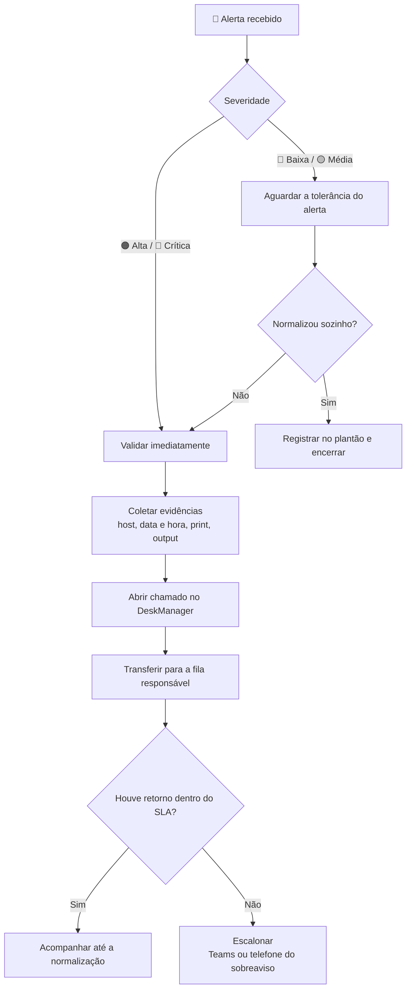

# 📘 Catálogo de Alertas — NOC

Guia operacional para **triagem, abertura de chamado e acionamento correto**
dos alertas monitorados. Cada categoria traz o catálogo completo em tabela —
descrição, causa, ação, quem acionar, canal e SLA — e o procedimento detalhado
logo abaixo.

> **Regra de ouro:** nenhum acionamento por Teams ou telefone acontece sem
> **chamado aberto** e **evidência coletada** (host, horário, print/output).
> O SLA só começa a contar depois do chamado registrado.
{.is-warning}

> **Esta página é gerada.** O conteúdo vem das fichas validadas em
> `docs/alerts/` do repositório Zabbix-Wiki — não edite aqui, edite a ficha e
> gere de novo (`python main.py wiki`). Assim a página nunca diverge do que o
> time aprovou, e envelhece junto com o Zabbix em vez de envelhecer sozinha.
{.is-info}

## ⚡ Fluxo de atendimento

## 🎚️ Severidade

| Ícone | Severidade | Postura esperada |
| :---: | :--- | :--- |
| 🔴 | **Crítica** (Disaster) | Validar e abrir chamado na hora. Comunicar o plantão. |
| 🟠 | **Alta** (High) | Validar e abrir chamado na hora. |
| 🟡 | **Média** (Average/Warning) | Respeitar a tolerância do alerta antes de abrir. |
| 🔵 | **Baixa** (Information) | Registrar e transferir sem urgência. |

> **Como ler o SLA:** `7 min` é o tempo de tolerância **mais** a espera pelo
> retorno do chamado antes de escalonar. `Imediato` significa abrir o chamado
> assim que o alerta for validado.
{.is-info}

## 🏢 Clientes

| Cliente | Procedimentos | Alertas | Hosts |
| :--- | ---: | ---: | ---: |
| **Vibe Tecnologia** | 77 | 77 | 20 |
| **Chubb** | 14 | 24 | 3 |
| **Master Support (interno)** | 6 | 6 | 1 |
| **Votorantim** | 6 | 6 | 2 |

## 📋 Catálogo por cliente {.tabset}

### Vibe Tecnologia

**77 alerta(s)** em 77 procedimento(s) · 20 host(s): `Embratel - Roteador [Cisco]`, `Interconect - Roteador`, `Vibe - AP REUNIAO [Ubiquiti]`, `Vibe - Certificado mastersupport.com.br`, `Vibe - DeskManager API`, `Vibe - Ferramentas Internas`, `Vibe - Grafana`, `Vibe - Impressora [HP]` e mais 12

> Vem por último entre os monitorados: o host group 'Vibe Tecnologia' é usado como guarda-chuva de infraestrutura compartilhada (links de operadora, câmeras, servidores sem prefixo).
{.is-info}

#### ☎️ Acionamento

| Fila / Time | Canal | Escalonamento | Alertas cobertos |
| :--- | :--- | :--- | ---: |
| **Administrativo** | DeskManager · E-mail | — | 4 |
| **Carlos Favacho** | DeskManager | Carlos Favacho | 1 |
| **Infraestrutura** | DeskManager | Rafael Sales | 49 |
| **NOC** | DeskManager | — | 2 |
| **NOC / GE** | Central de Servicos | — | 5 |
| **NOC / Infra** | DeskManager | — | 6 |
| **NOC → operadora** | Desk Manager (com o protocolo da operadora) | líderes + NOC · líderes + NOC (e-mail com protocolo) | 4 |
| **RH** | DeskManager | — | 2 |
| **SOC** | DeskManager → fila SOC | analista SOC (somente horário comercial) | 2 |
| **Suporte Oracle** | DeskManager | — | 2 |

#### Rede / Conectividade

| Alerta | Host / Sistema | Severidade | Descrição do Alerta | Causa Provável | Ação Imediata do Operador | Quem Acionar | Canal / Contato | SLA para Escalonar | Link / Referência |
| :--- | :--- | :--- | :--- | :--- | :--- | :--- | :--- | :--- | :--- |
| `Alta perda de pacotes ICMP — AP REUNIAO` | Vibe - AP REUNIAO [Ubiquiti] | 🟡 Média | Perda de pacotes na comunicacao com o AP. | Intermitencia wireless (AirOS). | Abrir chamado. Sem resposta, acionar no Teams (Rafael Sales). | Infraestrutura | DeskManager / Teams (Rafael Sales) | 5 min | — |
| `Conectividade (ICMP/TCP) — Ativos de Rede` | Embratel - Roteador [Cisco] | 🔵 Baixa | 20 alertas em 6 host(s) do grupo 'Ativos de Rede': Embratel - Roteador [Cisco], Vibe - AP REUNIAO [Ubiquiti], Vibe - AP SALA Ubiquiti, Vibe - AP14_VIBE, Vibe - Proxy [Fortigate]…. Itens `icmpping*` e `net.tcp*` medem alcancabilidade por ping e porta TCP. Severidades: Information=2, High=6, Warning=10, Disaster=2. 18 dependencia(s) entre triggers deste agrupamento — o proprio Zabbix ja os relaciona. | Equipamento desligado, queda de link, saturacao do caminho ou manutencao nao comunicada. | Abrir chamado para o time de Infraestrutura. Caso o problema permaneça sem resposta, acionar o Rafael Sales via Teams. | Infraestrutura | DeskManager / Teams (Rafael Sales) | Imediato | — |
| `Conectividade (ICMP/TCP) — IOT` | Vibe - Impressora [HP] | 🟡 Média | 8 alertas em 2 host(s) do grupo 'IOT': Vibe - Impressora [HP], Vibe - Porta [Intelbras]. Itens `icmpping*` e `net.tcp*` medem alcancabilidade por ping e porta TCP. Severidades: Warning=7, High=1. 7 dependencia(s) entre triggers deste agrupamento — o proprio Zabbix ja os relaciona. | Equipamento desligado, queda de link, saturacao do caminho ou manutencao nao comunicada. | Abrir chamado para o time de Infraestrutura. Caso o problema permaneça sem resposta, acionar o Rafael Sales via Teams. | Infraestrutura | DeskManager / Teams (Rafael Sales) | Imediato | — |
| `Conectividade (ICMP/TCP) — Servidores` | Vibe - Servidor iDRAC [DELL] | 🟡 Média | 6 alertas em 2 host(s) do grupo 'Servidores': Vibe - Servidor iDRAC [DELL], Vibe - VMware. Itens `icmpping*` e `net.tcp*` medem alcancabilidade por ping e porta TCP. Severidades: Warning=4, High=2. 6 dependencia(s) entre triggers deste agrupamento — o proprio Zabbix ja os relaciona. | Equipamento desligado, queda de link, saturacao do caminho ou manutencao nao comunicada. | Abrir chamado para o time de Infraestrutura. Caso o problema permaneça sem resposta, acionar o Rafael Sales via Teams. | Infraestrutura | DeskManager / Teams (Rafael Sales) | Imediato | — |
| `Conectividade (ICMP/TCP) — Zabbix servers` | Vibe - Zabbix-Proxy-Gateway | 🔴 Crítica | 6 alertas em 3 host(s) do grupo 'Zabbix servers': Vibe - Zabbix server, Vibe - Zabbix-Proxy, Vibe - Zabbix-Proxy-Gateway. Itens `icmpping*` e `net.tcp*` medem alcancabilidade por ping e porta TCP. 1 instancia(s): tcp. Severidades: Disaster=3, Warning=2, High=1. 3 dependencia(s) entre triggers deste agrupamento — o proprio Zabbix ja os relaciona. | Equipamento desligado, queda de link, saturacao do caminho ou manutencao nao comunicada. | Abrir chamado para o time de Infraestrutura. Caso o problema permaneça sem resposta, acionar o Rafael Sales via Teams. | Infraestrutura | DeskManager / Teams (Rafael Sales) | Imediato | — |
| `Host/servico indisponivel por ICMP ou TCP — grupo Vibe Tecnologia` | Vibe - Influxdb | 🔴 Crítica | 38 alertas, 16 hosts heterogeneos (firewalls Banpara, roteadores Interconect/Oi/Cisco, cameras IP, InfluxDB, CorreiosDB). Severidade grave: 7 Disaster + 10 High de 38. | Equipamento desligado, falha de rede/link, ou host sem enviar dados ha muito tempo. | Abrir chamado para o time de Infraestrutura. Caso o problema permaneça sem resposta, acionar o Rafael Sales via Teams. | Infraestrutura | DeskManager / Teams (Rafael Sales) | Imediato | — |
| `Impressora HP inacessivel (ICMP)` | Vibe - Impressora [HP] | 🟡 Média | Impressora inacessivel na rede da fabrica. | Equipamento desligado ou falha de rede. | Verificar presencialmente na fabrica e abrir chamado. | NOC / GE | Central de Servicos | Imediato | — |
| `Link PRINCIPAL da fábrica (Embratel) indisponível` | Embratel - Roteador [Cisco] | 🔴 Crítica | Host 'Embratel - Roteador [Cisco]'. É o link PRINCIPAL da fábrica. Com ele fora, a operação depende do link de backup (Interconnect/Vellon) — se os dois caírem, a fábrica fica sem conectividade. | Falha do circuito da operadora, equipamento no local, ou rompimento. | Acionar a Embratel pelo portal WebSIR com o código de designação, ou pelo 0800 721 1021 / caebt@claroatendimento.com.br | NOC → operadora | Desk Manager (com o protocolo da operadora) / Portal/telefone da operadora, conforme o link (líderes + NOC (e-mail com protocolo)) | Imediato | — |
| `Link de BACKUP da fábrica (Interconnect/Vellon) indisponível` | Interconect - Roteador | 🔴 Crítica | Alerta no próprio host 'Interconect - Roteador'. É o link de BACKUP da fábrica; o principal é a Embratel. | Falha do circuito da Vellon/Interconnect ou do equipamento no local. | Acionar a Vellon Telecom por WhatsApp (+55 91 99264-4565): opção 1 → 1 (sou cliente) → CNPJ 13956365000136 → 1 → 1 → aguardar operador | NOC → operadora | Desk Manager (com o protocolo da operadora) / Portal/telefone da operadora, conforme o link (líderes + NOC (e-mail com protocolo)) | Imediato | — |
| `Link de BACKUP da fábrica (Interconnect/Vellon) indisponível — visto pelo Embratel` | Embratel - Roteador [Cisco] | 🔴 Crítica | Alerta no host 'Embratel - Roteador [Cisco]' sinalizando que o link de BACKUP (Interconnect/Vellon) está fora. Sozinho não derruba a operação — mas deixa a fábrica sem redundância. | Falha do circuito da Vellon/Interconnect ou do equipamento no local. | Acionar a Vellon Telecom por WhatsApp (+55 91 99264-4565): opção 1 → 1 (sou cliente) → CNPJ 13956365000136 → 1 → 1 → aguardar operador | NOC → operadora | Desk Manager (com o protocolo da operadora) / Portal/telefone da operadora, conforme o link (líderes + NOC (e-mail com protocolo)) | Imediato | — |
| `Roteador Embratel inalcançável (ICMP)` | Embratel - Roteador [Cisco] | 🟠 Alta | Host 'Embratel - Roteador [Cisco]' não responde a ping — pode ser queda do link ou do equipamento. | Queda do circuito, do equipamento no local, ou falta de energia. | Acionar a Embratel (portal WebSIR com a designação, ou 0800 721 1021) | NOC → operadora | Desk Manager (com o protocolo da operadora) / Portal/telefone da operadora, conforme o link (líderes + NOC) | Imediato | — |

##### 🟡 Alta perda de pacotes ICMP — AP REUNIAO

**Sintomas:**
* 'Ubiquiti AirOS: High ICMP ping loss' no host Vibe - AP REUNIAO Ubiquiti

**Ações:**
* Abrir chamado. Sem resposta, acionar no Teams (Rafael Sales).

**Critério de resolução:** Perda de pacotes volta ao normal.

**Observações:** Severidade: Media. SLA: 7 min (5m tolerancia + 2m espera de retorno do chamado). Ver docs/escalation_matrix.md para a matriz completa de filas, contatos e horarios. Fluxo geral: validar severidade -> respeitar tolerancia (se media/baixa) -> coletar evidencias (host, data/hora, print/output) -> abrir chamado no DeskManager -> transferir para a fila -> se nao houver retorno dentro do SLA, escalar por Teams/telefone do sobreaviso.

##### 🔵 Conectividade (ICMP/TCP) — Ativos de Rede

Confirmar se o equipamento/servico esta mesmo fora antes de escalar.

**Sintomas:**
* 'Unavailable by ICMP ping' (host fora)
* 'High ICMP ping loss' (perda de pacotes)
* 'High ICMP ping response time' (latencia alta)

**Verificações antes de agir:**
* Testar o ping/porta manualmente para confirmar
* Verificar se outros hosts do mesmo caminho tambem cairam (indica link, nao host)
* Confirmar se ha manutencao ou reinicio programado

**Ações:**
* Abrir chamado para o time de Infraestrutura. Caso o problema permaneça sem resposta, acionar o Rafael Sales via Teams.

**Riscos e ressalvas:**
* 'ping loss' e 'response time' costumam preceder a queda total -- tratar como aviso, nao como incidente equivalente ao 'Unavailable'
* Esta regra cobre os mesmos alertas de: pontos-de-acesso--connectivity, roteadores--connectivity (hosts em mais de um host group). ESTA e a ficha primaria — documentar aqui vale para todas; nao escrever de novo nas outras.

**Critério de resolução:** Alerta normaliza e o indicador volta ao patamar esperado. [EXTRAPOLADO — ajuste se o critério real for outro]

**Observações:** Rascunho tecnico da Fase 2 (confianca high, 11 familias tecnicas). Criterio de resolucao, time, fila e SLA ficam em branco de proposito — sao conhecimento organizacional, nao se deduzem da chave de item. Ver docs/escalation_matrix.md. ROTEAMENTO EXTRAPOLADO do padrão das fichas que vieram do time — não foi informado especificamente para este alerta. Confira o time e a fila antes de tratar como definitivo. EM ABERTO: Quem aciona quando e link de operadora vs equipamento interno.

##### 🟡 Conectividade (ICMP/TCP) — IOT

Confirmar se o equipamento/servico esta mesmo fora antes de escalar.

**Sintomas:**
* 'Unavailable by ICMP ping' (host fora)
* 'High ICMP ping loss' (perda de pacotes)
* 'High ICMP ping response time' (latencia alta)

**Verificações antes de agir:**
* Testar o ping/porta manualmente para confirmar
* Verificar se outros hosts do mesmo caminho tambem cairam (indica link, nao host)
* Confirmar se ha manutencao ou reinicio programado

**Ações:**
* Abrir chamado para o time de Infraestrutura. Caso o problema permaneça sem resposta, acionar o Rafael Sales via Teams.

**Riscos e ressalvas:**
* 'ping loss' e 'response time' costumam preceder a queda total -- tratar como aviso, nao como incidente equivalente ao 'Unavailable'

**Critério de resolução:** Alerta normaliza e o indicador volta ao patamar esperado. [EXTRAPOLADO — ajuste se o critério real for outro]

**Observações:** Rascunho tecnico da Fase 2 (confianca high, 5 familias tecnicas). Criterio de resolucao, time, fila e SLA ficam em branco de proposito — sao conhecimento organizacional, nao se deduzem da chave de item. Ver docs/escalation_matrix.md. ROTEAMENTO EXTRAPOLADO do padrão das fichas que vieram do time — não foi informado especificamente para este alerta. Confira o time e a fila antes de tratar como definitivo. EM ABERTO: Quem aciona quando e link de operadora vs equipamento interno.

##### 🟡 Conectividade (ICMP/TCP) — Servidores

Confirmar se o equipamento/servico esta mesmo fora antes de escalar.

**Sintomas:**
* 'Unavailable by ICMP ping' (host fora)
* 'High ICMP ping loss' (perda de pacotes)
* 'High ICMP ping response time' (latencia alta)

**Verificações antes de agir:**
* Testar o ping/porta manualmente para confirmar
* Verificar se outros hosts do mesmo caminho tambem cairam (indica link, nao host)
* Confirmar se ha manutencao ou reinicio programado

**Ações:**
* Abrir chamado para o time de Infraestrutura. Caso o problema permaneça sem resposta, acionar o Rafael Sales via Teams.

**Riscos e ressalvas:**
* 'ping loss' e 'response time' costumam preceder a queda total -- tratar como aviso, nao como incidente equivalente ao 'Unavailable'

**Critério de resolução:** Alerta normaliza e o indicador volta ao patamar esperado. [EXTRAPOLADO — ajuste se o critério real for outro]

**Observações:** Rascunho tecnico da Fase 2 (confianca high, 6 familias tecnicas). Criterio de resolucao, time, fila e SLA ficam em branco de proposito — sao conhecimento organizacional, nao se deduzem da chave de item. Ver docs/escalation_matrix.md. ROTEAMENTO EXTRAPOLADO do padrão das fichas que vieram do time — não foi informado especificamente para este alerta. Confira o time e a fila antes de tratar como definitivo. EM ABERTO: Quem aciona quando e link de operadora vs equipamento interno.

##### 🔴 Conectividade (ICMP/TCP) — Zabbix servers

Confirmar se o equipamento/servico esta mesmo fora antes de escalar.

**Sintomas:**
* 'Unavailable by ICMP ping' (host fora)
* 'High ICMP ping loss' (perda de pacotes)
* 'High ICMP ping response time' (latencia alta)

**Verificações antes de agir:**
* Testar o ping/porta manualmente para confirmar
* Verificar se outros hosts do mesmo caminho tambem cairam (indica link, nao host)
* Confirmar se ha manutencao ou reinicio programado

**Ações:**
* Abrir chamado para o time de Infraestrutura. Caso o problema permaneça sem resposta, acionar o Rafael Sales via Teams.

**Riscos e ressalvas:**
* 'ping loss' e 'response time' costumam preceder a queda total -- tratar como aviso, nao como incidente equivalente ao 'Unavailable'
* Inclui 'Zabbix-Proxy-Service Indisponivel' (Disaster): se o proxy cai, os alertas dos hosts atras dele param de chegar em silencio. Nao e um alerta de conectividade comum.

**Critério de resolução:** Alerta normaliza e o indicador volta ao patamar esperado. [EXTRAPOLADO — ajuste se o critério real for outro]

**Observações:** Rascunho tecnico da Fase 2 (confianca high, 5 familias tecnicas). Criterio de resolucao, time, fila e SLA ficam em branco de proposito — sao conhecimento organizacional, nao se deduzem da chave de item. Ver docs/escalation_matrix.md. ROTEAMENTO EXTRAPOLADO do padrão das fichas que vieram do time — não foi informado especificamente para este alerta. Confira o time e a fila antes de tratar como definitivo. EM ABERTO: Quem aciona quando e link de operadora vs equipamento interno.

##### 🔴 Host/servico indisponivel por ICMP ou TCP — grupo Vibe Tecnologia

Reagir a perda de conectividade basica (ping ICMP ou porta TCP) em 16 hosts variados do grupo Vibe Tecnologia (firewalls, roteadores, cameras, bancos de dados).

**Sintomas:**
* 'ICMP: Unavailable by ICMP ping'
* 'ICMP: High ICMP ping loss/response time'
* 'DNX Influxdb indisponivel - 10m sem novos dados'

**Verificações antes de agir:**
* Identificar o host exato (grupo muito heterogeneo -- camera de seguranca e firewall pedem tratamento diferente)

**Ações:**
* Abrir chamado para o time de Infraestrutura. Caso o problema permaneça sem resposta, acionar o Rafael Sales via Teams.

**Riscos e ressalvas:**
* Agrupar cameras de seguranca com firewalls de cliente bancario sob o mesmo procedimento pode subestimar a urgencia de um dos dois

**Critério de resolução:** Alerta normaliza e o indicador volta ao patamar esperado. [EXTRAPOLADO — ajuste se o critério real for outro]

**Observações:** Rascunho tecnico -- confianca alta, mas o grupo e heterogeneo demais para 1 procedimento so. Considerar dividir por tipo de host antes de documentar de vez. ROTEAMENTO EXTRAPOLADO do padrão das fichas que vieram do time — não foi informado especificamente para este alerta. Confira o time e a fila antes de tratar como definitivo. EM ABERTO: Este grupo mistura ativos MUITO diferentes (cameras de seguranca, firewall de cliente, banco de dados interno) -- provavelmente precisa de mais de um procedimento, nao um so.

##### 🟡 Impressora HP inacessivel (ICMP)

**Sintomas:**
* 'ICMP: Unavailable by ICMP ping' no host Vibe - Impressora HP

**Verificações antes de agir:**
* Verificar presencialmente na fabrica

**Ações:**
* Verificar presencialmente na fabrica e abrir chamado.

**Critério de resolução:** Impressora volta a responder ao ping.

**Observações:** Severidade: Alta. SLA: Imediato. Horario: NOC/GE atende 24x7. Ver docs/escalation_matrix.md para a matriz completa de filas, contatos e horarios. Fluxo geral: validar severidade -> respeitar tolerancia (se media/baixa) -> coletar evidencias (host, data/hora, print/output) -> abrir chamado no DeskManager -> transferir para a fila -> se nao houver retorno dentro do SLA, escalar por Teams/telefone do sobreaviso.

##### 🔴 Link PRINCIPAL da fábrica (Embratel) indisponível

Restabelecer o link principal da fábrica acionando a Embratel.

**Sintomas:**
* 'Link Principal - Fábrica Embratel indisponível' (Disaster)

**Verificações antes de agir:**
* Verificar o aparelho preto no local: lâmpada PON verde = conexão OK; lâmpada SD vermelha = rede instável
* Confirmar se o link de backup (Interconnect) assumiu

**Ações:**
* Acionar a Embratel pelo portal WebSIR com o código de designação, ou pelo 0800 721 1021 / caebt@claroatendimento.com.br
* Informar +55 91 3222-1678 (NOC) como telefone de contato do chamado
* Formalizar por e-mail para líderes e NOC, com o erro e o protocolo
* Abrir chamado no Desk Manager por integração, com o protocolo da operadora

**Riscos e ressalvas:**
* Se o backup também estiver fora, a fábrica está sem conectividade — tratar como indisponibilidade total, não como queda de um link.

**Critério de resolução:** Link principal volta a responder e a operadora confirma o restabelecimento.

**Observações:** Wiki de rede do NOC (acionamento de operadoras), repassada pelo time em 2026-09-06. EMBRATEL (link principal) — Antes de abrir chamado, verificar o aparelho: no primeiro equipamento (preto), lâmpada PON verde = conexão estável; lâmpada SD vermelha = rede instável. Abertura pelo portal WebSIR (link com a designação na wiki de rede), ou 0800 721 1021 / caebt@claroatendimento.com.br. Informar o telefone do NOC como contato: +55 91 3222-1678. Depois formalizar por e-mail (erro + protocolo) para os líderes e o NOC, e abrir chamado no Desk Manager por integração com o protocolo.

**Evidências obrigatórias no chamado:** Protocolo da Embratel · Estado das lâmpadas do aparelho (PON/SD)

##### 🔴 Link de BACKUP da fábrica (Interconnect/Vellon) indisponível

Restabelecer o link de backup antes que o principal também falhe.

**Sintomas:**
* 'Link Backup - Fábrica Interconnect indisponível' (Disaster)

**Verificações antes de agir:**
* Confirmar que o link principal (Embratel) segue operando

**Ações:**
* Acionar a Vellon Telecom por WhatsApp (+55 91 99264-4565): opção 1 → 1 (sou cliente) → CNPJ 13956365000136 → 1 → 1 → aguardar operador
* Formalizar por e-mail para líderes e NOC com o protocolo
* Abrir chamado no Desk Manager com o protocolo

**Riscos e ressalvas:**
* Este alerta e o do host Embratel apontam o MESMO link de backup, por caminhos diferentes. Dois alertas, um incidente — não abrir dois chamados.

**Critério de resolução:** Link de backup volta a responder.

**Observações:** Wiki de rede do NOC (acionamento de operadoras), repassada pelo time em 2026-09-06. VELLON TELECOM / INTERCONNECT (link de backup) — Atendimento por WhatsApp: +55 91 99264-4565. Sequência: opção 1 → opção 1 (sou cliente) → CNPJ 13956365000136 → opção 1 → opção 1 → aguardar operador. Formalizar por e-mail para líderes e NOC, e abrir chamado no Desk Manager com o protocolo.

**Evidências obrigatórias no chamado:** Protocolo da Vellon · Estado do link principal no momento

##### 🔴 Link de BACKUP da fábrica (Interconnect/Vellon) indisponível — visto pelo Embratel

Restabelecer o link de backup antes que o principal também falhe.

**Sintomas:**
* 'Link Backup - Fábrica Interconnect indisponível' (Disaster)

**Verificações antes de agir:**
* Confirmar que o link principal (Embratel) segue operando

**Ações:**
* Acionar a Vellon Telecom por WhatsApp (+55 91 99264-4565): opção 1 → 1 (sou cliente) → CNPJ 13956365000136 → 1 → 1 → aguardar operador
* Formalizar por e-mail para líderes e NOC com o protocolo
* Abrir chamado no Desk Manager com o protocolo

**Riscos e ressalvas:**
* Severidade Disaster, mas sem impacto imediato SE o principal estiver de pé: o risco é ficar sem redundância. Confirmar o estado do principal antes de classificar a urgência.

**Critério de resolução:** Link de backup volta a responder e a redundância é restabelecida.

**Observações:** Wiki de rede do NOC (acionamento de operadoras), repassada pelo time em 2026-09-06. VELLON TELECOM / INTERCONNECT (link de backup) — Atendimento por WhatsApp: +55 91 99264-4565. Sequência: opção 1 → opção 1 (sou cliente) → CNPJ 13956365000136 → opção 1 → opção 1 → aguardar operador. Formalizar por e-mail para líderes e NOC, e abrir chamado no Desk Manager com o protocolo.

**Evidências obrigatórias no chamado:** Protocolo da Vellon · Estado do link principal no momento

##### 🟠 Roteador Embratel inalcançável (ICMP)

Confirmar se o roteador do link principal está fora antes de acionar a operadora.

**Sintomas:**
* 'Cisco IOS: Unavailable by ICMP ping' (High)

**Verificações antes de agir:**
* Verificar as lâmpadas do aparelho preto no local (PON verde = OK, SD vermelha = instável)
* Confirmar se o alerta de 'Link Principal indisponível' também disparou

**Ações:**
* Acionar a Embratel (portal WebSIR com a designação, ou 0800 721 1021)
* Informar +55 91 3222-1678 (NOC) como contato
* Formalizar por e-mail e abrir no Desk Manager com o protocolo

**Riscos e ressalvas:**
* Costuma vir junto com 'Link Principal indisponível' — é o mesmo incidente.

**Critério de resolução:** Roteador volta a responder ao ping.

**Observações:** Wiki de rede do NOC (acionamento de operadoras), repassada pelo time em 2026-09-06. EMBRATEL (link principal) — Antes de abrir chamado, verificar o aparelho: no primeiro equipamento (preto), lâmpada PON verde = conexão estável; lâmpada SD vermelha = rede instável. Abertura pelo portal WebSIR (link com a designação na wiki de rede), ou 0800 721 1021 / caebt@claroatendimento.com.br. Informar o telefone do NOC como contato: +55 91 3222-1678. Depois formalizar por e-mail (erro + protocolo) para os líderes e o NOC, e abrir chamado no Desk Manager por integração com o protocolo.

#### Rede / Interfaces

| Alerta | Host / Sistema | Severidade | Descrição do Alerta | Causa Provável | Ação Imediata do Operador | Quem Acionar | Canal / Contato | SLA para Escalonar | Link / Referência |
| :--- | :--- | :--- | :--- | :--- | :--- | :--- | :--- | :--- | :--- |
| `Interfaces de rede (roteador/AP) com erro, queda ou degradacao` | Embratel - Roteador [Cisco] | 🟡 Média | Itens `net.if*` monitoram estado/erros/utilizacao de interfaces em 5 hosts (Embratel-Roteador Cisco, 3 APs Ubiquiti Vibe, Proxy Fortigate). 269 alertas cobrem 128 interfaces distintas (Gi0/0, ifHCInOctets.*, INTERNO2, VISITANTE...). Severidade varia de Information a Disaster -- nao e um alerta so, e uma familia com niveis de gravidade reais. | Cabo/porta com problema fisico, negociacao de velocidade incorreta, saturacao de link ou equipamento remoto reiniciando. | Abrir chamado para o time de Infraestrutura. Caso o problema permaneça sem resposta, acionar o Rafael Sales via Teams. | Infraestrutura | DeskManager / Teams (Rafael Sales) | Imediato | — |
| `Interfaces de rede — Vibe Tecnologia` | Vibe - Wazuh SIEM | 🔵 Baixa | 12 alertas em 3 host(s) do grupo 'Vibe Tecnologia': SRV_INCONTROL_2026, Vibe - MSTracker-vm Hom, Vibe - Wazuh SIEM. Itens `net.if*` medem estado operacional, erros e trafego das interfaces. 3 instancia(s): Intel, ens160, ens192. Severidades: Information=3, Warning=6, Average=3. 9 dependencia(s) entre triggers deste agrupamento — o proprio Zabbix ja os relaciona. | Cabo/porta com defeito, negociacao de velocidade incorreta ou saturacao real do link. | Abrir chamado para o time de Infraestrutura. Caso o problema permaneça sem resposta, acionar o Rafael Sales via Teams. | Infraestrutura | DeskManager / Teams (Rafael Sales) | Imediato | — |
| `Interfaces de rede — Virtual machines` | Windows bob | 🔵 Baixa | 4 alertas em 1 host(s) do grupo 'Virtual machines': Windows bob. Itens `net.if*` medem estado operacional, erros e trafego das interfaces. 1 instancia(s): Amazon Elastic Network Adapter. Severidades: Information=1, Warning=2, Average=1. 3 dependencia(s) entre triggers deste agrupamento — o proprio Zabbix ja os relaciona. | Cabo/porta com defeito, negociacao de velocidade incorreta ou saturacao real do link. | Abrir chamado para o time de Infraestrutura. Caso o problema permaneça sem resposta, acionar o Rafael Sales via Teams. | Infraestrutura | DeskManager / Teams (Rafael Sales) | Imediato | — |
| `Interfaces de rede — Zabbix servers` | Vibe - Zabbix server | 🔵 Baixa | 8 alertas em 2 host(s) do grupo 'Zabbix servers': Vibe - Zabbix server, Vibe - Zabbix-Proxy. Itens `net.if*` medem estado operacional, erros e trafego das interfaces. 2 instancia(s): ens192, ens5. Severidades: Information=2, Warning=4, Average=2. 6 dependencia(s) entre triggers deste agrupamento — o proprio Zabbix ja os relaciona. | Cabo/porta com defeito, negociacao de velocidade incorreta ou saturacao real do link. | Abrir chamado para o time de Infraestrutura. Caso o problema permaneça sem resposta, acionar o Rafael Sales via Teams. | Infraestrutura | DeskManager / Teams (Rafael Sales) | Imediato | — |
| `VPNBKP com baixo trafego (Proxy Fortigate)` | Vibe - Proxy [Fortigate] | 🟡 Média | Trafego abaixo do normal na VPN de backup. | Intermitencia IPsec. | Abrir chamado. Sem resposta, acionar no Teams (Rafael Sales). | Infraestrutura | DeskManager / Teams (Rafael Sales) | 5 min | — |

##### 🟡 Interfaces de rede (roteador/AP) com erro, queda ou degradacao

Reagir a interfaces de rede fora do estado esperado (link down, half-duplex, alta taxa de erro, banda) em roteador Cisco e APs Ubiquiti antes que afete o servico.

**Sintomas:**
* 'Interface X: Link down'
* 'Interface X: In half-duplex mode' ou 'Ethernet has changed to lower speed'
* 'Interface X: High bandwidth usage' / 'High error rate'

**Verificações antes de agir:**
* Identificar host e interface exata (nome vem no titulo do alerta)
* Checar se a queda coincide com manutencao/reinicio programado
* Verificar se ha impacto perceptivel (rede visitante x rede interna tem prioridades diferentes)

**Ações:**
* Abrir chamado para o time de Infraestrutura. Caso o problema permaneça sem resposta, acionar o Rafael Sales via Teams.

**Riscos e ressalvas:**
* 'VISITANTE' e 'INTERNO2' sao redes de propositos diferentes -- mesma regra tecnica, urgencia de negocio pode ser diferente

**Critério de resolução:** Alerta normaliza e o indicador volta ao patamar esperado. [EXTRAPOLADO — ajuste se o critério real for outro]

**Observações:** Rascunho tecnico. Esta regra reune 24 familias tecnicas (confianca alta). Antes de tratar como um unico procedimento, considerar separar por severidade ou por rede (corporativa x visitante) na revisao humana. ROTEAMENTO EXTRAPOLADO do padrão das fichas que vieram do time — não foi informado especificamente para este alerta. Confira o time e a fila antes de tratar como definitivo. EM ABERTO: Procedimento por severidade -- Disaster (23 casos) provavelmente exige acao imediata, Information (57 casos) pode so precisar de registro.

##### 🔵 Interfaces de rede — Vibe Tecnologia

Reagir a queda, degradacao ou saturacao de interface.

**Sintomas:**
* 'Link down'
* 'Ethernet has changed to lower speed'
* 'High error rate'
* 'High bandwidth usage'

**Verificações antes de agir:**
* Identificar host e interface exata (vem no titulo)
* Verificar se a interface e de producao ou secundaria/backup
* Conferir se coincide com manutencao

**Ações:**
* Abrir chamado para o time de Infraestrutura. Caso o problema permaneça sem resposta, acionar o Rafael Sales via Teams.

**Riscos e ressalvas:**
* 'High bandwidth usage' pode ser uso legitimo (backup, replicacao) -- confirmar antes de tratar como incidente

**Critério de resolução:** Alerta normaliza e o indicador volta ao patamar esperado. [EXTRAPOLADO — ajuste se o critério real for outro]

**Observações:** Rascunho tecnico da Fase 2 (confianca high, 12 familias tecnicas). Criterio de resolucao, time, fila e SLA ficam em branco de proposito — sao conhecimento organizacional, nao se deduzem da chave de item. Ver docs/escalation_matrix.md. ROTEAMENTO EXTRAPOLADO do padrão das fichas que vieram do time — não foi informado especificamente para este alerta. Confira o time e a fila antes de tratar como definitivo. EM ABERTO: Prioridade por interface -- nem toda interface do host tem o mesmo peso.

##### 🔵 Interfaces de rede — Virtual machines

Reagir a queda, degradacao ou saturacao de interface.

**Sintomas:**
* 'Link down'
* 'Ethernet has changed to lower speed'
* 'High error rate'
* 'High bandwidth usage'

**Verificações antes de agir:**
* Identificar host e interface exata (vem no titulo)
* Verificar se a interface e de producao ou secundaria/backup
* Conferir se coincide com manutencao

**Ações:**
* Abrir chamado para o time de Infraestrutura. Caso o problema permaneça sem resposta, acionar o Rafael Sales via Teams.

**Riscos e ressalvas:**
* 'High bandwidth usage' pode ser uso legitimo (backup, replicacao) -- confirmar antes de tratar como incidente

**Critério de resolução:** Alerta normaliza e o indicador volta ao patamar esperado. [EXTRAPOLADO — ajuste se o critério real for outro]

**Observações:** Rascunho tecnico da Fase 2 (confianca high, 4 familias tecnicas). Criterio de resolucao, time, fila e SLA ficam em branco de proposito — sao conhecimento organizacional, nao se deduzem da chave de item. Ver docs/escalation_matrix.md. ROTEAMENTO EXTRAPOLADO do padrão das fichas que vieram do time — não foi informado especificamente para este alerta. Confira o time e a fila antes de tratar como definitivo. EM ABERTO: Prioridade por interface -- nem toda interface do host tem o mesmo peso.

##### 🔵 Interfaces de rede — Zabbix servers

Reagir a queda, degradacao ou saturacao de interface.

**Sintomas:**
* 'Link down'
* 'Ethernet has changed to lower speed'
* 'High error rate'
* 'High bandwidth usage'

**Verificações antes de agir:**
* Identificar host e interface exata (vem no titulo)
* Verificar se a interface e de producao ou secundaria/backup
* Conferir se coincide com manutencao

**Ações:**
* Abrir chamado para o time de Infraestrutura. Caso o problema permaneça sem resposta, acionar o Rafael Sales via Teams.

**Riscos e ressalvas:**
* 'High bandwidth usage' pode ser uso legitimo (backup, replicacao) -- confirmar antes de tratar como incidente

**Critério de resolução:** Alerta normaliza e o indicador volta ao patamar esperado. [EXTRAPOLADO — ajuste se o critério real for outro]

**Observações:** Rascunho tecnico da Fase 2 (confianca high, 8 familias tecnicas). Criterio de resolucao, time, fila e SLA ficam em branco de proposito — sao conhecimento organizacional, nao se deduzem da chave de item. Ver docs/escalation_matrix.md. ROTEAMENTO EXTRAPOLADO do padrão das fichas que vieram do time — não foi informado especificamente para este alerta. Confira o time e a fila antes de tratar como definitivo. EM ABERTO: Prioridade por interface -- nem toda interface do host tem o mesmo peso.

##### 🟡 VPNBKP com baixo trafego (Proxy Fortigate)

**Sintomas:**
* 'Interface VPNBKP(): Baixo Trafego' no host Vibe - Proxy Fortigate

**Ações:**
* Abrir chamado. Sem resposta, acionar no Teams (Rafael Sales).

**Critério de resolução:** Trafego da VPN de backup volta ao patamar normal.

**Observações:** Severidade: Media. SLA: 7 min (5m + 2m). SLA MAIS ESPECIFICO que o da regra 'Rede / Interfaces' do grupo Ativos de Rede (12 min) -- esta ficha prevalece para esta interface especifica. Ver docs/escalation_matrix.md para a matriz completa de filas, contatos e horarios. Fluxo geral: validar severidade -> respeitar tolerancia (se media/baixa) -> coletar evidencias (host, data/hora, print/output) -> abrir chamado no DeskManager -> transferir para a fila -> se nao houver retorno dentro do SLA, escalar por Teams/telefone do sobreaviso.

#### Rede / VPN e SD-WAN

| Alerta | Host / Sistema | Severidade | Descrição do Alerta | Causa Provável | Ação Imediata do Operador | Quem Acionar | Canal / Contato | SLA para Escalonar | Link / Referência |
| :--- | :--- | :--- | :--- | :--- | :--- | :--- | :--- | :--- | :--- |
| `Tunel VPN ou link SD-WAN degradado (Fortigate)` | Vibe - VPN [Fortigate] API | 🟠 Alta | 56 alertas, 17 instancias (Default_AWS, Default_FortiGuard, Default_Gmail, Default_Google Search, Default_Office_365, MASTER_VOTO1, Master_Algar, Master_Algar2, Master_Algar3, VIBE_BANPARA_01, VOTO2...), 2 hosts (Vibe - Proxy [Fortigate], Vibe - VPN [Fortigate] API). Severidade grave: 22 High + 19 Disaster de 56 -- a maioria dos casos desta regra ja e critica. | Instabilidade do provedor de link, saturacao de banda ou falha de configuracao do tunel IPsec/SD-WAN. | Abrir chamado para o time de Infraestrutura. Caso o problema permaneça sem resposta, acionar o Rafael Sales via Teams. | Infraestrutura | DeskManager / Teams (Rafael Sales) | Imediato | — |

##### 🟠 Tunel VPN ou link SD-WAN degradado (Fortigate)

Reagir a perda de pacotes ou queda de tuneis SD-WAN/VPN entre a matriz e os links monitorados (AWS, FortiGuard, Gmail, Google Search, Office 365, parceiros Algar/Votorantim/Banpara).

**Sintomas:**
* 'Sem dados de VPN'
* 'SD-WAN [NomeDoLink]:[wan1/wan2/internal2]: Perda de Pacotes acima de 5%'

**Verificações antes de agir:**
* Identificar qual link/tunel especifico (nome vem no titulo)
* Verificar se e um parceiro externo (Algar, Votorantim, Banpara) ou um servico proprio (AWS, Office 365)
* Checar se o problema e so perda de pacotes ou queda total do tunel

**Ações:**
* Abrir chamado para o time de Infraestrutura. Caso o problema permaneça sem resposta, acionar o Rafael Sales via Teams.

**Riscos e ressalvas:**
* Links de clientes especificos (Votorantim, Banpara, Algar) podem ter SLA contratual diferente do generico da Infraestrutura -- nao tratar todos os 17 links com a mesma prioridade sem confirmar

**Critério de resolução:** Alerta normaliza e o indicador volta ao patamar esperado. [EXTRAPOLADO — ajuste se o critério real for outro]

**Observações:** Rascunho tecnico -- confianca alta, reune 10 familias tecnicas. Nao confundir com a ficha 'Interface VPNBKP(): Baixo Trafego' (ja documentada, SLA 7min) -- aquela e uma interface especifica do Proxy Fortigate, classificada como 'Rede / Interfaces', nao 'VPN e SD-WAN'. ROTEAMENTO EXTRAPOLADO do padrão das fichas que vieram do time — não foi informado especificamente para este alerta. Confira o time e a fila antes de tratar como definitivo. EM ABERTO: VOTO2/MASTER_VOTO1 sao do cliente Votorantim -- confirmar se ha SLA/contato especifico do cliente para esses links.

#### Disco / Filesystem

| Alerta | Host / Sistema | Severidade | Descrição do Alerta | Causa Provável | Ação Imediata do Operador | Quem Acionar | Canal / Contato | SLA para Escalonar | Link / Referência |
| :--- | :--- | :--- | :--- | :--- | :--- | :--- | :--- | :--- | :--- |
| `Disco (/) acima de 80% no Wazuh SIEM` | Vibe - Wazuh SIEM | 🟡 Média | Espaco da particao raiz (/) acima de 80%. | Geracao excessiva de logs pelo firewall. | Abrir chamado informando o alerta e o host afetado. | Infraestrutura | DeskManager | Imediato | — |
| `Disco critico (/) no Zabbix-Proxy` | Vibe - Zabbix-Proxy | 🟡 Média | Espaco da particao raiz em nivel critico. Tende a durar dias ate a intervencao. | Crescimento de logs ou arquivos temporarios. | Abrir ou transferir chamado solicitando liberacao de espaco. | Infraestrutura | DeskManager | Imediato | Ref: 0726-001673 |
| `Espaco em disco / filesystem — Ativos de Rede` | Vibe - Switch [Fortigate] | 🟡 Média | 4 alertas em 2 host(s) do grupo 'Ativos de Rede': Vibe - Proxy [Fortigate], Vibe - Switch [Fortigate]. Itens `vfs.fs*` medem espaco livre, inodes e estado (read-only) das particoes. Severidades: Warning=2, High=2. 2 dependencia(s) entre triggers deste agrupamento — o proprio Zabbix ja os relaciona. | Crescimento de log, arquivo temporario acumulado ou volume subdimensionado. | Abrir chamado para o time de Infraestrutura. Caso o problema permaneça sem resposta, acionar o Rafael Sales via Teams. | Infraestrutura | DeskManager / Teams (Rafael Sales) | Imediato | — |
| `Espaco em disco / filesystem — Vibe Tecnologia` | Vibe - Wazuh SIEM | 🟡 Média | 23 alertas em 3 host(s) do grupo 'Vibe Tecnologia': SRV_INCONTROL_2026, Vibe - MSTracker-vm Hom, Vibe - Wazuh SIEM. Itens `vfs.fs*` medem espaco livre, inodes e estado (read-only) das particoes. 3 instancia(s): /, /boot, C:. Severidades: Average=13, Warning=10. 9 dependencia(s) entre triggers deste agrupamento — o proprio Zabbix ja os relaciona. | Crescimento de log, arquivo temporario acumulado ou volume subdimensionado. | Abrir chamado para o time de Infraestrutura. Caso o problema permaneça sem resposta, acionar o Rafael Sales via Teams. | Infraestrutura | DeskManager / Teams (Rafael Sales) | Imediato | — |
| `Espaco em disco / filesystem — Virtual machines` | Windows bob | 🟡 Média | 2 alertas em 1 host(s) do grupo 'Virtual machines': Windows bob. Itens `vfs.fs*` medem espaco livre, inodes e estado (read-only) das particoes. 1 instancia(s): C:. Severidades: Average=1, Warning=1. 1 dependencia(s) entre triggers deste agrupamento — o proprio Zabbix ja os relaciona. | Crescimento de log, arquivo temporario acumulado ou volume subdimensionado. | Abrir chamado para o time de Infraestrutura. Caso o problema permaneça sem resposta, acionar o Rafael Sales via Teams. | Infraestrutura | DeskManager / Teams (Rafael Sales) | Imediato | — |
| `Espaco em disco / filesystem — Zabbix servers` | Vibe - Zabbix server | 🟡 Média | 15 alertas em 2 host(s) do grupo 'Zabbix servers': Vibe - Zabbix server, Vibe - Zabbix-Proxy. Itens `vfs.fs*` medem espaco livre, inodes e estado (read-only) das particoes. 2 instancia(s): /, /boot. Severidades: Average=9, Warning=6. 6 dependencia(s) entre triggers deste agrupamento — o proprio Zabbix ja os relaciona. | Crescimento de log, arquivo temporario acumulado ou volume subdimensionado. | Abrir chamado para o time de Infraestrutura. Caso o problema permaneça sem resposta, acionar o Rafael Sales via Teams. | Infraestrutura | DeskManager / Teams (Rafael Sales) | Imediato | — |

##### 🟡 Disco (/) acima de 80% no Wazuh SIEM

**Sintomas:**
* '/: Disk space is low (used > 80%)' no host Vibe - Wazuh SIEM

**Verificações antes de agir:**
* Checar volume de logs recentes no SIEM

**Ações:**
* Abrir chamado informando o alerta e o host afetado.

**Critério de resolução:** Uso volta a ficar abaixo de 80%.

**Observações:** Severidade: Media. SLA: Imediato. Ver docs/escalation_matrix.md para a matriz completa de filas, contatos e horarios. Fluxo geral: validar severidade -> respeitar tolerancia (se media/baixa) -> coletar evidencias (host, data/hora, print/output) -> abrir chamado no DeskManager -> transferir para a fila -> se nao houver retorno dentro do SLA, escalar por Teams/telefone do sobreaviso.

##### 🟡 Disco critico (/) no Zabbix-Proxy

**Sintomas:**
* '/: Disk space is critically low' no host Vibe - Zabbix-Proxy

**Verificações antes de agir:**
* Confirmar o percentual livre atual no host

**Ações:**
* Abrir ou transferir chamado solicitando liberacao de espaco.

**Critério de resolução:** Espaco livre volta a ficar acima do limite critico configurado no trigger.

**Observações:** Severidade: Critica. SLA: Imediato. Ref. chamado 0726-001673 (caso anterior). Ver docs/escalation_matrix.md para a matriz completa de filas, contatos e horarios. Fluxo geral: validar severidade -> respeitar tolerancia (se media/baixa) -> coletar evidencias (host, data/hora, print/output) -> abrir chamado no DeskManager -> transferir para a fila -> se nao houver retorno dentro do SLA, escalar por Teams/telefone do sobreaviso.

##### 🟡 Espaco em disco / filesystem — Ativos de Rede

Evitar que uma particao cheia derrube o servico antes de alguem perceber.

**Sintomas:**
* 'Disk space is low' (aviso)
* 'Disk space is critically low' (critico)
* 'Running out of free inodes'
* 'Filesystem has become read-only'

**Verificações antes de agir:**
* Identificar a particao exata (vem no titulo do alerta)
* Ver o que cresceu: log, dump, backup, arquivo temporario
* Confirmar se e crescimento continuo ou pico pontual

**Ações:**
* Abrir chamado para o time de Infraestrutura. Caso o problema permaneça sem resposta, acionar o Rafael Sales via Teams.

**Riscos e ressalvas:**
* 'read-only' e categoria a parte: o filesystem entrou em protecao e quase sempre indica problema de disco, nao falta de espaco

**Critério de resolução:** Alerta normaliza e o indicador volta ao patamar esperado. [EXTRAPOLADO — ajuste se o critério real for outro]

**Observações:** Rascunho tecnico da Fase 2 (confianca high, 2 familias tecnicas). Criterio de resolucao, time, fila e SLA ficam em branco de proposito — sao conhecimento organizacional, nao se deduzem da chave de item. Ver docs/escalation_matrix.md. ROTEAMENTO EXTRAPOLADO do padrão das fichas que vieram do time — não foi informado especificamente para este alerta. Confira o time e a fila antes de tratar como definitivo. EM ABERTO: Se o NOC pode liberar espaco direto ou se abre chamado para a Infraestrutura.

##### 🟡 Espaco em disco / filesystem — Vibe Tecnologia

Evitar que uma particao cheia derrube o servico antes de alguem perceber.

**Sintomas:**
* 'Disk space is low' (aviso)
* 'Disk space is critically low' (critico)
* 'Running out of free inodes'
* 'Filesystem has become read-only'

**Verificações antes de agir:**
* Identificar a particao exata (vem no titulo do alerta)
* Ver o que cresceu: log, dump, backup, arquivo temporario
* Confirmar se e crescimento continuo ou pico pontual

**Ações:**
* Abrir chamado para o time de Infraestrutura. Caso o problema permaneça sem resposta, acionar o Rafael Sales via Teams.

**Riscos e ressalvas:**
* 'read-only' e categoria a parte: o filesystem entrou em protecao e quase sempre indica problema de disco, nao falta de espaco

**Critério de resolução:** Alerta normaliza e o indicador volta ao patamar esperado. [EXTRAPOLADO — ajuste se o critério real for outro]

**Observações:** Rascunho tecnico da Fase 2 (confianca high, 11 familias tecnicas). Criterio de resolucao, time, fila e SLA ficam em branco de proposito — sao conhecimento organizacional, nao se deduzem da chave de item. Ver docs/escalation_matrix.md. ROTEAMENTO EXTRAPOLADO do padrão das fichas que vieram do time — não foi informado especificamente para este alerta. Confira o time e a fila antes de tratar como definitivo. EM ABERTO: Se o NOC pode liberar espaco direto ou se abre chamado para a Infraestrutura.

##### 🟡 Espaco em disco / filesystem — Virtual machines

Evitar que uma particao cheia derrube o servico antes de alguem perceber.

**Sintomas:**
* 'Disk space is low' (aviso)
* 'Disk space is critically low' (critico)
* 'Running out of free inodes'
* 'Filesystem has become read-only'

**Verificações antes de agir:**
* Identificar a particao exata (vem no titulo do alerta)
* Ver o que cresceu: log, dump, backup, arquivo temporario
* Confirmar se e crescimento continuo ou pico pontual

**Ações:**
* Abrir chamado para o time de Infraestrutura. Caso o problema permaneça sem resposta, acionar o Rafael Sales via Teams.

**Riscos e ressalvas:**
* 'read-only' e categoria a parte: o filesystem entrou em protecao e quase sempre indica problema de disco, nao falta de espaco

**Critério de resolução:** Alerta normaliza e o indicador volta ao patamar esperado. [EXTRAPOLADO — ajuste se o critério real for outro]

**Observações:** Rascunho tecnico da Fase 2 (confianca high, 2 familias tecnicas). Criterio de resolucao, time, fila e SLA ficam em branco de proposito — sao conhecimento organizacional, nao se deduzem da chave de item. Ver docs/escalation_matrix.md. ROTEAMENTO EXTRAPOLADO do padrão das fichas que vieram do time — não foi informado especificamente para este alerta. Confira o time e a fila antes de tratar como definitivo. EM ABERTO: Se o NOC pode liberar espaco direto ou se abre chamado para a Infraestrutura.

##### 🟡 Espaco em disco / filesystem — Zabbix servers

Evitar que uma particao cheia derrube o servico antes de alguem perceber.

**Sintomas:**
* 'Disk space is low' (aviso)
* 'Disk space is critically low' (critico)
* 'Running out of free inodes'
* 'Filesystem has become read-only'

**Verificações antes de agir:**
* Identificar a particao exata (vem no titulo do alerta)
* Ver o que cresceu: log, dump, backup, arquivo temporario
* Confirmar se e crescimento continuo ou pico pontual

**Ações:**
* Abrir chamado para o time de Infraestrutura. Caso o problema permaneça sem resposta, acionar o Rafael Sales via Teams.

**Riscos e ressalvas:**
* 'read-only' e categoria a parte: o filesystem entrou em protecao e quase sempre indica problema de disco, nao falta de espaco

**Critério de resolução:** Alerta normaliza e o indicador volta ao patamar esperado. [EXTRAPOLADO — ajuste se o critério real for outro]

**Observações:** Rascunho tecnico da Fase 2 (confianca high, 8 familias tecnicas). Criterio de resolucao, time, fila e SLA ficam em branco de proposito — sao conhecimento organizacional, nao se deduzem da chave de item. Ver docs/escalation_matrix.md. ROTEAMENTO EXTRAPOLADO do padrão das fichas que vieram do time — não foi informado especificamente para este alerta. Confira o time e a fila antes de tratar como definitivo. EM ABERTO: Se o NOC pode liberar espaco direto ou se abre chamado para a Infraestrutura.

#### Disco / Desempenho de I-O

| Alerta | Host / Sistema | Severidade | Descrição do Alerta | Causa Provável | Ação Imediata do Operador | Quem Acionar | Canal / Contato | SLA para Escalonar | Link / Referência |
| :--- | :--- | :--- | :--- | :--- | :--- | :--- | :--- | :--- | :--- |
| `Disco (sda) com tempo de resposta alto no Zabbix-Proxy` | Vibe - Zabbix-Proxy | 🟡 Média | Tempo de espera (await) muito alto no disco do servidor. | Gargalo de I/O no disco. | Abrir chamado. Sem resposta, acionar no Teams (Rafael Sales). | Infraestrutura | DeskManager / Teams (Rafael Sales) | Imediato | — |
| `Latencia de disco (I/O) — Vibe Tecnologia` | Vibe - MSTracker-vm Hom | 🟡 Média | 3 alertas em 1 host(s) do grupo 'Vibe Tecnologia': Vibe - MSTracker-vm Hom. Itens `vfs.dev*` medem tempo de resposta de leitura/escrita dos dispositivos. 2 instancia(s): sda, sdb. Severidades: Warning=3. | Disco saturado, concorrencia de processos ou storage compartilhado sob carga. | Abrir chamado para o time de Infraestrutura. Caso o problema permaneça sem resposta, acionar o Rafael Sales via Teams. | Infraestrutura | DeskManager / Teams (Rafael Sales) | Imediato | — |
| `Latencia de disco (I/O) — Zabbix servers` | Vibe - Zabbix server | 🟡 Média | 2 alertas em 2 host(s) do grupo 'Zabbix servers': Vibe - Zabbix server, Vibe - Zabbix-Proxy. Itens `vfs.dev*` medem tempo de resposta de leitura/escrita dos dispositivos. 2 instancia(s): nvme0n1, sda. Severidades: Warning=2. | Disco saturado, concorrencia de processos ou storage compartilhado sob carga. | Abrir chamado para o time de Infraestrutura. Caso o problema permaneça sem resposta, acionar o Rafael Sales via Teams. | Infraestrutura | DeskManager / Teams (Rafael Sales) | Imediato | — |

##### 🟡 Disco (sda) com tempo de resposta alto no Zabbix-Proxy

**Sintomas:**
* 'sda: Disk read/write request responses are too high' no host Vibe - Zabbix-Proxy

**Verificações antes de agir:**
* Verificar uso de I/O e processos consumindo disco no host

**Ações:**
* Abrir chamado. Sem resposta, acionar no Teams (Rafael Sales).

**Critério de resolução:** Tempo de resposta do disco volta ao normal.

**Observações:** Severidade: Alta. SLA: Imediato. Ver docs/escalation_matrix.md para a matriz completa de filas, contatos e horarios. Fluxo geral: validar severidade -> respeitar tolerancia (se media/baixa) -> coletar evidencias (host, data/hora, print/output) -> abrir chamado no DeskManager -> transferir para a fila -> se nao houver retorno dentro do SLA, escalar por Teams/telefone do sobreaviso.

##### 🟡 Latencia de disco (I/O) — Vibe Tecnologia

Identificar gargalo de I/O antes que vire lentidao percebida pelo usuario.

**Sintomas:**
* '<dispositivo>: Disk read/write request responses are too high'

**Verificações antes de agir:**
* Identificar o dispositivo (vem no titulo)
* Ver se coincide com backup/batch conhecido
* Conferir se e disco local ou storage compartilhado

**Ações:**
* Abrir chamado para o time de Infraestrutura. Caso o problema permaneça sem resposta, acionar o Rafael Sales via Teams.

**Critério de resolução:** Alerta normaliza e o indicador volta ao patamar esperado. [EXTRAPOLADO — ajuste se o critério real for outro]

**Observações:** Rascunho tecnico da Fase 2 (confianca high, 2 familias tecnicas). Criterio de resolucao, time, fila e SLA ficam em branco de proposito — sao conhecimento organizacional, nao se deduzem da chave de item. Ver docs/escalation_matrix.md. ROTEAMENTO EXTRAPOLADO do padrão das fichas que vieram do time — não foi informado especificamente para este alerta. Confira o time e a fila antes de tratar como definitivo. EM ABERTO: Limite de tolerancia -- I/O alto durante backup costuma ser esperado.

##### 🟡 Latencia de disco (I/O) — Zabbix servers

Identificar gargalo de I/O antes que vire lentidao percebida pelo usuario.

**Sintomas:**
* '<dispositivo>: Disk read/write request responses are too high'

**Verificações antes de agir:**
* Identificar o dispositivo (vem no titulo)
* Ver se coincide com backup/batch conhecido
* Conferir se e disco local ou storage compartilhado

**Ações:**
* Abrir chamado para o time de Infraestrutura. Caso o problema permaneça sem resposta, acionar o Rafael Sales via Teams.

**Critério de resolução:** Alerta normaliza e o indicador volta ao patamar esperado. [EXTRAPOLADO — ajuste se o critério real for outro]

**Observações:** Rascunho tecnico da Fase 2 (confianca high, 2 familias tecnicas). Criterio de resolucao, time, fila e SLA ficam em branco de proposito — sao conhecimento organizacional, nao se deduzem da chave de item. Ver docs/escalation_matrix.md. ROTEAMENTO EXTRAPOLADO do padrão das fichas que vieram do time — não foi informado especificamente para este alerta. Confira o time e a fila antes de tratar como definitivo. EM ABERTO: Limite de tolerancia -- I/O alto durante backup costuma ser esperado.

#### CPU / Processamento

| Alerta | Host / Sistema | Severidade | Descrição do Alerta | Causa Provável | Ação Imediata do Operador | Quem Acionar | Canal / Contato | SLA para Escalonar | Link / Referência |
| :--- | :--- | :--- | :--- | :--- | :--- | :--- | :--- | :--- | :--- |
| `CPU / carga de processamento — Applications` | Vibe - Grafana | ⚪ Não classificada | 7 alertas em 5 host(s) do grupo 'Applications': Carguero - Grafana, Pagol - Grafana, Strada - Grafana Bank, Strada - Grafana Log, Vibe - Grafana. Itens `system.cpu*` / `perf_counter_en*` medem utilizacao e fila de processador. 6 instancia(s): CPU Load - Zabbix host=zabbix-dnxBrasil, CPU RDS > 70% DBInstanceIdentifier=orcl-prod-tipbank-db, Host com CPU acima de 90% CW undefined, RDS Uso CPU 90% - Bankeiro - Non prod, Uso de CPU > 70% - Zabbix (AWS)  host=zabbix-dnxBrasil. Severidades: Not classified=5, High=2. | Processo em loop, carga legitima acima do dimensionado ou concorrencia de I/O. | Abrir chamado para o time de Infraestrutura. Caso o problema permaneça sem resposta, acionar o Rafael Sales via Teams. | Infraestrutura | DeskManager / Teams (Rafael Sales) | Imediato | — |
| `CPU / carga de processamento — Ativos de Rede` | Embratel - Roteador [Cisco] | 🟡 Média | 7 alertas em 6 host(s) do grupo 'Ativos de Rede': Embratel - Roteador [Cisco], Vibe - AP REUNIAO [Ubiquiti], Vibe - AP SALA Ubiquiti, Vibe - AP14_VIBE, Vibe - Proxy [Fortigate]…. Itens `system.cpu*` / `perf_counter_en*` medem utilizacao e fila de processador. 4 instancia(s): 1, CPU ON-DIE Temperature, fgSysCpuUsage.0, loadValue.2. Severidades: Warning=6, High=1. | Processo em loop, carga legitima acima do dimensionado ou concorrencia de I/O. | Abrir chamado para o time de Infraestrutura. Caso o problema permaneça sem resposta, acionar o Rafael Sales via Teams. | Infraestrutura | DeskManager / Teams (Rafael Sales) | Imediato | — |
| `CPU / carga de processamento — Vibe Tecnologia` | Vibe - Influxdb | 🟡 Média | 18 alertas em 4 host(s) do grupo 'Vibe Tecnologia': SRV_INCONTROL_2026, Vibe - Influxdb, Vibe - MSTracker-vm Hom, Vibe - Wazuh SIEM. Itens `system.cpu*` / `perf_counter_en*` medem utilizacao e fila de processador. 12 instancia(s): 0 C:, \Memory\Free System Page Table Entries, \Memory\Pages/sec, \Processor Information(_total)\% Interrupt Time, \Processor Information(_total)\% Privileged Time. Severidades: Average=7, Warning=11. 8 dependencia(s) entre triggers deste agrupamento — o proprio Zabbix ja os relaciona. | Processo em loop, carga legitima acima do dimensionado ou concorrencia de I/O. | Abrir chamado para o time de Infraestrutura. Caso o problema permaneça sem resposta, acionar o Rafael Sales via Teams. | Infraestrutura | DeskManager / Teams (Rafael Sales) | Imediato | — |
| `CPU / carga de processamento — Virtual machines` | Windows bob | 🟡 Média | 9 alertas em 1 host(s) do grupo 'Virtual machines': Windows bob. Itens `system.cpu*` / `perf_counter_en*` medem utilizacao e fila de processador. 6 instancia(s): 0 C:, \Memory\Free System Page Table Entries, \Memory\Pages/sec, \Processor Information(_total)\% Interrupt Time, \Processor Information(_total)\% Privileged Time. Severidades: Warning=9. 6 dependencia(s) entre triggers deste agrupamento — o proprio Zabbix ja os relaciona. | Processo em loop, carga legitima acima do dimensionado ou concorrencia de I/O. | Abrir chamado para o time de Infraestrutura. Caso o problema permaneça sem resposta, acionar o Rafael Sales via Teams. | Infraestrutura | DeskManager / Teams (Rafael Sales) | Imediato | — |
| `CPU / carga de processamento — Zabbix servers` | Vibe - Zabbix server | 🟡 Média | 4 alertas em 2 host(s) do grupo 'Zabbix servers': Vibe - Zabbix server, Vibe - Zabbix-Proxy. Itens `system.cpu*` / `perf_counter_en*` medem utilizacao e fila de processador. 1 instancia(s): avg15. Severidades: Warning=2, Average=2. 2 dependencia(s) entre triggers deste agrupamento — o proprio Zabbix ja os relaciona. | Processo em loop, carga legitima acima do dimensionado ou concorrencia de I/O. | Abrir chamado para o time de Infraestrutura. Caso o problema permaneça sem resposta, acionar o Rafael Sales via Teams. | Infraestrutura | DeskManager / Teams (Rafael Sales) | Imediato | — |

##### ⚪ CPU / carga de processamento — Applications

Distinguir pico normal de saturacao real de CPU.

**Sintomas:**
* 'High CPU utilization'
* 'Load average is too high'
* 'Uso de CPU acima de N%'

**Verificações antes de agir:**
* Ver se o pico e continuo ou pontual (janela do trigger)
* Identificar o processo/container que puxa a CPU
* Conferir se coincide com janela de batch/backup conhecida

**Ações:**
* Abrir chamado para o time de Infraestrutura. Caso o problema permaneça sem resposta, acionar o Rafael Sales via Teams.

**Riscos e ressalvas:**
* ALERTAS DE TESTE EM PRODUCAO: as descricoes trazem o prefixo 'TESTE'. Antes de documentar procedimento, confirmar com o time se estes triggers deveriam existir no ambiente de producao — pode ser configuracao esquecida ligada. Aqui 5 de 7 alertas sao 'Not classified' e varios trazem 'TESTE' ou '(copy)'.
* Mistura Grafana de CLIENTES DIFERENTES (Carguero, Pagol, Strada, Vibe) num agrupamento so — o procedimento e o acionamento provavelmente diferem por cliente.

**Critério de resolução:** Alerta normaliza e o indicador volta ao patamar esperado. [EXTRAPOLADO — ajuste se o critério real for outro]

**Observações:** Rascunho tecnico da Fase 2 (confianca medium, 5 familias tecnicas). Criterio de resolucao, time, fila e SLA ficam em branco de proposito — sao conhecimento organizacional, nao se deduzem da chave de item. Ver docs/escalation_matrix.md. ROTEAMENTO EXTRAPOLADO do padrão das fichas que vieram do time — não foi informado especificamente para este alerta. Confira o time e a fila antes de tratar como definitivo. EM ABERTO: Limite de tolerancia antes de abrir chamado -- pico curto costuma nao valer chamado.

##### 🟡 CPU / carga de processamento — Ativos de Rede

Distinguir pico normal de saturacao real de CPU.

**Sintomas:**
* 'High CPU utilization'
* 'Load average is too high'
* 'Uso de CPU acima de N%'

**Verificações antes de agir:**
* Ver se o pico e continuo ou pontual (janela do trigger)
* Identificar o processo/container que puxa a CPU
* Conferir se coincide com janela de batch/backup conhecida

**Ações:**
* Abrir chamado para o time de Infraestrutura. Caso o problema permaneça sem resposta, acionar o Rafael Sales via Teams.

**Riscos e ressalvas:**
* Esta regra cobre os mesmos alertas de: pontos-de-acesso--cpu, roteadores--cpu (hosts em mais de um host group). ESTA e a ficha primaria — documentar aqui vale para todas; nao escrever de novo nas outras.

**Critério de resolução:** Alerta normaliza e o indicador volta ao patamar esperado. [EXTRAPOLADO — ajuste se o critério real for outro]

**Observações:** Rascunho tecnico da Fase 2 (confianca high, 5 familias tecnicas). Criterio de resolucao, time, fila e SLA ficam em branco de proposito — sao conhecimento organizacional, nao se deduzem da chave de item. Ver docs/escalation_matrix.md. ROTEAMENTO EXTRAPOLADO do padrão das fichas que vieram do time — não foi informado especificamente para este alerta. Confira o time e a fila antes de tratar como definitivo. EM ABERTO: Limite de tolerancia antes de abrir chamado -- pico curto costuma nao valer chamado.

##### 🟡 CPU / carga de processamento — Vibe Tecnologia

Distinguir pico normal de saturacao real de CPU.

**Sintomas:**
* 'High CPU utilization'
* 'Load average is too high'
* 'Uso de CPU acima de N%'

**Verificações antes de agir:**
* Ver se o pico e continuo ou pontual (janela do trigger)
* Identificar o processo/container que puxa a CPU
* Conferir se coincide com janela de batch/backup conhecida

**Ações:**
* Abrir chamado para o time de Infraestrutura. Caso o problema permaneça sem resposta, acionar o Rafael Sales via Teams.

**Riscos e ressalvas:**
* Mistura containers/servicos (centralizador, grafana, ords-dev-vibe) com contadores de performance do Windows. Sao realidades diferentes sob a mesma categoria.

**Critério de resolução:** Alerta normaliza e o indicador volta ao patamar esperado. [EXTRAPOLADO — ajuste se o critério real for outro]

**Observações:** Rascunho tecnico da Fase 2 (confianca high, 16 familias tecnicas). Criterio de resolucao, time, fila e SLA ficam em branco de proposito — sao conhecimento organizacional, nao se deduzem da chave de item. Ver docs/escalation_matrix.md. ROTEAMENTO EXTRAPOLADO do padrão das fichas que vieram do time — não foi informado especificamente para este alerta. Confira o time e a fila antes de tratar como definitivo. EM ABERTO: Limite de tolerancia antes de abrir chamado -- pico curto costuma nao valer chamado.

##### 🟡 CPU / carga de processamento — Virtual machines

Distinguir pico normal de saturacao real de CPU.

**Sintomas:**
* 'High CPU utilization'
* 'Load average is too high'
* 'Uso de CPU acima de N%'

**Verificações antes de agir:**
* Ver se o pico e continuo ou pontual (janela do trigger)
* Identificar o processo/container que puxa a CPU
* Conferir se coincide com janela de batch/backup conhecida

**Ações:**
* Abrir chamado para o time de Infraestrutura. Caso o problema permaneça sem resposta, acionar o Rafael Sales via Teams.

**Riscos e ressalvas:**
* O agrupamento mistura CPU com DISCO: varios alertas sao '0 C:: Disk is overloaded' e 'Disk read/write request responses are too high', que sao I/O, nao processamento. Entraram aqui pelo prefixo `perf_counter_en` do Windows, que serve as duas coisas.

**Critério de resolução:** Alerta normaliza e o indicador volta ao patamar esperado. [EXTRAPOLADO — ajuste se o critério real for outro]

**Observações:** Rascunho tecnico da Fase 2 (confianca high, 9 familias tecnicas). Criterio de resolucao, time, fila e SLA ficam em branco de proposito — sao conhecimento organizacional, nao se deduzem da chave de item. Ver docs/escalation_matrix.md. ROTEAMENTO EXTRAPOLADO do padrão das fichas que vieram do time — não foi informado especificamente para este alerta. Confira o time e a fila antes de tratar como definitivo. EM ABERTO: Limite de tolerancia antes de abrir chamado -- pico curto costuma nao valer chamado.

##### 🟡 CPU / carga de processamento — Zabbix servers

Distinguir pico normal de saturacao real de CPU.

**Sintomas:**
* 'High CPU utilization'
* 'Load average is too high'
* 'Uso de CPU acima de N%'

**Verificações antes de agir:**
* Ver se o pico e continuo ou pontual (janela do trigger)
* Identificar o processo/container que puxa a CPU
* Conferir se coincide com janela de batch/backup conhecida

**Ações:**
* Abrir chamado para o time de Infraestrutura. Caso o problema permaneça sem resposta, acionar o Rafael Sales via Teams.

**Critério de resolução:** Alerta normaliza e o indicador volta ao patamar esperado. [EXTRAPOLADO — ajuste se o critério real for outro]

**Observações:** Rascunho tecnico da Fase 2 (confianca high, 2 familias tecnicas). Criterio de resolucao, time, fila e SLA ficam em branco de proposito — sao conhecimento organizacional, nao se deduzem da chave de item. Ver docs/escalation_matrix.md. ROTEAMENTO EXTRAPOLADO do padrão das fichas que vieram do time — não foi informado especificamente para este alerta. Confira o time e a fila antes de tratar como definitivo. EM ABERTO: Limite de tolerancia antes de abrir chamado -- pico curto costuma nao valer chamado.

#### Memória

| Alerta | Host / Sistema | Severidade | Descrição do Alerta | Causa Provável | Ação Imediata do Operador | Quem Acionar | Canal / Contato | SLA para Escalonar | Link / Referência |
| :--- | :--- | :--- | :--- | :--- | :--- | :--- | :--- | :--- | :--- |
| `Memoria e swap — Ativos de Rede` | Vibe - Switch [Fortigate] | 🟡 Média | 7 alertas em 6 host(s) do grupo 'Ativos de Rede': Embratel - Roteador [Cisco], Vibe - AP REUNIAO [Ubiquiti], Vibe - AP SALA Ubiquiti, Vibe - AP14_VIBE, Vibe - Proxy [Fortigate]…. Itens `vm.memory*` e `system.swap*` medem memoria disponivel e uso de swap. 4 instancia(s): I/O, Processor, memoryUsedPercentage, memoryUsedPercentage.0. Severidades: Average=7. | Vazamento de memoria, carga acima do dimensionado ou cache legitimo do SO. | Abrir chamado para o time de Infraestrutura. Caso o problema permaneça sem resposta, acionar o Rafael Sales via Teams. | Infraestrutura | DeskManager / Teams (Rafael Sales) | Imediato | — |
| `Memoria e swap — Vibe Tecnologia` | Vibe - Influxdb | 🟠 Alta | 13 alertas em 4 host(s) do grupo 'Vibe Tecnologia': SRV_INCONTROL_2026, Vibe - Influxdb, Vibe - MSTracker-vm Hom, Vibe - Wazuh SIEM. Itens `vm.memory*` e `system.swap*` medem memoria disponivel e uso de swap. 5 instancia(s): centralizador, grafana, ords-dev-vibe, ords-prod-vibe, zabbix-dnxBrasil. Severidades: High=5, Average=5, Warning=3. 7 dependencia(s) entre triggers deste agrupamento — o proprio Zabbix ja os relaciona. | Vazamento de memoria, carga acima do dimensionado ou cache legitimo do SO. | Abrir chamado para o time de Infraestrutura. Caso o problema permaneça sem resposta, acionar o Rafael Sales via Teams. | Infraestrutura | DeskManager / Teams (Rafael Sales) | Imediato | — |
| `Memoria e swap — Virtual machines` | Windows bob | 🟡 Média | 2 alertas em 1 host(s) do grupo 'Virtual machines': Windows bob. Itens `vm.memory*` e `system.swap*` medem memoria disponivel e uso de swap. Severidades: Average=1, Warning=1. 1 dependencia(s) entre triggers deste agrupamento — o proprio Zabbix ja os relaciona. | Vazamento de memoria, carga acima do dimensionado ou cache legitimo do SO. | Abrir chamado para o time de Infraestrutura. Caso o problema permaneça sem resposta, acionar o Rafael Sales via Teams. | Infraestrutura | DeskManager / Teams (Rafael Sales) | Imediato | — |
| `Memoria e swap — Zabbix servers` | Vibe - Zabbix server | 🟡 Média | 6 alertas em 2 host(s) do grupo 'Zabbix servers': Vibe - Zabbix server, Vibe - Zabbix-Proxy. Itens `vm.memory*` e `system.swap*` medem memoria disponivel e uso de swap. Severidades: Average=4, Warning=2. 6 dependencia(s) entre triggers deste agrupamento — o proprio Zabbix ja os relaciona. | Vazamento de memoria, carga acima do dimensionado ou cache legitimo do SO. | Abrir chamado para o time de Infraestrutura. Caso o problema permaneça sem resposta, acionar o Rafael Sales via Teams. | Infraestrutura | DeskManager / Teams (Rafael Sales) | Imediato | — |

##### 🟡 Memoria e swap — Ativos de Rede

Reagir a falta de memoria antes do OOM matar processo em producao.

**Sintomas:**
* 'High memory utilization'
* 'Lack of available memory'
* 'High swap space usage'

**Verificações antes de agir:**
* Distinguir memoria realmente usada de cache/buffer (no Linux, cache alto e normal)
* Identificar o processo com maior consumo
* Ver se o swap esta sendo usado de fato ou so alocado

**Ações:**
* Abrir chamado para o time de Infraestrutura. Caso o problema permaneça sem resposta, acionar o Rafael Sales via Teams.

**Riscos e ressalvas:**
* 'Lack of available memory' e mais grave que 'High memory utilization': o primeiro significa que ja nao ha memoria para alocar, o segundo e so uso alto
* Esta regra cobre os mesmos alertas de: pontos-de-acesso--memory, roteadores--memory (hosts em mais de um host group). ESTA e a ficha primaria — documentar aqui vale para todas; nao escrever de novo nas outras.

**Critério de resolução:** Alerta normaliza e o indicador volta ao patamar esperado. [EXTRAPOLADO — ajuste se o critério real for outro]

**Observações:** Rascunho tecnico da Fase 2 (confianca high, 4 familias tecnicas). Criterio de resolucao, time, fila e SLA ficam em branco de proposito — sao conhecimento organizacional, nao se deduzem da chave de item. Ver docs/escalation_matrix.md. ROTEAMENTO EXTRAPOLADO do padrão das fichas que vieram do time — não foi informado especificamente para este alerta. Confira o time e a fila antes de tratar como definitivo. EM ABERTO: Se reiniciar servico e permitido ao NOC ou exige aprovacao.

##### 🟠 Memoria e swap — Vibe Tecnologia

Reagir a falta de memoria antes do OOM matar processo em producao.

**Sintomas:**
* 'High memory utilization'
* 'Lack of available memory'
* 'High swap space usage'

**Verificações antes de agir:**
* Distinguir memoria realmente usada de cache/buffer (no Linux, cache alto e normal)
* Identificar o processo com maior consumo
* Ver se o swap esta sendo usado de fato ou so alocado

**Ações:**
* Abrir chamado para o time de Infraestrutura. Caso o problema permaneça sem resposta, acionar o Rafael Sales via Teams.

**Riscos e ressalvas:**
* 'Lack of available memory' e mais grave que 'High memory utilization': o primeiro significa que ja nao ha memoria para alocar, o segundo e so uso alto

**Critério de resolução:** Alerta normaliza e o indicador volta ao patamar esperado. [EXTRAPOLADO — ajuste se o critério real for outro]

**Observações:** Rascunho tecnico da Fase 2 (confianca high, 10 familias tecnicas). Criterio de resolucao, time, fila e SLA ficam em branco de proposito — sao conhecimento organizacional, nao se deduzem da chave de item. Ver docs/escalation_matrix.md. ROTEAMENTO EXTRAPOLADO do padrão das fichas que vieram do time — não foi informado especificamente para este alerta. Confira o time e a fila antes de tratar como definitivo. EM ABERTO: Se reiniciar servico e permitido ao NOC ou exige aprovacao.

##### 🟡 Memoria e swap — Virtual machines

Reagir a falta de memoria antes do OOM matar processo em producao.

**Sintomas:**
* 'High memory utilization'
* 'Lack of available memory'
* 'High swap space usage'

**Verificações antes de agir:**
* Distinguir memoria realmente usada de cache/buffer (no Linux, cache alto e normal)
* Identificar o processo com maior consumo
* Ver se o swap esta sendo usado de fato ou so alocado

**Ações:**
* Abrir chamado para o time de Infraestrutura. Caso o problema permaneça sem resposta, acionar o Rafael Sales via Teams.

**Riscos e ressalvas:**
* 'Lack of available memory' e mais grave que 'High memory utilization': o primeiro significa que ja nao ha memoria para alocar, o segundo e so uso alto

**Critério de resolução:** Alerta normaliza e o indicador volta ao patamar esperado. [EXTRAPOLADO — ajuste se o critério real for outro]

**Observações:** Rascunho tecnico da Fase 2 (confianca medium, 2 familias tecnicas). Criterio de resolucao, time, fila e SLA ficam em branco de proposito — sao conhecimento organizacional, nao se deduzem da chave de item. Ver docs/escalation_matrix.md. ROTEAMENTO EXTRAPOLADO do padrão das fichas que vieram do time — não foi informado especificamente para este alerta. Confira o time e a fila antes de tratar como definitivo. EM ABERTO: Se reiniciar servico e permitido ao NOC ou exige aprovacao.

##### 🟡 Memoria e swap — Zabbix servers

Reagir a falta de memoria antes do OOM matar processo em producao.

**Sintomas:**
* 'High memory utilization'
* 'Lack of available memory'
* 'High swap space usage'

**Verificações antes de agir:**
* Distinguir memoria realmente usada de cache/buffer (no Linux, cache alto e normal)
* Identificar o processo com maior consumo
* Ver se o swap esta sendo usado de fato ou so alocado

**Ações:**
* Abrir chamado para o time de Infraestrutura. Caso o problema permaneça sem resposta, acionar o Rafael Sales via Teams.

**Riscos e ressalvas:**
* 'Lack of available memory' e mais grave que 'High memory utilization': o primeiro significa que ja nao ha memoria para alocar, o segundo e so uso alto

**Critério de resolução:** Alerta normaliza e o indicador volta ao patamar esperado. [EXTRAPOLADO — ajuste se o critério real for outro]

**Observações:** Rascunho tecnico da Fase 2 (confianca high, 3 familias tecnicas). Criterio de resolucao, time, fila e SLA ficam em branco de proposito — sao conhecimento organizacional, nao se deduzem da chave de item. Ver docs/escalation_matrix.md. ROTEAMENTO EXTRAPOLADO do padrão das fichas que vieram do time — não foi informado especificamente para este alerta. Confira o time e a fila antes de tratar como definitivo. EM ABERTO: Se reiniciar servico e permitido ao NOC ou exige aprovacao.

#### Sistema operacional

| Alerta | Host / Sistema | Severidade | Descrição do Alerta | Causa Provável | Ação Imediata do Operador | Quem Acionar | Canal / Contato | SLA para Escalonar | Link / Referência |
| :--- | :--- | :--- | :--- | :--- | :--- | :--- | :--- | :--- | :--- |
| `Estado do sistema operacional — Ativos de Rede` | Embratel - Roteador [Cisco] | 🔵 Baixa | 9 alertas em 6 host(s) do grupo 'Ativos de Rede': Embratel - Roteador [Cisco], Vibe - AP REUNIAO [Ubiquiti], Vibe - AP SALA Ubiquiti, Vibe - AP14_VIBE, Vibe - Proxy [Fortigate]…. Itens `system.uptime`, `system.sw`, `system.hostname` e `kernel.max*`. 2 instancia(s): fgSysUpTime.0, sysDescr.0. Severidades: Information=9. 1 dependencia(s) entre triggers deste agrupamento — o proprio Zabbix ja os relaciona. | Reinicio (programado ou nao), atualizacao de pacote, ou limite de kernel abaixo do recomendado. | Abrir chamado para o time de Infraestrutura. Caso o problema permaneça sem resposta, acionar o Rafael Sales via Teams. | Infraestrutura | DeskManager / Teams (Rafael Sales) | Imediato | — |
| `Estado do sistema operacional — Servidores` | Vibe - Servidor iDRAC [DELL] | 🔵 Baixa | 1 alertas em 1 host(s) do grupo 'Servidores': Vibe - Servidor iDRAC [DELL]. Itens `system.uptime`, `system.sw`, `system.hostname` e `kernel.max*`. 1 instancia(s): systemOSName. Severidades: Information=1. | Reinicio (programado ou nao), atualizacao de pacote, ou limite de kernel abaixo do recomendado. | Abrir chamado para o time de Infraestrutura. Caso o problema permaneça sem resposta, acionar o Rafael Sales via Teams. | Infraestrutura | DeskManager / Teams (Rafael Sales) | Imediato | — |
| `Estado do sistema operacional — Vibe Tecnologia` | Vibe - Wazuh SIEM | 🔵 Baixa | 18 alertas em 3 host(s) do grupo 'Vibe Tecnologia': SRV_INCONTROL_2026, Vibe - MSTracker-vm Hom, Vibe - Wazuh SIEM. Itens `system.uptime`, `system.sw`, `system.hostname` e `kernel.max*`. Severidades: Information=11, Warning=7. 3 dependencia(s) entre triggers deste agrupamento — o proprio Zabbix ja os relaciona. | Reinicio (programado ou nao), atualizacao de pacote, ou limite de kernel abaixo do recomendado. | Abrir chamado para o time de Infraestrutura. Caso o problema permaneça sem resposta, acionar o Rafael Sales via Teams. | Infraestrutura | DeskManager / Teams (Rafael Sales) | Imediato | — |
| `Estado do sistema operacional — Virtual machines` | Windows bob | 🟡 Média | 4 alertas em 1 host(s) do grupo 'Virtual machines': Windows bob. Itens `system.uptime`, `system.sw`, `system.hostname` e `kernel.max*`. Severidades: Warning=2, Information=2. 1 dependencia(s) entre triggers deste agrupamento — o proprio Zabbix ja os relaciona. | Reinicio (programado ou nao), atualizacao de pacote, ou limite de kernel abaixo do recomendado. | Abrir chamado para o time de Infraestrutura. Caso o problema permaneça sem resposta, acionar o Rafael Sales via Teams. | Infraestrutura | DeskManager / Teams (Rafael Sales) | Imediato | — |
| `Estado do sistema operacional — Zabbix servers` | Vibe - Zabbix server | 🔵 Baixa | 15 alertas em 2 host(s) do grupo 'Zabbix servers': Vibe - Zabbix server, Vibe - Zabbix-Proxy. Itens `system.uptime`, `system.sw`, `system.hostname` e `kernel.max*`. Severidades: Information=8, Warning=6, High=1. 2 dependencia(s) entre triggers deste agrupamento — o proprio Zabbix ja os relaciona. | Reinicio (programado ou nao), atualizacao de pacote, ou limite de kernel abaixo do recomendado. | Abrir chamado para o time de Infraestrutura. Caso o problema permaneça sem resposta, acionar o Rafael Sales via Teams. | Infraestrutura | DeskManager / Teams (Rafael Sales) | Imediato | — |

##### 🔵 Estado do sistema operacional — Ativos de Rede

Perceber reinicio, mudanca de inventario e limites de kernel apertados.

**Sintomas:**
* 'Host has been restarted'
* 'Operating system description has changed'
* 'System name has changed'
* 'Configured max number of processes/filedescriptors is too low'

**Verificações antes de agir:**
* Confirmar se o reinicio foi programado -- a maioria destes alertas e informativa
* Para limites de kernel: verificar se ja houve impacto ou e so recomendacao

**Ações:**
* Abrir chamado para o time de Infraestrutura. Caso o problema permaneça sem resposta, acionar o Rafael Sales via Teams.

**Riscos e ressalvas:**
* Boa parte destes alertas e Information: sao mudancas registradas, nao falhas. Tratar todos como incidente gera ruido e cansa o plantao
* Esta regra cobre os mesmos alertas de: pontos-de-acesso--system_state, roteadores--system_state (hosts em mais de um host group). ESTA e a ficha primaria — documentar aqui vale para todas; nao escrever de novo nas outras.

**Critério de resolução:** Alerta normaliza e o indicador volta ao patamar esperado. [EXTRAPOLADO — ajuste se o critério real for outro]

**Observações:** Rascunho tecnico da Fase 2 (confianca high, 5 familias tecnicas). Criterio de resolucao, time, fila e SLA ficam em branco de proposito — sao conhecimento organizacional, nao se deduzem da chave de item. Ver docs/escalation_matrix.md. ROTEAMENTO EXTRAPOLADO do padrão das fichas que vieram do time — não foi informado especificamente para este alerta. Confira o time e a fila antes de tratar como definitivo. EM ABERTO: Se reinicio nao programado exige chamado ou apenas registro no plantao.

##### 🔵 Estado do sistema operacional — Servidores

Perceber reinicio, mudanca de inventario e limites de kernel apertados.

**Sintomas:**
* 'Host has been restarted'
* 'Operating system description has changed'
* 'System name has changed'
* 'Configured max number of processes/filedescriptors is too low'

**Verificações antes de agir:**
* Confirmar se o reinicio foi programado -- a maioria destes alertas e informativa
* Para limites de kernel: verificar se ja houve impacto ou e so recomendacao

**Ações:**
* Abrir chamado para o time de Infraestrutura. Caso o problema permaneça sem resposta, acionar o Rafael Sales via Teams.

**Riscos e ressalvas:**
* Boa parte destes alertas e Information: sao mudancas registradas, nao falhas. Tratar todos como incidente gera ruido e cansa o plantao
* Confianca BAIXA no agrupamento: revisar se estes alertas sao mesmo uma unidade antes de tratar a ficha como definitiva. Os motivos estao na pagina da regra.

**Critério de resolução:** Alerta normaliza e o indicador volta ao patamar esperado. [EXTRAPOLADO — ajuste se o critério real for outro]

**Observações:** Rascunho tecnico da Fase 2 (confianca low, 1 familias tecnicas). Criterio de resolucao, time, fila e SLA ficam em branco de proposito — sao conhecimento organizacional, nao se deduzem da chave de item. Ver docs/escalation_matrix.md. ROTEAMENTO EXTRAPOLADO do padrão das fichas que vieram do time — não foi informado especificamente para este alerta. Confira o time e a fila antes de tratar como definitivo. EM ABERTO: Se reinicio nao programado exige chamado ou apenas registro no plantao.

##### 🔵 Estado do sistema operacional — Vibe Tecnologia

Perceber reinicio, mudanca de inventario e limites de kernel apertados.

**Sintomas:**
* 'Host has been restarted'
* 'Operating system description has changed'
* 'System name has changed'
* 'Configured max number of processes/filedescriptors is too low'

**Verificações antes de agir:**
* Confirmar se o reinicio foi programado -- a maioria destes alertas e informativa
* Para limites de kernel: verificar se ja houve impacto ou e so recomendacao

**Ações:**
* Abrir chamado para o time de Infraestrutura. Caso o problema permaneça sem resposta, acionar o Rafael Sales via Teams.

**Riscos e ressalvas:**
* Boa parte destes alertas e Information: sao mudancas registradas, nao falhas. Tratar todos como incidente gera ruido e cansa o plantao

**Critério de resolução:** Alerta normaliza e o indicador volta ao patamar esperado. [EXTRAPOLADO — ajuste se o critério real for outro]

**Observações:** Rascunho tecnico da Fase 2 (confianca high, 11 familias tecnicas). Criterio de resolucao, time, fila e SLA ficam em branco de proposito — sao conhecimento organizacional, nao se deduzem da chave de item. Ver docs/escalation_matrix.md. ROTEAMENTO EXTRAPOLADO do padrão das fichas que vieram do time — não foi informado especificamente para este alerta. Confira o time e a fila antes de tratar como definitivo. EM ABERTO: Se reinicio nao programado exige chamado ou apenas registro no plantao.

##### 🟡 Estado do sistema operacional — Virtual machines

Perceber reinicio, mudanca de inventario e limites de kernel apertados.

**Sintomas:**
* 'Host has been restarted'
* 'Operating system description has changed'
* 'System name has changed'
* 'Configured max number of processes/filedescriptors is too low'

**Verificações antes de agir:**
* Confirmar se o reinicio foi programado -- a maioria destes alertas e informativa
* Para limites de kernel: verificar se ja houve impacto ou e so recomendacao

**Ações:**
* Abrir chamado para o time de Infraestrutura. Caso o problema permaneça sem resposta, acionar o Rafael Sales via Teams.

**Riscos e ressalvas:**
* Boa parte destes alertas e Information: sao mudancas registradas, nao falhas. Tratar todos como incidente gera ruido e cansa o plantao

**Critério de resolução:** Alerta normaliza e o indicador volta ao patamar esperado. [EXTRAPOLADO — ajuste se o critério real for outro]

**Observações:** Rascunho tecnico da Fase 2 (confianca high, 4 familias tecnicas). Criterio de resolucao, time, fila e SLA ficam em branco de proposito — sao conhecimento organizacional, nao se deduzem da chave de item. Ver docs/escalation_matrix.md. ROTEAMENTO EXTRAPOLADO do padrão das fichas que vieram do time — não foi informado especificamente para este alerta. Confira o time e a fila antes de tratar como definitivo. EM ABERTO: Se reinicio nao programado exige chamado ou apenas registro no plantao.

##### 🔵 Estado do sistema operacional — Zabbix servers

Perceber reinicio, mudanca de inventario e limites de kernel apertados.

**Sintomas:**
* 'Host has been restarted'
* 'Operating system description has changed'
* 'System name has changed'
* 'Configured max number of processes/filedescriptors is too low'

**Verificações antes de agir:**
* Confirmar se o reinicio foi programado -- a maioria destes alertas e informativa
* Para limites de kernel: verificar se ja houve impacto ou e so recomendacao

**Ações:**
* Abrir chamado para o time de Infraestrutura. Caso o problema permaneça sem resposta, acionar o Rafael Sales via Teams.

**Riscos e ressalvas:**
* Boa parte destes alertas e Information: sao mudancas registradas, nao falhas. Tratar todos como incidente gera ruido e cansa o plantao

**Critério de resolução:** Alerta normaliza e o indicador volta ao patamar esperado. [EXTRAPOLADO — ajuste se o critério real for outro]

**Observações:** Rascunho tecnico da Fase 2 (confianca high, 8 familias tecnicas). Criterio de resolucao, time, fila e SLA ficam em branco de proposito — sao conhecimento organizacional, nao se deduzem da chave de item. Ver docs/escalation_matrix.md. ROTEAMENTO EXTRAPOLADO do padrão das fichas que vieram do time — não foi informado especificamente para este alerta. Confira o time e a fila antes de tratar como definitivo. EM ABERTO: Se reinicio nao programado exige chamado ou apenas registro no plantao.

#### Agente Zabbix

| Alerta | Host / Sistema | Severidade | Descrição do Alerta | Causa Provável | Ação Imediata do Operador | Quem Acionar | Canal / Contato | SLA para Escalonar | Link / Referência |
| :--- | :--- | :--- | :--- | :--- | :--- | :--- | :--- | :--- | :--- |
| `Agente/Proxy Zabbix indisponivel ou desatualizado (Zabbix server / Zabbix-Proxy)` | Vibe - Zabbix server | 🟡 Média | 79 alertas, 9 instancias (Zabbix_Proxy_Fabrica, process, queue, rcache, uptime, vcache, version, vmware, wcache), 2 hosts (Vibe - Zabbix server, Vibe - Zabbix-Proxy). Severidade concentrada em Average (69) -- e o proprio sistema de monitoramento avisando sobre si mesmo, entao um problema aqui pode significar outros alertas parando de chegar. | Servico do agente/proxy parado, porta 10050/10051 bloqueada, ou versao do proxy desatualizada em relacao ao servidor. | Abrir chamado para o time de Infraestrutura. Caso o problema permaneça sem resposta, acionar o Rafael Sales via Teams. | NOC / Infra | DeskManager | Imediato | — |
| `Coleta indisponivel (agente/SNMP) — Ativos de Rede` | Embratel - Roteador [Cisco] | 🔵 Baixa | 6 alertas em 6 host(s) do grupo 'Ativos de Rede': Embratel - Roteador [Cisco], Vibe - AP REUNIAO [Ubiquiti], Vibe - AP SALA Ubiquiti, Vibe - AP14_VIBE, Vibe - Proxy [Fortigate]…. Itens `zabbix[...]` medem disponibilidade do agente e da coleta SNMP. 1 instancia(s): snmp. Severidades: Information=1, Warning=5. | Servico do agente parado, porta bloqueada (10050), community SNMP incorreta ou host fora. | Abrir chamado para o time de Infraestrutura. Caso o problema permaneça sem resposta, acionar o Rafael Sales via Teams. | NOC / Infra | DeskManager | Imediato | — |
| `Coleta indisponivel (agente/SNMP) — Servidores` | Vibe - Servidor iDRAC [DELL] | 🟡 Média | 1 alertas em 1 host(s) do grupo 'Servidores': Vibe - Servidor iDRAC [DELL]. Itens `zabbix[...]` medem disponibilidade do agente e da coleta SNMP. 1 instancia(s): snmp. Severidades: Warning=1. | Servico do agente parado, porta bloqueada (10050), community SNMP incorreta ou host fora. | Abrir chamado para o time de Infraestrutura. Caso o problema permaneça sem resposta, acionar o Rafael Sales via Teams. | NOC / Infra | DeskManager | Imediato | — |
| `Coleta indisponivel (agente/SNMP) — Vibe Tecnologia` | Vibe - MSTracker-vm Hom | 🟡 Média | 3 alertas em 3 host(s) do grupo 'Vibe Tecnologia': SRV_INCONTROL_2026, Vibe - MSTracker-vm Hom, Vibe - Wazuh SIEM. Itens `zabbix[...]` medem disponibilidade do agente e da coleta SNMP. Severidades: Average=3. | Servico do agente parado, porta bloqueada (10050), community SNMP incorreta ou host fora. | Abrir chamado para o time de Infraestrutura. Caso o problema permaneça sem resposta, acionar o Rafael Sales via Teams. | NOC / Infra | DeskManager | Imediato | — |
| `Coleta indisponivel (agente/SNMP) — Virtual machines` | Windows bob | 🟡 Média | 1 alertas em 1 host(s) do grupo 'Virtual machines': Windows bob. Itens `zabbix[...]` medem disponibilidade do agente e da coleta SNMP. Severidades: Average=1. | Servico do agente parado, porta bloqueada (10050), community SNMP incorreta ou host fora. | Abrir chamado para o time de Infraestrutura. Caso o problema permaneça sem resposta, acionar o Rafael Sales via Teams. | NOC / Infra | DeskManager | Imediato | — |
| `Zabbix agent indisponivel no Wazuh SIEM` | Vibe - MSTracker-vm Hom | 🟡 Média | Agente Zabbix parado ou host indisponivel (mensagem padrao inclui aviso sobre agentes passive-only). | Falha de rede ou porta 10050 bloqueada. | Transferir para a Infraestrutura (chamado teste do setor). | NOC / Infra | DeskManager | Imediato | — |

##### 🟡 Agente/Proxy Zabbix indisponivel ou desatualizado (Zabbix server / Zabbix-Proxy)

Garantir que o agente e o proxy Zabbix que sustentam a propria coleta de alertas estejam disponiveis, atualizados e suportados.

**Sintomas:**
* 'Linux: Zabbix agent is not available'
* 'Proxy [Zabbix_Proxy_Fabrica]: Proxy last seen' (proxy sem contato recente)
* 'Zabbix proxy is not supported' / 'Zabbix proxy is outdated'

**Verificações antes de agir:**
* Confirmar se o servico zabbix-agent/zabbix-proxy esta rodando no host
* Verificar conectividade de rede na porta correspondente
* Checar a versao do proxy contra a versao do servidor Zabbix

**Ações:**
* Abrir chamado para o time de Infraestrutura. Caso o problema permaneça sem resposta, acionar o Rafael Sales via Teams.

**Riscos e ressalvas:**
* Este e o monitoramento monitorando a si mesmo: se o proxy cair, os alertas dos hosts atras dele param de chegar silenciosamente -- tratar com prioridade mesmo sendo severidade 'Average'

**Critério de resolução:** Alerta normaliza e o indicador volta ao patamar esperado. [EXTRAPOLADO — ajuste se o critério real for outro]

**Observações:** Rascunho tecnico -- confianca alta, reune 78 familias tecnicas (praticamente 1 familia por metrica de proxy). ROTEAMENTO EXTRAPOLADO do padrão das fichas que vieram do time — não foi informado especificamente para este alerta. Confira o time e a fila antes de tratar como definitivo. EM ABERTO: Quem reinicia o servico -- provavelmente o mesmo time que administra o Zabbix, nao o NOC de plantao.

##### 🔵 Coleta indisponivel (agente/SNMP) — Ativos de Rede

Restabelecer a coleta -- sem ela, os outros alertas deste host param de existir.

**Sintomas:**
* 'Zabbix agent is not available'
* 'No SNMP data collection'

**Verificações antes de agir:**
* Verificar se o host responde a ping (se nao responde, o problema e outro)
* Conferir servico do agente / configuracao SNMP
* Checar firewall na porta de coleta

**Ações:**
* Abrir chamado para o time de Infraestrutura. Caso o problema permaneça sem resposta, acionar o Rafael Sales via Teams.

**Riscos e ressalvas:**
* FALHA SILENCIOSA: enquanto a coleta esta fora, nenhum outro alerta deste host dispara. A ausencia de alertas nao significa que esta tudo bem
* Esta regra cobre os mesmos alertas de: pontos-de-acesso--agent, roteadores--agent (hosts em mais de um host group). ESTA e a ficha primaria — documentar aqui vale para todas; nao escrever de novo nas outras.

**Critério de resolução:** Alerta normaliza e o indicador volta ao patamar esperado. [EXTRAPOLADO — ajuste se o critério real for outro]

**Observações:** Rascunho tecnico da Fase 2 (confianca medium, 3 familias tecnicas). Criterio de resolucao, time, fila e SLA ficam em branco de proposito — sao conhecimento organizacional, nao se deduzem da chave de item. Ver docs/escalation_matrix.md. ROTEAMENTO EXTRAPOLADO do padrão das fichas que vieram do time — não foi informado especificamente para este alerta. Confira o time e a fila antes de tratar como definitivo. EM ABERTO: Quem reinicia o agente e se o NOC tem acesso para isso.

##### 🟡 Coleta indisponivel (agente/SNMP) — Servidores

Restabelecer a coleta -- sem ela, os outros alertas deste host param de existir.

**Sintomas:**
* 'Zabbix agent is not available'
* 'No SNMP data collection'

**Verificações antes de agir:**
* Verificar se o host responde a ping (se nao responde, o problema e outro)
* Conferir servico do agente / configuracao SNMP
* Checar firewall na porta de coleta

**Ações:**
* Abrir chamado para o time de Infraestrutura. Caso o problema permaneça sem resposta, acionar o Rafael Sales via Teams.

**Riscos e ressalvas:**
* FALHA SILENCIOSA: enquanto a coleta esta fora, nenhum outro alerta deste host dispara. A ausencia de alertas nao significa que esta tudo bem
* Confianca BAIXA no agrupamento: revisar se estes alertas sao mesmo uma unidade antes de tratar a ficha como definitiva. Os motivos estao na pagina da regra.

**Critério de resolução:** Alerta normaliza e o indicador volta ao patamar esperado. [EXTRAPOLADO — ajuste se o critério real for outro]

**Observações:** Rascunho tecnico da Fase 2 (confianca low, 1 familias tecnicas). Criterio de resolucao, time, fila e SLA ficam em branco de proposito — sao conhecimento organizacional, nao se deduzem da chave de item. Ver docs/escalation_matrix.md. ROTEAMENTO EXTRAPOLADO do padrão das fichas que vieram do time — não foi informado especificamente para este alerta. Confira o time e a fila antes de tratar como definitivo. EM ABERTO: Quem reinicia o agente e se o NOC tem acesso para isso.

##### 🟡 Coleta indisponivel (agente/SNMP) — Vibe Tecnologia

Restabelecer a coleta -- sem ela, os outros alertas deste host param de existir.

**Sintomas:**
* 'Zabbix agent is not available'
* 'No SNMP data collection'

**Verificações antes de agir:**
* Verificar se o host responde a ping (se nao responde, o problema e outro)
* Conferir servico do agente / configuracao SNMP
* Checar firewall na porta de coleta

**Ações:**
* Abrir chamado para o time de Infraestrutura. Caso o problema permaneça sem resposta, acionar o Rafael Sales via Teams.

**Riscos e ressalvas:**
* FALHA SILENCIOSA: enquanto a coleta esta fora, nenhum outro alerta deste host dispara. A ausencia de alertas nao significa que esta tudo bem

**Critério de resolução:** Alerta normaliza e o indicador volta ao patamar esperado. [EXTRAPOLADO — ajuste se o critério real for outro]

**Observações:** Rascunho tecnico da Fase 2 (confianca high, 2 familias tecnicas). Criterio de resolucao, time, fila e SLA ficam em branco de proposito — sao conhecimento organizacional, nao se deduzem da chave de item. Ver docs/escalation_matrix.md. ROTEAMENTO EXTRAPOLADO do padrão das fichas que vieram do time — não foi informado especificamente para este alerta. Confira o time e a fila antes de tratar como definitivo. EM ABERTO: Quem reinicia o agente e se o NOC tem acesso para isso.

##### 🟡 Coleta indisponivel (agente/SNMP) — Virtual machines

Restabelecer a coleta -- sem ela, os outros alertas deste host param de existir.

**Sintomas:**
* 'Zabbix agent is not available'
* 'No SNMP data collection'

**Verificações antes de agir:**
* Verificar se o host responde a ping (se nao responde, o problema e outro)
* Conferir servico do agente / configuracao SNMP
* Checar firewall na porta de coleta

**Ações:**
* Abrir chamado para o time de Infraestrutura. Caso o problema permaneça sem resposta, acionar o Rafael Sales via Teams.

**Riscos e ressalvas:**
* FALHA SILENCIOSA: enquanto a coleta esta fora, nenhum outro alerta deste host dispara. A ausencia de alertas nao significa que esta tudo bem

**Critério de resolução:** Alerta normaliza e o indicador volta ao patamar esperado. [EXTRAPOLADO — ajuste se o critério real for outro]

**Observações:** Rascunho tecnico da Fase 2 (confianca medium, 1 familias tecnicas). Criterio de resolucao, time, fila e SLA ficam em branco de proposito — sao conhecimento organizacional, nao se deduzem da chave de item. Ver docs/escalation_matrix.md. ROTEAMENTO EXTRAPOLADO do padrão das fichas que vieram do time — não foi informado especificamente para este alerta. Confira o time e a fila antes de tratar como definitivo. EM ABERTO: Quem reinicia o agente e se o NOC tem acesso para isso.

##### 🟡 Zabbix agent indisponivel no Wazuh SIEM

**Sintomas:**
* 'Linux: Zabbix agent is not available' no host Vibe - Wazuh SIEM

**Verificações antes de agir:**
* Confirmar se e chamado teste do setor antes de escalar

**Ações:**
* Transferir para a Infraestrutura (chamado teste do setor).

**Critério de resolução:** Agente volta a responder / host volta a 'monitored'.

**Observações:** Severidade: Media. SLA: Imediato. Ver docs/escalation_matrix.md para a matriz completa de filas, contatos e horarios. Fluxo geral: validar severidade -> respeitar tolerancia (se media/baixa) -> coletar evidencias (host, data/hora, print/output) -> abrir chamado no DeskManager -> transferir para a fila -> se nao houver retorno dentro do SLA, escalar por Teams/telefone do sobreaviso.

#### Serviços e processos

| Alerta | Host / Sistema | Severidade | Descrição do Alerta | Causa Provável | Ação Imediata do Operador | Quem Acionar | Canal / Contato | SLA para Escalonar | Link / Referência |
| :--- | :--- | :--- | :--- | :--- | :--- | :--- | :--- | :--- | :--- |
| `Servico do Windows/Linux parado ou perto do limite de processos` | Vibe - Wazuh SIEM | 🟡 Média | 64 alertas, 62 instancias (nomes de servico: AudioEndpointBuilder, Audiosrv, BFE, BrokerInfrastructure, CoreMessagingRegistrar, CryptSvc, DPS, DcomLaunch, Dhcp, DiagTrack, DispBrokerDesktopSvc, Dnscache e outros), 3 hosts (SRV_INCONTROL_2026, Vibe - MSTracker-vm Hom, Vibe - Wazuh SIEM). A maioria e servico essencial do Windows (audio, DNS, DHCP, criptografia) -- nem sempre a parada afeta a operacao de negocio diretamente. | Servico do Windows travado/crashado, ou processo Linux proximo do limite configurado no SO. | Abrir chamado para o time de Infraestrutura. Caso o problema permaneça sem resposta, acionar o Rafael Sales via Teams. | Infraestrutura | DeskManager / Teams (Rafael Sales) | Imediato | — |
| `Servicos e limite de processos — Zabbix servers` | Vibe - Zabbix server | 🟡 Média | 2 alertas em 2 host(s) do grupo 'Zabbix servers': Vibe - Zabbix server, Vibe - Zabbix-Proxy. Itens `service.info*` e `proc.num*` medem estado de servico e contagem de processos. Severidades: Warning=2. | Servico travado apos atualizacao/reinicio, ou processo vazando handles. | Abrir chamado para o time de Infraestrutura. Caso o problema permaneça sem resposta, acionar o Rafael Sales via Teams. | Infraestrutura | DeskManager / Teams (Rafael Sales) | Imediato | — |
| `Serviço do Windows parado — Windows bob (VM)` | Windows bob | 🟡 Média | 48 alertas, 48 instancias -- 1 alerta por servico, todos no mesmo host 'Windows bob', severidade uniforme Average. Boa parte sao agentes AWS (AWSLiteAgent, Amazon EC2Launch, AmazonSSMAgent) -- sugere que e uma instancia EC2, nao um servidor fisico. | Servico do Windows travado ou parado apos atualizacao/reinicio. | Abrir chamado para o time de Infraestrutura. Caso o problema permaneça sem resposta, acionar o Rafael Sales via Teams. | Infraestrutura | DeskManager / Teams (Rafael Sales) | Imediato | — |

##### 🟡 Servico do Windows/Linux parado ou perto do limite de processos

Reagir a servicos criticos de SO parados (Windows) ou ao sistema perto do limite de processos (Linux) em 3 hosts.

**Sintomas:**
* '"NomeDoServico" (Descricao) is not running'
* 'Linux: Getting closer to process limit'

**Verificações antes de agir:**
* Confirmar no host se o servico realmente esta parado (nome exato vem no titulo)
* Verificar se e um servico essencial ao funcionamento da aplicacao do host ou um servico generico do Windows

**Ações:**
* Abrir chamado para o time de Infraestrutura. Caso o problema permaneça sem resposta, acionar o Rafael Sales via Teams.

**Riscos e ressalvas:**
* 62 instancias de servicos do Windows sao, em sua maioria, servicos genericos do SO (audio, DNS, broker) -- nem todo servico parado justifica o mesmo nivel de urgencia

**Critério de resolução:** Alerta normaliza e o indicador volta ao patamar esperado. [EXTRAPOLADO — ajuste se o critério real for outro]

**Observações:** Rascunho tecnico -- confianca alta, reune 2 familias tecnicas (servico parado + limite de processos). ROTEAMENTO EXTRAPOLADO do padrão das fichas que vieram do time — não foi informado especificamente para este alerta. Confira o time e a fila antes de tratar como definitivo. EM ABERTO: Se o procedimento e so reiniciar o servico ou se precisa investigar a causa da parada antes.

##### 🟡 Servicos e limite de processos — Zabbix servers

Reagir a servico parado ou sistema perto do limite de processos.

**Sintomas:**
* '<servico> is not running'
* 'Getting closer to process limit'

**Verificações antes de agir:**
* Confirmar se o servico e essencial ao papel do host
* Verificar se parou sozinho ou foi parado por alguem

**Ações:**
* Abrir chamado para o time de Infraestrutura. Caso o problema permaneça sem resposta, acionar o Rafael Sales via Teams.

**Critério de resolução:** Alerta normaliza e o indicador volta ao patamar esperado. [EXTRAPOLADO — ajuste se o critério real for outro]

**Observações:** Rascunho tecnico da Fase 2 (confianca high, 1 familias tecnicas). Criterio de resolucao, time, fila e SLA ficam em branco de proposito — sao conhecimento organizacional, nao se deduzem da chave de item. Ver docs/escalation_matrix.md. ROTEAMENTO EXTRAPOLADO do padrão das fichas que vieram do time — não foi informado especificamente para este alerta. Confira o time e a fila antes de tratar como definitivo. EM ABERTO: Se reiniciar servico e autorizado ao NOC sem chamado previo.

##### 🟡 Serviço do Windows parado — Windows bob (VM)

Reagir a servicos de infraestrutura do Windows (agentes AWS, rede, seguranca) parados na VM 'Windows bob'.

**Sintomas:**
* '"NomeDoServico" (Descricao) is not running'

**Verificações antes de agir:**
* Confirmar se e servico de agente de nuvem (AWS) ou servico core do Windows

**Ações:**
* Abrir chamado para o time de Infraestrutura. Caso o problema permaneça sem resposta, acionar o Rafael Sales via Teams.

**Riscos e ressalvas:**
* Servicos de agente AWS (SSM, EC2Launch) parados podem indicar problema maior na instancia EC2, nao so o servico isolado

**Critério de resolução:** Alerta normaliza e o indicador volta ao patamar esperado. [EXTRAPOLADO — ajuste se o critério real for outro]

**Observações:** Rascunho tecnico -- confianca alta, 1 familia (mesma regra tecnica do Windows Services discovery). ROTEAMENTO EXTRAPOLADO do padrão das fichas que vieram do time — não foi informado especificamente para este alerta. Confira o time e a fila antes de tratar como definitivo. EM ABERTO: Se reinicio do servico e autorizado sem abertura previa de chamado.

#### APIs e checagens web

| Alerta | Host / Sistema | Severidade | Descrição do Alerta | Causa Provável | Ação Imediata do Operador | Quem Acionar | Canal / Contato | SLA para Escalonar | Link / Referência |
| :--- | :--- | :--- | :--- | :--- | :--- | :--- | :--- | :--- | :--- |
| `Endpoint web / API indisponivel ou lenta — Vibe Tecnologia` | Vibe - Ferramentas Internas | 🔴 Crítica | 13 alertas em 4 host(s) do grupo 'Vibe Tecnologia': Vibe -  Bot Zap, Vibe - Ferramentas Internas, Vibe - MSTracker API, Vibe - MSTracker-vm Hom. Itens `web.test*` executam cenarios HTTP contra os endpoints monitorados. 9 instancia(s): Checar status do bot, Waha SAQ API Status, https://apex.prod.cloud.dnxbrasil.com.br/ords/r/vibecloud/rh/hom, https://app.feedz.com.br/, https://app2.pontomais.com.br/login. Severidades: Disaster=10, Average=1, High=2. | Aplicacao fora, dependencia externa falhando, certificado invalido ou rede no caminho. | Abrir chamado para o time de Infraestrutura. Caso o problema permaneça sem resposta, acionar o Rafael Sales via Teams. | Infraestrutura | DeskManager / Teams (Rafael Sales) | Imediato | — |
| `Instabilidade na plataforma Feedz` | Vibe - Ferramentas Internas | 🔴 Crítica | Instabilidade na plataforma Feedz. | Falha de conexao externa. | Abrir chamado. Sem resposta, acionar no Teams (Rafael Sales). | Infraestrutura | DeskManager / Teams (Rafael Sales) | Imediato | — |
| `Instabilidade na plataforma Feedz (falha de step do cenario web)` | Vibe - Ferramentas Internas | 🔴 Crítica | Instabilidade na plataforma Feedz. | Falha de conexao externa. | Abrir chamado. Sem resposta, acionar no Teams (Rafael Sales). | Infraestrutura | DeskManager / Teams (Rafael Sales) | Imediato | — |
| `Instabilidade no Portal RH Cloud` | Vibe - Ferramentas Internas | 🔴 Crítica | Erro na resposta HTTP do Portal RH Cloud. | Causa nao informada na fonte original — investigar na ocorrencia. | Reportar a instabilidade do Portal. | Carlos Favacho | DeskManager / Teams (Carlos Favacho) | Imediato | — |

##### 🔴 Endpoint web / API indisponivel ou lenta — Vibe Tecnologia

Confirmar indisponibilidade de endpoint e acionar quem responde por ele.

**Sintomas:**
* 'API indisponivel - <nome>'
* 'Failed step of scenario'
* '<endpoint> com falha'
* 'API lenta'

**Verificações antes de agir:**
* Testar o endpoint manualmente (curl/navegador) para confirmar
* Verificar se e endpoint interno ou de terceiro -- muda quem aciona
* Conferir se e ambiente de producao ou dev/homologacao

**Ações:**
* Abrir chamado para o time de Infraestrutura. Caso o problema permaneça sem resposta, acionar o Rafael Sales via Teams.

**Riscos e ressalvas:**
* Endpoints de dev/homologacao costumam nao merecer o mesmo tratamento de producao -- confirmar a lista antes de tratar todos igual
* Um dos alertas se chama 'Alerte para Teste, Favor Desconciderar' e esta como Disaster. Alerta de teste em producao — confirmar se pode ser desligado.
* Mistura endpoints de PRODUCAO e de HOMOLOGACAO (ex.: .../rh/hom) no mesmo agrupamento.

**Critério de resolução:** Alerta normaliza e o indicador volta ao patamar esperado. [EXTRAPOLADO — ajuste se o critério real for outro]

**Observações:** Rascunho tecnico da Fase 2 (confianca high, 13 familias tecnicas). Criterio de resolucao, time, fila e SLA ficam em branco de proposito — sao conhecimento organizacional, nao se deduzem da chave de item. Ver docs/escalation_matrix.md. ROTEAMENTO EXTRAPOLADO do padrão das fichas que vieram do time — não foi informado especificamente para este alerta. Confira o time e a fila antes de tratar como definitivo. EM ABERTO: Responsavel por endpoint -- a lista mistura sistemas de donos diferentes.

##### 🔴 Instabilidade na plataforma Feedz

**Sintomas:**
* 'Http response - Feedz' no host Vibe - Ferramentas Internas

**Ações:**
* Abrir chamado. Sem resposta, acionar no Teams (Rafael Sales).

**Critério de resolução:** Cenario web volta a responder com sucesso.

**Observações:** Severidade: Media. SLA: Imediato. Ver docs/escalation_matrix.md para a matriz completa de filas, contatos e horarios. Fluxo geral: validar severidade -> respeitar tolerancia (se media/baixa) -> coletar evidencias (host, data/hora, print/output) -> abrir chamado no DeskManager -> transferir para a fila -> se nao houver retorno dentro do SLA, escalar por Teams/telefone do sobreaviso.

##### 🔴 Instabilidade na plataforma Feedz (falha de step do cenario web)

**Sintomas:**
* 'Failed step of scenario "Http Response - Feedz".' no host Vibe - Ferramentas Internas

**Ações:**
* Abrir chamado. Sem resposta, acionar no Teams (Rafael Sales).

**Critério de resolução:** Cenario web volta a responder com sucesso.

**Observações:** Severidade: Media. SLA: Imediato. Ver docs/escalation_matrix.md para a matriz completa de filas, contatos e horarios. Fluxo geral: validar severidade -> respeitar tolerancia (se media/baixa) -> coletar evidencias (host, data/hora, print/output) -> abrir chamado no DeskManager -> transferir para a fila -> se nao houver retorno dentro do SLA, escalar por Teams/telefone do sobreaviso.

##### 🔴 Instabilidade no Portal RH Cloud

**Sintomas:**
* 'Http Response - Portal RH Cloud' no host Vibe - Ferramentas Internas

**Ações:**
* Reportar a instabilidade do Portal.

**Critério de resolução:** Portal volta a responder com HTTP 200.

**Observações:** Severidade: Media. SLA: Imediato. Ver docs/escalation_matrix.md para a matriz completa de filas, contatos e horarios. Fluxo geral: validar severidade -> respeitar tolerancia (se media/baixa) -> coletar evidencias (host, data/hora, print/output) -> abrir chamado no DeskManager -> transferir para a fila -> se nao houver retorno dentro do SLA, escalar por Teams/telefone do sobreaviso.

#### Banco de dados

| Alerta | Host / Sistema | Severidade | Descrição do Alerta | Causa Provável | Ação Imediata do Operador | Quem Acionar | Canal / Contato | SLA para Escalonar | Link / Referência |
| :--- | :--- | :--- | :--- | :--- | :--- | :--- | :--- | :--- | :--- |
| `Banco de dados — Zabbix servers` | Vibe - Zabbix server | 🟡 Média | 11 alertas em 1 host(s) do grupo 'Zabbix servers': Vibe - Zabbix server. Itens `mysql*` / `mssql*` / `db.*` medem desempenho, buffer, backup e conexao. Severidades: Warning=5, Information=3, Average=2, High=1. 2 dependencia(s) entre triggers deste agrupamento — o proprio Zabbix ja os relaciona. | Carga alta, configuracao subdimensionada, ou credencial/coleta quebrada. | Abrir chamado para o time de Infraestrutura. Caso o problema permaneça sem resposta, acionar o Rafael Sales via Teams. | Infraestrutura | DeskManager / Teams (Rafael Sales) | Imediato | — |

##### 🟡 Banco de dados — Zabbix servers

Reagir a degradacao ou falha de coleta do banco.

**Sintomas:**
* 'Buffer pool utilization is too low'
* 'Failed to fetch info data'
* 'backup is old'

**Verificações antes de agir:**
* Distinguir problema DE COLETA ('Failed to fetch') de problema DO BANCO
* Verificar se ha impacto percebido na aplicacao

**Ações:**
* Abrir chamado para o time de Infraestrutura. Caso o problema permaneça sem resposta, acionar o Rafael Sales via Teams.

**Riscos e ressalvas:**
* 'Failed to fetch info data' significa que o Zabbix perdeu acesso ao banco -- enquanto durar, as outras metricas deste banco nao valem nada
* E o banco do PROPRIO Zabbix (MySQL do 'Vibe - Zabbix server'). Degradacao aqui afeta todo o monitoramento, nao um servico de negocio.

**Critério de resolução:** Alerta normaliza e o indicador volta ao patamar esperado. [EXTRAPOLADO — ajuste se o critério real for outro]

**Observações:** Rascunho tecnico da Fase 2 (confianca medium, 11 familias tecnicas). Criterio de resolucao, time, fila e SLA ficam em branco de proposito — sao conhecimento organizacional, nao se deduzem da chave de item. Ver docs/escalation_matrix.md. ROTEAMENTO EXTRAPOLADO do padrão das fichas que vieram do time — não foi informado especificamente para este alerta. Confira o time e a fila antes de tratar como definitivo. EM ABERTO: DBA responsavel.

#### Certificados e domínios

| Alerta | Host / Sistema | Severidade | Descrição do Alerta | Causa Provável | Ação Imediata do Operador | Quem Acionar | Canal / Contato | SLA para Escalonar | Link / Referência |
| :--- | :--- | :--- | :--- | :--- | :--- | :--- | :--- | :--- | :--- |
| `Certificado/dominio proximo do vencimento ou invalido — domínios Vibe` | Vibe - Certificado mastersupport.com.br | 🔵 Baixa | 36 alertas, 11 hosts (um por dominio/certificado: dnxbrasil.com, dnxbrasil.com.br, mastersupport.com.br, vibedesenv.com, vibetecnologia.com -- cada um com host de Certificado E host de Dominio separados -- mais SSO Azure). | Certificado nao renovado a tempo, ou renovacao automatica falhou. | Abrir chamado para o time de Infraestrutura. Caso o problema permaneça sem resposta, acionar o Rafael Sales via Teams. | Infraestrutura | DeskManager / Teams (Rafael Sales) | Imediato | — |
| `Certificados, dominios e licencas com validade — Ativos de Rede` | Vibe - Proxy [Fortigate] | 🟠 Alta | 3 alertas em 1 host(s) do grupo 'Ativos de Rede': Vibe - Proxy [Fortigate]. Itens `cert.*` / `domain_check_expiry` medem validade e integridade. Severidades: High=3. | Renovacao nao feita a tempo ou automacao de renovacao falhando. | Abrir chamado para o time de Infraestrutura. Caso o problema permaneça sem resposta, acionar o Rafael Sales via Teams. | Infraestrutura | DeskManager / Teams (Rafael Sales) | Imediato | — |

##### 🔵 Certificado/dominio proximo do vencimento ou invalido — domínios Vibe

Renovar certificados TLS e dominios da empresa antes do vencimento.

**Sintomas:**
* 'Cert: SSL certificate expires soon'
* 'Cert: SSL certificate is invalid'
* 'Cert: Fingerprint has changed'
* 'Certificado prestes a vencer (<= 15 dias)'

**Verificações antes de agir:**
* Confirmar qual dominio/certificado especifico (vem no titulo)
* Verificar se ha renovacao automatica configurada (Let's Encrypt, etc.) e por que falhou

**Ações:**
* Abrir chamado para o time de Infraestrutura. Caso o problema permaneça sem resposta, acionar o Rafael Sales via Teams.

**Riscos e ressalvas:**
* 'Fingerprint has changed' pode ser renovacao legitima OU sinal de certificado trocado sem autorizacao -- nao tratar como o mesmo caso de 'expira em breve'

**Critério de resolução:** Alerta normaliza e o indicador volta ao patamar esperado. [EXTRAPOLADO — ajuste se o critério real for outro]

**Observações:** Rascunho tecnico -- confianca alta, reune 7 familias tecnicas. MESMO CONJUNTO de dominios que a regra 'dominios-e-certificados--certificate' (grupo diferente, hosts quase identicos) -- mesma duplicacao estrutural ja vista em Control-M e nas APs. Ver nota na outra ficha. ROTEAMENTO EXTRAPOLADO do padrão das fichas que vieram do time — não foi informado especificamente para este alerta. Confira o time e a fila antes de tratar como definitivo. EM ABERTO: Quem detem a conta do provedor de certificado/dominio para renovar.

##### 🟠 Certificados, dominios e licencas com validade — Ativos de Rede

Renovar antes do vencimento.

**Sintomas:**
* 'SSL certificate expires soon'
* 'certificate is invalid'
* 'Fingerprint has changed'

**Verificações antes de agir:**
* Identificar o dominio/licenca exata
* Confirmar quem detem a conta do provedor

**Ações:**
* Abrir chamado para o time de Infraestrutura. Caso o problema permaneça sem resposta, acionar o Rafael Sales via Teams.

**Riscos e ressalvas:**
* 'Fingerprint has changed' pode ser renovacao legitima OU troca nao autorizada -- nao tratar igual a 'expira em breve'
* CLASSIFICACAO IMPRECISA: os 3 alertas sao licencas do FortiGate (AV, IPS, FortiCloud) e cairam em 'Certificados' porque mencionam 'expira'. O procedimento de renovacao de LICENCA do firewall nao e o mesmo de renovar certificado TLS — considerar a categoria 'Licencas'.
* Confianca BAIXA no agrupamento: revisar se estes alertas sao mesmo uma unidade antes de tratar a ficha como definitiva. Os motivos estao na pagina da regra.

**Critério de resolução:** Alerta normaliza e o indicador volta ao patamar esperado. [EXTRAPOLADO — ajuste se o critério real for outro]

**Observações:** Rascunho tecnico da Fase 2 (confianca low, 3 familias tecnicas). Criterio de resolucao, time, fila e SLA ficam em branco de proposito — sao conhecimento organizacional, nao se deduzem da chave de item. Ver docs/escalation_matrix.md. ROTEAMENTO EXTRAPOLADO do padrão das fichas que vieram do time — não foi informado especificamente para este alerta. Confira o time e a fila antes de tratar como definitivo. EM ABERTO: Responsavel pela renovacao.

#### Licenças

| Alerta | Host / Sistema | Severidade | Descrição do Alerta | Causa Provável | Ação Imediata do Operador | Quem Acionar | Canal / Contato | SLA para Escalonar | Link / Referência |
| :--- | :--- | :--- | :--- | :--- | :--- | :--- | :--- | :--- | :--- |
| `Licenca Microsoft 365 em 100% de uso` | Vibe - Licencas [Microsoft] | 🔴 Crítica | 58 alertas, 19 instancias (CCIBOTS_PRIVPREV_VIRAL, DYN365_TEAM_MEMBERS, Dynamics_365_Onboarding_SKU, Exchange Online (Plano 2), FLOW_FREE, FLOW_PER_USER, Microsoft 365 Business Premium, Office 365 F3, POWERAPPS_DEV, POWERAPPS_VIRAL, POWER_BI_STANDARD, PROJECTPROFESSIONAL...), host unico 'Vibe - Licencas [Microsoft]'. 20 dos 58 alertas ja sao Disaster -- indica que a licenca ja esgotou, nao que esta perto de esgotar. | Crescimento do numero de usuarios/uso sem compra proporcional de licencas adicionais do SKU. | Abrir chamado para o time de Infraestrutura. Caso o problema permaneça sem resposta, acionar o Rafael Sales via Teams. | Infraestrutura | DeskManager / Teams (Rafael Sales) | Imediato | — |

##### 🔴 Licenca Microsoft 365 em 100% de uso

Identificar quando um pool de licencas Microsoft 365 (Teams, Power Platform, Exchange, Office) chega a 100% de uso antes que um usuario fique sem poder ser provisionado.

**Sintomas:**
* '<NomeDoSKU>: Todas as licencas em uso 100%'

**Verificações antes de agir:**
* Confirmar no portal Microsoft 365 admin qual SKU esgotou e quantas licencas existem hoje
* Verificar se ha licencas ociosas em outro SKU que podem ser realocadas

**Ações:**
* Abrir chamado para o time de Infraestrutura. Caso o problema permaneça sem resposta, acionar o Rafael Sales via Teams.

**Riscos e ressalvas:**
* Severidade Disaster aqui nao significa indisponibilidade tecnica -- significa impacto de negocio (usuario novo sem poder ser provisionado). Nao tratar como incidente de infraestrutura.

**Critério de resolução:** Alerta normaliza e o indicador volta ao patamar esperado. [EXTRAPOLADO — ajuste se o critério real for outro]

**Observações:** Rascunho tecnico -- confianca alta. Categoria 'Licencas' foi criada especificamente porque o prefixo de item `pusado.`/`usados.` parecia disco e na verdade e percentual de licenca usada (achado durante a validacao com dados reais, ver src/rules/taxonomy.py). ROTEAMENTO EXTRAPOLADO do padrão das fichas que vieram do time — não foi informado especificamente para este alerta. Confira o time e a fila antes de tratar como definitivo. EM ABERTO: Se a compra de licenca adicional e decisao do NOC/Infra ou precisa ser escalada para Administrativo/Compras.

#### Segurança e integridade

| Alerta | Host / Sistema | Severidade | Descrição do Alerta | Causa Provável | Ação Imediata do Operador | Quem Acionar | Canal / Contato | SLA para Escalonar | Link / Referência |
| :--- | :--- | :--- | :--- | :--- | :--- | :--- | :--- | :--- | :--- |
| `Integridade de arquivo de sistema — Vibe Tecnologia` | Vibe - Wazuh SIEM | 🔵 Baixa | 2 alertas em 2 host(s) do grupo 'Vibe Tecnologia': Vibe - MSTracker-vm Hom, Vibe - Wazuh SIEM. Item `vfs.file.cksum` compara o checksum do arquivo entre coletas. 1 instancia(s): /etc/passwd. Severidades: Information=2. | Criacao/remocao legitima de usuario, ou alteracao nao autorizada. | Abrir chamado e encaminhar para a fila do SOC. | SOC | DeskManager → fila SOC / Teams (analista SOC (somente horário comercial)) | Imediato | — |
| `Integridade de arquivo de sistema — Zabbix servers` | Vibe - Zabbix server | 🔵 Baixa | 2 alertas em 2 host(s) do grupo 'Zabbix servers': Vibe - Zabbix server, Vibe - Zabbix-Proxy. Item `vfs.file.cksum` compara o checksum do arquivo entre coletas. 1 instancia(s): /etc/passwd. Severidades: Information=2. | Criacao/remocao legitima de usuario, ou alteracao nao autorizada. | Abrir chamado e encaminhar para a fila do SOC. | SOC | DeskManager → fila SOC / Teams (analista SOC (somente horário comercial)) | Imediato | — |

##### 🔵 Integridade de arquivo de sistema — Vibe Tecnologia

Confirmar se a alteracao foi legitima -- mudanca em /etc/passwd nao se ignora.

**Sintomas:**
* '/etc/passwd has been changed'

**Verificações antes de agir:**
* Verificar QUEM alterou e QUANDO (log de auditoria do host)
* Confirmar se houve mudanca planejada de usuario/acesso
* Comparar com a janela de alguma atividade conhecida

**Ações:**
* Abrir chamado e encaminhar para a fila do SOC.

**Riscos e ressalvas:**
* Severidade Information subestima o caso: alteracao NAO explicada em /etc/passwd e assunto de seguranca, nao de infraestrutura

**Critério de resolução:** Alerta normaliza e o indicador volta ao patamar esperado. [EXTRAPOLADO — ajuste se o critério real for outro]

**Observações:** Rascunho tecnico da Fase 2 (confianca high, 1 familias tecnicas). Criterio de resolucao, time, fila e SLA ficam em branco de proposito — sao conhecimento organizacional, nao se deduzem da chave de item. Ver docs/escalation_matrix.md. ROTEAMENTO EXTRAPOLADO do padrão das fichas que vieram do time — não foi informado especificamente para este alerta. Confira o time e a fila antes de tratar como definitivo. EM ABERTO: Se alteracao nao explicada vira chamado para o SOC.

##### 🔵 Integridade de arquivo de sistema — Zabbix servers

Confirmar se a alteracao foi legitima -- mudanca em /etc/passwd nao se ignora.

**Sintomas:**
* '/etc/passwd has been changed'

**Verificações antes de agir:**
* Verificar QUEM alterou e QUANDO (log de auditoria do host)
* Confirmar se houve mudanca planejada de usuario/acesso
* Comparar com a janela de alguma atividade conhecida

**Ações:**
* Abrir chamado e encaminhar para a fila do SOC.

**Riscos e ressalvas:**
* Severidade Information subestima o caso: alteracao NAO explicada em /etc/passwd e assunto de seguranca, nao de infraestrutura

**Critério de resolução:** Alerta normaliza e o indicador volta ao patamar esperado. [EXTRAPOLADO — ajuste se o critério real for outro]

**Observações:** Rascunho tecnico da Fase 2 (confianca high, 1 familias tecnicas). Criterio de resolucao, time, fila e SLA ficam em branco de proposito — sao conhecimento organizacional, nao se deduzem da chave de item. Ver docs/escalation_matrix.md. ROTEAMENTO EXTRAPOLADO do padrão das fichas que vieram do time — não foi informado especificamente para este alerta. Confira o time e a fila antes de tratar como definitivo. EM ABERTO: Se alteracao nao explicada vira chamado para o SOC.

#### Chamados e filas

| Alerta | Host / Sistema | Severidade | Descrição do Alerta | Causa Provável | Ação Imediata do Operador | Quem Acionar | Canal / Contato | SLA para Escalonar | Link / Referência |
| :--- | :--- | :--- | :--- | :--- | :--- | :--- | :--- | :--- | :--- |
| `Chamado do DeskManager aguardando retorno do cliente (5 dias úteis)` | Vibe - DeskManager API | 🔵 Baixa | 277 alertas no host 'Vibe - DeskManager API', um por chamado aberto. O item `temporestante2.[<código do chamado>]` mede o tempo restante de atendimento; este trigger dispara quando o chamado fica 5 dias úteis aguardando retorno do CLIENTE. Severidade uniforme Information — o alerta é de acompanhamento de SLA, não de falha técnica. Vem da regra de LLD 'Atualiza', que descobre um item por chamado aberto. | O chamado depende de informação ou aprovação do cliente e não teve movimentação no prazo acordado. Não é falha de sistema. | Abrir chamado no DeskManager e manter na fila do NOC para acompanhamento. | NOC | DeskManager | Imediato | — |
| `Chamados e filas de atendimento (DeskManager) sem movimentacao dentro do prazo` | Vibe - DeskManager API | 🔵 Baixa | O item `temporestante2*` mede o tempo restante para atendimento de um chamado especifico no DeskManager (host 'Vibe - DeskManager API'). O alerta dispara quando esse tempo cai abaixo de limiares (1h, 8h) ou quando o chamado fica 'aguardando cliente/setor' ou 'defasado' por dias uteis sem movimentacao. Severidade unica no snapshot (Information), mas 833 dependencias entre triggers indicam que varios estagios do mesmo chamado (aviso -> critico) estao amarrados. | Chamado sem retorno do time responsavel ou aguardando resposta do cliente ha mais tempo que o SLA acordado. | Abrir chamado no DeskManager e manter na fila do NOC para acompanhamento. | NOC | DeskManager | Imediato | — |

##### 🔵 Chamado do DeskManager aguardando retorno do cliente (5 dias úteis)

**Sintomas:**
* '<código>: <assunto> - Aguardando cliente (5 dias uteis)' — ex.: '0325-000383: Vibe Cloud - RH - Melhoria - Aguardando cliente (5 dias uteis)'

**Verificações antes de agir:**
* Abrir o chamado no DeskManager pelo código que vem no início do alerta
* Confirmar se a pendência é mesmo do cliente ou se ficou parada do lado interno
* Verificar a data da última interação registrada

**Ações:**
* Abrir chamado no DeskManager e manter na fila do NOC para acompanhamento.

**Riscos e ressalvas:**
* O host 'Vibe - DeskManager API' concentra 1.111 alertas em 7 famílias parecidas (aguardando cliente, aguardando setor, chamado defasado, chamado aguardando grupo). São estágios diferentes do MESMO chamado e há 833 dependências entre triggers — não tratar cada alerta como um incidente distinto.
* Severidade Information subestima: é acompanhamento de SLA contratual, não ruído. Mas também não é incidente técnico — confundir os dois gera chamado à toa.

**Critério de resolução:** Alerta normaliza e o indicador volta ao patamar esperado. [EXTRAPOLADO — ajuste se o critério real for outro]

**Observações:** Rascunho técnico escrito por IA a partir do dado do Zabbix (docs/PROMPT-AGENTE-IA.md). Time, fila, SLA e critério de resolução ficam em branco de propósito: são conhecimento organizacional. A regra 'vibe-tecnologia--ticket' agrega esta família e as outras 6. ROTEAMENTO EXTRAPOLADO do padrão das fichas que vieram do time — não foi informado especificamente para este alerta. Confira o time e a fila antes de tratar como definitivo. EM ABERTO: Quem cobra o retorno do cliente — o time dono do chamado ou o NOC Se o alerta gera ação ou é só indicador de SLA para relatório.

##### 🔵 Chamados e filas de atendimento (DeskManager) sem movimentacao dentro do prazo

Identificar chamados no DeskManager que estouraram o tempo de resposta/atendimento esperado antes que o cliente perceba antes do time.

**Sintomas:**
* Alerta cita um numero de chamado (ex.: 0325-000383) e um assunto
* Texto indica 'Tempo Restante para Atendimento menor que 1h/8h'
* Texto indica 'Chamado Expirado', 'Aguardando cliente' ou 'defasado'

**Verificações antes de agir:**
* Abrir o chamado citado no DeskManager pelo numero (#CODCHAMADO)
* Verificar status atual, ultima interacao e responsavel designado
* Confirmar se a pendencia e do cliente ou do time interno

**Ações:**
* Abrir chamado no DeskManager e manter na fila do NOC para acompanhamento.

**Riscos e ressalvas:**
* 833 dependencias entre triggers: o mesmo chamado pode gerar mais de um alerta em estagios diferentes -- nao tratar como 833 incidentes distintos

**Critério de resolução:** Alerta normaliza e o indicador volta ao patamar esperado. [EXTRAPOLADO — ajuste se o critério real for outro]

**Observações:** Rascunho gerado a partir da evidencia tecnica do agrupamento 'Chamados e filas' (confianca alta, 1111 alertas, 277 instancias/chamados, host unico 'Vibe - DeskManager API'). Time, fila e SLA precisam ser preenchidos por quem opera o DeskManager -- nao inferidos pelo Zabbix. ROTEAMENTO EXTRAPOLADO do padrão das fichas que vieram do time — não foi informado especificamente para este alerta. Confira o time e a fila antes de tratar como definitivo. EM ABERTO: Fila/time correto para cada tipo de chamado (o alerta traz o grupo em '{#NOMEGRUPO}' quando presente) Se aplicavel escalar automaticamente ou apenas registrar.

#### Hardware e ambiente

| Alerta | Host / Sistema | Severidade | Descrição do Alerta | Causa Provável | Ação Imediata do Operador | Quem Acionar | Canal / Contato | SLA para Escalonar | Link / Referência |
| :--- | :--- | :--- | :--- | :--- | :--- | :--- | :--- | :--- | :--- |
| `Hardware de rede — temperatura, fonte, chassi (roteadores/APs/Fortigate)` | Embratel - Roteador [Cisco] | 🔵 Baixa | 36 alertas, 14 instancias (fontes, ventoinhas, sensores de temperatura), 6 hosts. 26 de 36 sao LLD (discovered) -- a maioria vem de descoberta automatica de sensores. | Falha real de componente fisico (fonte, ventoinha) ou substituicao de equipamento nao comunicada. | Abrir chamado para o time de Infraestrutura. Caso o problema permaneça sem resposta, acionar o Rafael Sales via Teams. | Infraestrutura | DeskManager / Teams (Rafael Sales) | Imediato | — |
| `Hardware do servidor DELL (iDRAC) — temperatura, fonte, disco fisico, RAID` | Vibe - Servidor iDRAC [DELL] | 🟠 Alta | 35 alertas, 12 instancias (CPU1/2 Temp, PS1/2 Status, discos fisicos, controladora RAID, status global do sistema), host unico 'Vibe - Servidor iDRAC [DELL]'. 28 de 35 sao LLD. | Falha real de componente (fonte, disco, ventoinha) ou ambiente com temperatura elevada no rack. | Abrir chamado para o time de Infraestrutura. Caso o problema permaneça sem resposta, acionar o Rafael Sales via Teams. | Infraestrutura | DeskManager / Teams (Rafael Sales) | Imediato | — |
| `Hardware e sensores — Vibe Tecnologia` | Vibe - Influxdb | 🟠 Alta | 1 alertas em 1 host(s) do grupo 'Vibe Tecnologia': Vibe - Influxdb. Itens `sensor.*` e `system.hw*` medem temperatura, fontes, ventoinhas e estado do chassi. 1 instancia(s): grafana. Severidades: High=1. | Falha de componente ou ambiente (temperatura do rack). | Abrir chamado para o time de Infraestrutura. Caso o problema permaneça sem resposta, acionar o Rafael Sales via Teams. | Infraestrutura | DeskManager / Teams (Rafael Sales) | Imediato | — |

##### 🔵 Hardware de rede — temperatura, fonte, chassi (roteadores/APs/Fortigate)

Reagir a alertas fisicos de hardware (fonte, temperatura, ventoinha, chassi trocado) em roteadores, APs e Fortigate.

**Sintomas:**
* '<Sensor>: Power supply is in critical/warning state'
* 'Cisco IOS: Device has been replaced'
* 'Cisco IOS: Host has been restarted'

**Verificações antes de agir:**
* Confirmar presencialmente ou via console remoto o estado do componente
* 'Device has been replaced' pode ser troca planejada -- confirmar antes de tratar como incidente

**Ações:**
* Abrir chamado para o time de Infraestrutura. Caso o problema permaneça sem resposta, acionar o Rafael Sales via Teams.

**Riscos e ressalvas:**
* 'Device has been replaced' e 'Host has been restarted' sao eventos informativos, nao necessariamente falha -- confirmar antes de escalar como incidente

**Critério de resolução:** Alerta normaliza e o indicador volta ao patamar esperado. [EXTRAPOLADO — ajuste se o critério real for outro]

**Observações:** Rascunho tecnico -- confianca alta, reune 14 familias tecnicas. ROTEAMENTO EXTRAPOLADO do padrão das fichas que vieram do time — não foi informado especificamente para este alerta. Confira o time e a fila antes de tratar como definitivo. EM ABERTO: Procedimento de substituicao de hardware -- provavelmente exige RMA/fornecedor, fora do escopo de resolucao imediata do NOC.

##### 🟠 Hardware do servidor DELL (iDRAC) — temperatura, fonte, disco fisico, RAID

Reagir a alertas de saude fisica do servidor DELL via iDRAC (temperatura, fonte, disco, RAID).

**Sintomas:**
* 'CPUx Temp: Temperature is above critical/warning threshold'
* 'PSx Status' / disco fisico / RAID Controller com problema

**Verificações antes de agir:**
* Consultar o iDRAC diretamente para o log de hardware detalhado
* Verificar se ha disco fisico marcado como falho no RAID (indica risco de perda de dados, nao so degradacao)

**Ações:**
* Abrir chamado para o time de Infraestrutura. Caso o problema permaneça sem resposta, acionar o Rafael Sales via Teams.

**Riscos e ressalvas:**
* Disco fisico com falha em array RAID e o caso mais serio desta regra (risco real de perda de dados) -- nao tratar com a mesma prioridade que uma temperatura alta pontual

**Critério de resolução:** Alerta normaliza e o indicador volta ao patamar esperado. [EXTRAPOLADO — ajuste se o critério real for outro]

**Observações:** Rascunho tecnico -- confianca alta, reune 26 familias tecnicas. ROTEAMENTO EXTRAPOLADO do padrão das fichas que vieram do time — não foi informado especificamente para este alerta. Confira o time e a fila antes de tratar como definitivo. EM ABERTO: Procedimento de troca de disco/fonte -- normalmente hot-swap, mas confirmar quem executa.

##### 🟠 Hardware e sensores — Vibe Tecnologia

Reagir a falha de componente fisico.

**Sintomas:**
* 'Temperature is above threshold'
* 'Power supply is in critical state'

**Verificações antes de agir:**
* Confirmar pelo console de gerencia do equipamento (iDRAC, etc.)

**Ações:**
* Abrir chamado para o time de Infraestrutura. Caso o problema permaneça sem resposta, acionar o Rafael Sales via Teams.

**Riscos e ressalvas:**
* CLASSIFICACAO PROVAVELMENTE ERRADA: o alerta e 'Uso de Disco acima de 90% - grafana' e caiu em 'Hardware' porque 'grafana' contem 'fan'. E disco, nao ventoinha. Corrigir a taxonomia antes de documentar.
* Confianca BAIXA no agrupamento: revisar se estes alertas sao mesmo uma unidade antes de tratar a ficha como definitiva. Os motivos estao na pagina da regra.

**Critério de resolução:** Alerta normaliza e o indicador volta ao patamar esperado. [EXTRAPOLADO — ajuste se o critério real for outro]

**Observações:** Rascunho tecnico da Fase 2 (confianca low, 1 familias tecnicas). Criterio de resolucao, time, fila e SLA ficam em branco de proposito — sao conhecimento organizacional, nao se deduzem da chave de item. Ver docs/escalation_matrix.md. ROTEAMENTO EXTRAPOLADO do padrão das fichas que vieram do time — não foi informado especificamente para este alerta. Confira o time e a fila antes de tratar como definitivo. EM ABERTO: Fluxo de acionamento de fornecedor/RMA.

#### Nuvem (AWS/Lambda)

| Alerta | Host / Sistema | Severidade | Descrição do Alerta | Causa Provável | Ação Imediata do Operador | Quem Acionar | Canal / Contato | SLA para Escalonar | Link / Referência |
| :--- | :--- | :--- | :--- | :--- | :--- | :--- | :--- | :--- | :--- |
| `Recursos em nuvem — Vibe Tecnologia` | Vibe - Influxdb | 🟠 Alta | 2 alertas em 1 host(s) do grupo 'Vibe Tecnologia': Vibe - Influxdb. Itens `aws_check*` / `aws.*` consultam recursos da conta. 2 instancia(s): ords-dev-vibe, ords-prod-vibe. Severidades: High=2. | Erro no recurso, credencial expirada ou indisponibilidade do provedor. | Abrir chamado para o time de Infraestrutura. Caso o problema permaneça sem resposta, acionar o Rafael Sales via Teams. | Infraestrutura | DeskManager / Teams (Rafael Sales) | Imediato | — |

##### 🟠 Recursos em nuvem — Vibe Tecnologia

Reagir a falha de recurso gerenciado em nuvem.

**Sintomas:**
* Falha reportada pelo check do recurso

**Verificações antes de agir:**
* Verificar no console do provedor
* Conferir validade da credencial usada no check

**Ações:**
* Abrir chamado para o time de Infraestrutura. Caso o problema permaneça sem resposta, acionar o Rafael Sales via Teams.

**Riscos e ressalvas:**
* CLASSIFICACAO PROVAVELMENTE ERRADA: os 2 alertas sao 'Uso de Disco acima de 90%' (ords-dev-vibe, ords-prod-vibe) e cairam em 'Nuvem' porque a palavra 'ords' contem 'rds'. E disco, nao nuvem. Corrigir a taxonomia antes de documentar — a ficha certa e a de filesystem.
* Confianca BAIXA no agrupamento: revisar se estes alertas sao mesmo uma unidade antes de tratar a ficha como definitiva. Os motivos estao na pagina da regra.

**Critério de resolução:** Alerta normaliza e o indicador volta ao patamar esperado. [EXTRAPOLADO — ajuste se o critério real for outro]

**Observações:** Rascunho tecnico da Fase 2 (confianca low, 2 familias tecnicas). Criterio de resolucao, time, fila e SLA ficam em branco de proposito — sao conhecimento organizacional, nao se deduzem da chave de item. Ver docs/escalation_matrix.md. ROTEAMENTO EXTRAPOLADO do padrão das fichas que vieram do time — não foi informado especificamente para este alerta. Confira o time e a fila antes de tratar como definitivo. EM ABERTO: Time responsavel pela conta de nuvem.

#### Outros

| Alerta | Host / Sistema | Severidade | Descrição do Alerta | Causa Provável | Ação Imediata do Operador | Quem Acionar | Canal / Contato | SLA para Escalonar | Link / Referência |
| :--- | :--- | :--- | :--- | :--- | :--- | :--- | :--- | :--- | :--- |
| `Toner Amarelo abaixo de 5% (Impressora HP)` | Vibe - Impressora [HP] | 🟡 Média | Baixa qualidade de impressao por falta de suprimento (toner magenta). | Fim da vida util do toner. | Solicitar substituicao e fazer teste de impressao apos a troca. | NOC / GE | Central de Servicos | Imediato | — |
| `Toner Ciano abaixo de 5% (Impressora HP)` | Vibe - Impressora [HP] | 🟡 Média | Baixa qualidade de impressao por falta de suprimento (toner magenta). | Fim da vida util do toner. | Solicitar substituicao e fazer teste de impressao apos a troca. | NOC / GE | Central de Servicos | Imediato | — |
| `Toner Magenta abaixo de 5% (Impressora HP)` | Vibe - Impressora [HP] | 🟡 Média | Baixa qualidade de impressao por falta de suprimento (toner magenta). | Fim da vida util do toner. | Solicitar substituicao e fazer teste de impressao apos a troca. | NOC / GE | Central de Servicos | Imediato | — |
| `Toner Preto abaixo de 5% (Impressora HP)` | Vibe - Impressora [HP] | 🟡 Média | Baixa qualidade de impressao por falta de suprimento (toner magenta). | Fim da vida util do toner. | Solicitar substituicao e fazer teste de impressao apos a troca. | NOC / GE | Central de Servicos | Imediato | — |

##### 🟡 Toner Amarelo abaixo de 5% (Impressora HP)

**Sintomas:**
* 'Toner Amarelo abaixo de 5%' no host Vibe - Impressora HP

**Ações:**
* Solicitar substituicao e fazer teste de impressao apos a troca.

**Critério de resolução:** Teste de impressao apos a troca sai correto.

**Observações:** Severidade: Baixa. SLA: Imediato. Mesmo procedimento vale para as 3 outras cores (ver fichas irmas). Ver docs/escalation_matrix.md para a matriz completa de filas, contatos e horarios. Fluxo geral: validar severidade -> respeitar tolerancia (se media/baixa) -> coletar evidencias (host, data/hora, print/output) -> abrir chamado no DeskManager -> transferir para a fila -> se nao houver retorno dentro do SLA, escalar por Teams/telefone do sobreaviso.

##### 🟡 Toner Ciano abaixo de 5% (Impressora HP)

**Sintomas:**
* 'Toner Ciano abaixo de 5%' no host Vibe - Impressora HP

**Ações:**
* Solicitar substituicao e fazer teste de impressao apos a troca.

**Critério de resolução:** Teste de impressao apos a troca sai correto.

**Observações:** Severidade: Baixa. SLA: Imediato. Mesmo procedimento vale para as 3 outras cores (ver fichas irmas). Ver docs/escalation_matrix.md para a matriz completa de filas, contatos e horarios. Fluxo geral: validar severidade -> respeitar tolerancia (se media/baixa) -> coletar evidencias (host, data/hora, print/output) -> abrir chamado no DeskManager -> transferir para a fila -> se nao houver retorno dentro do SLA, escalar por Teams/telefone do sobreaviso.

##### 🟡 Toner Magenta abaixo de 5% (Impressora HP)

**Sintomas:**
* 'Toner Magenta abaixo de 5%' no host Vibe - Impressora HP

**Ações:**
* Solicitar substituicao e fazer teste de impressao apos a troca.

**Critério de resolução:** Teste de impressao apos a troca sai correto.

**Observações:** Severidade: Baixa. SLA: Imediato. Mesmo procedimento vale para as 3 outras cores (ver fichas irmas). Ver docs/escalation_matrix.md para a matriz completa de filas, contatos e horarios. Fluxo geral: validar severidade -> respeitar tolerancia (se media/baixa) -> coletar evidencias (host, data/hora, print/output) -> abrir chamado no DeskManager -> transferir para a fila -> se nao houver retorno dentro do SLA, escalar por Teams/telefone do sobreaviso.

##### 🟡 Toner Preto abaixo de 5% (Impressora HP)

**Sintomas:**
* 'Toner Preto abaixo de 5%' no host Vibe - Impressora HP

**Ações:**
* Solicitar substituicao e fazer teste de impressao apos a troca.

**Critério de resolução:** Teste de impressao apos a troca sai correto.

**Observações:** Severidade: Baixa. SLA: Imediato. Mesmo procedimento vale para as 3 outras cores (ver fichas irmas). Ver docs/escalation_matrix.md para a matriz completa de filas, contatos e horarios. Fluxo geral: validar severidade -> respeitar tolerancia (se media/baixa) -> coletar evidencias (host, data/hora, print/output) -> abrir chamado no DeskManager -> transferir para a fila -> se nao houver retorno dentro do SLA, escalar por Teams/telefone do sobreaviso.

#### Fora do Zabbix

> Estes alertas **não vêm do Zabbix**: quem avisa é o próprio sistema de origem, por e-mail ou webhook. Não espere encontrá-los no painel.
{.is-warning}

| Alerta | Host / Sistema | Severidade | Descrição do Alerta | Causa Provável | Ação Imediata do Operador | Quem Acionar | Canal / Contato | SLA para Escalonar | Link / Referência |
| :--- | :--- | :--- | :--- | :--- | :--- | :--- | :--- | :--- | :--- |
| `RH Cloud — BeneficioNaoDisponibilizado` | fora do Zabbix | ⚪ Não classificada | Beneficio do funcionario nao foi disponibilizado. | Causa desconhecida (falha de integracao). | Criar chamado reportando a falha de integracao e transferir. | RH | DeskManager | Imediato | — |
| `RH Cloud — CargaComFalha` | fora do Zabbix | ⚪ Não classificada | Falha de carga sistemica no RH Cloud. | Erros diversos do sistema. | Transferir chamado informando o erro. | Suporte Oracle | DeskManager | Imediato | — |
| `RH Cloud — CentroDeCustoIncompleto` | fora do Zabbix | ⚪ Não classificada | Colaborador com centro de custo em 0%. | Cadastro incompleto. | Transferir chamado para o setor competente. | Administrativo | DeskManager | Imediato | — |
| `RH Cloud — ColaboradorNaoAtivado` | fora do Zabbix | ⚪ Não classificada | Contratacao iniciada, mas o perfil segue inativo. | Fluxo de ativacao travado. | Transferir chamado informando a matricula afetada. | RH | DeskManager | Imediato | — |
| `RH Cloud — PagamentoNaoConciliado` | fora do Zabbix | ⚪ Não classificada | Falha na conciliacao dos valores de pagamento. | Causa desconhecida. | Transferir chamado relatando a divergencia. | Administrativo | DeskManager | Imediato | — |
| `RH Cloud — PagamentoNaoProcessado` | fora do Zabbix | ⚪ Não classificada | Falha sistemica no fluxo de pagamento. | Causa desconhecida. | Transferir chamado relatando o erro sistemico. | Administrativo | DeskManager | Imediato | — |
| `RH Cloud — PagamentoNegativo` | fora do Zabbix | ⚪ Não classificada | Contracheque com saldo negativo. | Erro de calculo. | Enviar e-mail para o setor e buscar historico de casos similares. | Administrativo | E-mail / E-mail | — | — |
| `RH Cloud — RotinaComFalha` | fora do Zabbix | ⚪ Não classificada | Falha na execucao de uma rotina do RH Cloud. | Erros diversos do sistema. | Se o erro mudar numa reexecucao, nao abrir chamado duplicado: vincular ao chamado existente ou abrir novo apenas se for inedito. | Suporte Oracle | DeskManager | Imediato | — |

##### ⚪ RH Cloud — BeneficioNaoDisponibilizado

**Sintomas:**
* Notificacao 'BeneficioNaoDisponibilizado' do RH Cloud

**Ações:**
* Criar chamado reportando a falha de integracao e transferir.

**Critério de resolução:** Beneficio disponibilizado ao colaborador.

**Observações:** Severidade: Media. SLA: Imediato. Fluxo geral: validar -> coletar evidencias -> abrir chamado -> transferir para a fila -> escalar se faltar retorno no SLA. Ver docs/escalation_matrix.md.

##### ⚪ RH Cloud — CargaComFalha

**Sintomas:**
* Notificacao 'CargaComFalha' do RH Cloud

**Ações:**
* Transferir chamado informando o erro.

**Critério de resolução:** Carga volta a processar com sucesso.

**Observações:** Severidade: Alta. SLA: Imediato. Fluxo geral: validar -> coletar evidencias -> abrir chamado -> transferir para a fila -> escalar se faltar retorno no SLA. Ver docs/escalation_matrix.md.

##### ⚪ RH Cloud — CentroDeCustoIncompleto

**Sintomas:**
* Notificacao 'CentroDeCustoIncompleto' do RH Cloud

**Ações:**
* Transferir chamado para o setor competente.

**Critério de resolução:** Centro de custo preenchido corretamente.

**Observações:** Severidade: Baixa. SLA: Imediato. Fluxo geral: validar -> coletar evidencias -> abrir chamado -> transferir para a fila -> escalar se faltar retorno no SLA. Ver docs/escalation_matrix.md.

##### ⚪ RH Cloud — ColaboradorNaoAtivado

**Sintomas:**
* Notificacao 'ColaboradorNaoAtivado' do RH Cloud

**Ações:**
* Transferir chamado informando a matricula afetada.

**Critério de resolução:** Perfil do colaborador ativado.

**Observações:** Severidade: Media. SLA: Imediato. Fluxo geral: validar -> coletar evidencias -> abrir chamado -> transferir para a fila -> escalar se faltar retorno no SLA. Ver docs/escalation_matrix.md.

##### ⚪ RH Cloud — PagamentoNaoConciliado

**Sintomas:**
* Notificacao 'PagamentoNaoConciliado' do RH Cloud

**Ações:**
* Transferir chamado relatando a divergencia.

**Critério de resolução:** Valores conciliados.

**Observações:** Severidade: Alta. SLA: Imediato. Fluxo geral: validar -> coletar evidencias -> abrir chamado -> transferir para a fila -> escalar se faltar retorno no SLA. Ver docs/escalation_matrix.md.

##### ⚪ RH Cloud — PagamentoNaoProcessado

**Sintomas:**
* Notificacao 'PagamentoNaoProcessado' do RH Cloud

**Ações:**
* Transferir chamado relatando o erro sistemico.

**Critério de resolução:** Pagamento processado com sucesso.

**Observações:** Severidade: Alta. SLA: Imediato. Fluxo geral: validar -> coletar evidencias -> abrir chamado -> transferir para a fila -> escalar se faltar retorno no SLA. Ver docs/escalation_matrix.md.

##### ⚪ RH Cloud — PagamentoNegativo

**Sintomas:**
* Notificacao 'PagamentoNegativo' do RH Cloud

**Ações:**
* Enviar e-mail para o setor e buscar historico de casos similares.

**Critério de resolução:** Saldo do contracheque corrigido/confirmado pelo setor.

**Observações:** Severidade: Alta. SLA: Imediato. Fluxo geral: validar -> coletar evidencias -> abrir chamado -> transferir para a fila -> escalar se faltar retorno no SLA. Ver docs/escalation_matrix.md.

##### ⚪ RH Cloud — RotinaComFalha

**Sintomas:**
* Notificacao 'RotinaComFalha' do RH Cloud

**Ações:**
* Se o erro mudar numa reexecucao, nao abrir chamado duplicado: vincular ao chamado existente ou abrir novo apenas se for inedito.

**Critério de resolução:** Rotina volta a executar com sucesso.

**Observações:** Severidade: Alta. SLA: Imediato. Fluxo geral: validar -> coletar evidencias -> abrir chamado -> transferir para a fila -> escalar se faltar retorno no SLA. Ver docs/escalation_matrix.md.

### Chubb

**24 alerta(s)** em 14 procedimento(s) · 3 host(s): `Chubb - Links de API`, `Chubb - SQLDB`, `Control-M server [IN01]`

> Inclui a plataforma Control-M SaaS (IN01 e SaaS Master), confirmada como dedicada à Chubb, e a Azure Function do App Enel.
{.is-info}

#### ☎️ Acionamento

| Fila / Time | Canal | Escalonamento | Alertas cobertos |
| :--- | :--- | :--- | ---: |
| **NOC** | DeskManager · e-mail para contatos Chubb | Mayara Polonio, Gabriel Chakrian, Jajyta Biadolla, Priscila Costa (Chubb) — copiar João Queiroz (Vibe) · contatos Chubb (ver escalation_matrix.md) | 22 |
| **Suporte DEV** | DeskManager | — | 1 |
| **Suporte Oracle (procedure iniciou e falhou) ou Suporte BMC (falha do Control-M/integracao)** | DeskManager | — | 1 |

#### Rede / Conectividade

| Alerta | Host / Sistema | Severidade | Descrição do Alerta | Causa Provável | Ação Imediata do Operador | Quem Acionar | Canal / Contato | SLA para Escalonar | Link / Referência |
| :--- | :--- | :--- | :--- | :--- | :--- | :--- | :--- | :--- | :--- |
| `API ENEL Token autenticador indisponivel (erro 401)` | Chubb - Links de API | 🔴 Crítica | Item `autorization.enel.item`, host 'Chubb - Links de API'. Erros 401 nas APIs ENEL estao associados a necessidade de renovar o token de autorizacao, que expira a cada 1 hora pela complexidade da implementacao — NAO e, em si, uma indisponibilidade da API. | Token de autorizacao expirado (renovacao necessaria a cada 1h). | Seguir o video de atualizacao manual do token (anexado ao procedimento original) para o passo a passo | NOC | — | — | — |
| `API ENEL indisponivel (endpoint especifico)` | Chubb - Links de API | 🟠 Alta | Item `services.<endpoint>.<regiao>.[Bearer]`, host 'Chubb - Links de API'. Endpoints monitorados: adesao/subscription (CE), faturamento/invoice (SP), customer-address (CE), request-history (RJ). | Indisponibilidade do lado ENEL (externa) ou falha de token/autenticacao (ver ficha propria de token). | Analisar o alerta e notificar os contatos da Chubb via e-mail | NOC | e-mail para contatos Chubb / E-mail (Mayara Polonio, Gabriel Chakrian, Jajyta Biadolla, Priscila Costa (Chu) | — | — |
| `Conectividade (ICMP/TCP) — Cliente_chubb` | Chubb - Links de API | 🔴 Crítica | 12 alertas em 2 host(s) do grupo 'Cliente_chubb': Chubb - Links de API, Chubb - SQLDB. Itens `icmpping*` e `net.tcp*` medem alcancabilidade por ping e porta TCP. 4 instancia(s): Bearer, https, ssh, tcp. Severidades: Disaster=5, Warning=4, High=3. 3 dependencia(s) entre triggers deste agrupamento — o proprio Zabbix ja os relaciona. | Equipamento desligado, queda de link, saturacao do caminho ou manutencao nao comunicada. | Abrir chamado no DeskManager e manter na fila do NOC para acompanhamento. | NOC | DeskManager | Imediato | — |
| `FTP Chubb Indisponivel (https://mft.chubblatinamerica.com:9443/Login) — SEM PROCEDIMENTO NO MANUAL` | Chubb - Links de API | 🔴 Crítica | Alerta real no host 'Chubb - Links de API', nao mencionado em nenhuma secao do manual 'Control-M SaaS Chubb'. | — | — | NOC | DeskManager | Imediato | — |
| `FTP Chubb Indisponivel — SEM PROCEDIMENTO NO MANUAL` | Chubb - Links de API | 🔴 Crítica | Alerta real no host 'Chubb - Links de API', nao mencionado em nenhuma secao do manual 'Control-M SaaS Chubb'. | — | — | NOC | DeskManager | Imediato | — |
| `SSH Chubb Indisponivel (http://mft.chubblatinamerica.com:1224) — SEM PROCEDIMENTO NO MANUAL` | Chubb - Links de API | 🔴 Crítica | Alerta real no host 'Chubb - Links de API', nao mencionado em nenhuma secao do manual 'Control-M SaaS Chubb'. | — | — | NOC | DeskManager | Imediato | — |

##### 🔴 API ENEL Token autenticador indisponivel (erro 401)

Distinguir falha real de token de autenticacao vencido antes de abrir incidente.

**Sintomas:**
* 'API ENEL Token autenticador Indisponivel'
* Erros 401 nas chamadas as APIs ENEL

**Verificações antes de agir:**
* Priorizar a atualizacao do token ANTES de tratar como incidente
* Acessar o link do Zabbix do host Chubb (filtro latest.view, hostids=10705)
* Selecionar o host, clicar em atualizar, recarregar a pagina e verificar a ultima checagem
* Atualizar cada estado individualmente

**Ações:**
* Seguir o video de atualizacao manual do token (anexado ao procedimento original) para o passo a passo
* Somente apos seguir esse procedimento e os alertas permanecerem, considerar o incidente confirmado

**Riscos e ressalvas:**
* Se os alertas normalizarem apos a atualizacao do token, tratava-se de limitacao da ENEL, NAO de incidente -- nao abrir chamado para esse caso

**Critério de resolução:** Alertas normalizam apos a atualizacao do token. Se persistirem apos o procedimento, aí sim e incidente confirmado e deve seguir para o fluxo padrao de 'API ENEL Indisponivel'.

**Observações:** Manual 'Control-M SaaS Chubb' colado pelo usuario em 2026-09-06. Video de referencia citado na fonte original ('atualizacao-manual-token-enel.mp4', anexado pela Vanessa no chamado) -- verificar se o link continua acessivel antes de divulgar.

##### 🟠 API ENEL indisponivel (endpoint especifico)

Validar indisponibilidade real de um endpoint ENEL e notificar os contatos da Chubb.

**Cobre 8 alertas:**
* `ENEL API Adesão(Subscription) CE Indisponível`
* `ENEL API Adesão(Subscription) CE Indisponível a Mais de 2hs`
* `ENEL API Customer-address CE Indisponível`
* `ENEL API Customer-address CE Indisponível a Mais de 2hs`
* `ENEL API Faturamento(Invoice) SP Indisponível`
* `ENEL API Faturamento(Invoice) SP Indisponível a Mais de 2hs`
* `ENEL API Request-history Indisponível`
* `Todas as APIs sem dados`

**Sintomas:**
* 'ENEL API Adesao(Subscription) CE Indisponivel' (+ variante 'a Mais de 2hs')
* 'ENEL API Faturamento(Invoice) SP Indisponivel' (+ variante 'a Mais de 2hs')
* 'ENEL API Customer-address CE Indisponivel' (+ variante 'a Mais de 2hs')
* 'ENEL API Request-history Indisponivel'
* 'Todas as APIs sem dados'

**Verificações antes de agir:**
* Primeiro descartar o caso do token vencido (ver ficha 'API ENEL Token autenticador indisponivel')
* Validar a indisponibilidade diretamente, se possivel

**Ações:**
* Analisar o alerta e notificar os contatos da Chubb via e-mail

**Riscos e ressalvas:**
* 'a Mais de 2hs' e uma segunda severidade do MESMO endpoint (o par avisar/agir do Zabbix) -- nao tratar como incidente novo, e o mesmo caso escalado por tempo

**Critério de resolução:** Endpoint volta a responder normalmente.

**Observações:** Manual 'Control-M SaaS Chubb' colado pelo usuario em 2026-09-06. Contatos em docs/escalation_matrix.md, secao Chubb.

##### 🔴 Conectividade (ICMP/TCP) — Cliente_chubb

Confirmar se o equipamento/servico esta mesmo fora antes de escalar.

**Sintomas:**
* 'Unavailable by ICMP ping' (host fora)
* 'High ICMP ping loss' (perda de pacotes)
* 'High ICMP ping response time' (latencia alta)

**Verificações antes de agir:**
* Testar o ping/porta manualmente para confirmar
* Verificar se outros hosts do mesmo caminho tambem cairam (indica link, nao host)
* Confirmar se ha manutencao ou reinicio programado

**Ações:**
* Abrir chamado no DeskManager e manter na fila do NOC para acompanhamento.

**Riscos e ressalvas:**
* 'ping loss' e 'response time' costumam preceder a queda total -- tratar como aviso, nao como incidente equivalente ao 'Unavailable'
* Varios destes alertas JA TEM ficha propria de familia, escrita a partir do manual da Chubb (token ENEL, FTP, SSH, APIs ENEL). Esta regra os agrega; conferir as fichas de familia antes de escrever procedimento novo aqui.

**Critério de resolução:** Alerta normaliza e o indicador volta ao patamar esperado. [EXTRAPOLADO — ajuste se o critério real for outro]

**Observações:** Rascunho tecnico da Fase 2 (confianca high, 12 familias tecnicas). Criterio de resolucao, time, fila e SLA ficam em branco de proposito — sao conhecimento organizacional, nao se deduzem da chave de item. Ver docs/escalation_matrix.md. ROTEAMENTO EXTRAPOLADO do padrão das fichas que vieram do time — não foi informado especificamente para este alerta. Confira o time e a fila antes de tratar como definitivo. EM ABERTO: Quem aciona quando e link de operadora vs equipamento interno.

##### 🔴 FTP Chubb Indisponivel (https://mft.chubblatinamerica.com:9443/Login) — SEM PROCEDIMENTO NO MANUAL

**Sintomas:**
* 'FTP Chubb Indisponivel (https://mft.chubblatinamerica.com:9443/Login)'

**Riscos e ressalvas:**
* GAP: nenhuma orientacao existe hoje para este alerta. Se disparar, o operador nao tem o que seguir.

**Critério de resolução:** Alerta normaliza e o indicador volta ao patamar esperado. [EXTRAPOLADO — ajuste se o critério real for outro]

**Observações:** Manual 'Control-M SaaS Chubb' colado pelo usuario em 2026-09-06. Nao coberto -- precisa de procedimento do time. ROTEAMENTO EXTRAPOLADO do padrão das fichas que vieram do time — não foi informado especificamente para este alerta. Confira o time e a fila antes de tratar como definitivo.

##### 🔴 FTP Chubb Indisponivel — SEM PROCEDIMENTO NO MANUAL

**Sintomas:**
* 'FTP Chubb Indisponivel'

**Riscos e ressalvas:**
* GAP: nenhuma orientacao existe hoje para este alerta. Se disparar, o operador nao tem o que seguir.

**Critério de resolução:** Alerta normaliza e o indicador volta ao patamar esperado. [EXTRAPOLADO — ajuste se o critério real for outro]

**Observações:** Manual 'Control-M SaaS Chubb' colado pelo usuario em 2026-09-06. Nao coberto -- precisa de procedimento do time. ROTEAMENTO EXTRAPOLADO do padrão das fichas que vieram do time — não foi informado especificamente para este alerta. Confira o time e a fila antes de tratar como definitivo.

##### 🔴 SSH Chubb Indisponivel (http://mft.chubblatinamerica.com:1224) — SEM PROCEDIMENTO NO MANUAL

**Sintomas:**
* 'SSH Chubb Indisponivel (http://mft.chubblatinamerica.com:1224)'

**Riscos e ressalvas:**
* GAP: nenhuma orientacao existe hoje para este alerta. Se disparar, o operador nao tem o que seguir.

**Critério de resolução:** Alerta normaliza e o indicador volta ao patamar esperado. [EXTRAPOLADO — ajuste se o critério real for outro]

**Observações:** Manual 'Control-M SaaS Chubb' colado pelo usuario em 2026-09-06. Nao coberto -- precisa de procedimento do time. ROTEAMENTO EXTRAPOLADO do padrão das fichas que vieram do time — não foi informado especificamente para este alerta. Confira o time e a fila antes de tratar como definitivo.

#### CPU / Processamento

| Alerta | Host / Sistema | Severidade | Descrição do Alerta | Causa Provável | Ação Imediata do Operador | Quem Acionar | Canal / Contato | SLA para Escalonar | Link / Referência |
| :--- | :--- | :--- | :--- | :--- | :--- | :--- | :--- | :--- | :--- |
| `API - Vibe (processamento) indisponivel — SEM PROCEDIMENTO NO MANUAL` | Chubb - Links de API | 🔴 Crítica | Alerta real no host 'Chubb - Links de API', nao mencionado em nenhuma secao do manual 'Control-M SaaS Chubb'. | — | — | NOC | DeskManager | Imediato | — |
| `CPU / carga de processamento — Cliente_chubb` | Chubb - Links de API | 🔴 Crítica | 1 alertas em 1 host(s) do grupo 'Cliente_chubb': Chubb - Links de API. Itens `system.cpu*` / `perf_counter_en*` medem utilizacao e fila de processador. Severidades: Disaster=1. | Processo em loop, carga legitima acima do dimensionado ou concorrencia de I/O. | Abrir chamado no DeskManager e manter na fila do NOC para acompanhamento. | NOC | DeskManager | Imediato | — |

##### 🔴 API - Vibe (processamento) indisponivel — SEM PROCEDIMENTO NO MANUAL

**Sintomas:**
* 'API - Vibe (processamento) indisponivel'

**Riscos e ressalvas:**
* GAP: nenhuma orientacao existe hoje para este alerta. Se disparar, o operador nao tem o que seguir.

**Critério de resolução:** Alerta normaliza e o indicador volta ao patamar esperado. [EXTRAPOLADO — ajuste se o critério real for outro]

**Observações:** Manual 'Control-M SaaS Chubb' colado pelo usuario em 2026-09-06. Nao coberto -- precisa de procedimento do time. ROTEAMENTO EXTRAPOLADO do padrão das fichas que vieram do time — não foi informado especificamente para este alerta. Confira o time e a fila antes de tratar como definitivo.

##### 🔴 CPU / carga de processamento — Cliente_chubb

Distinguir pico normal de saturacao real de CPU.

**Sintomas:**
* 'High CPU utilization'
* 'Load average is too high'
* 'Uso de CPU acima de N%'

**Verificações antes de agir:**
* Ver se o pico e continuo ou pontual (janela do trigger)
* Identificar o processo/container que puxa a CPU
* Conferir se coincide com janela de batch/backup conhecida

**Ações:**
* Abrir chamado no DeskManager e manter na fila do NOC para acompanhamento.

**Riscos e ressalvas:**
* CLASSIFICACAO PROVAVELMENTE ERRADA: o alerta e 'API - Vibe (processamento) indisponivel' e caiu em 'CPU' porque menciona 'processamento'. E uma API. Ja existe ficha propria dele (rule|api-vibe-processamento-indisponivel) marcada como gap do manual da Chubb.
* Confianca BAIXA no agrupamento: revisar se estes alertas sao mesmo uma unidade antes de tratar a ficha como definitiva. Os motivos estao na pagina da regra.

**Critério de resolução:** Alerta normaliza e o indicador volta ao patamar esperado. [EXTRAPOLADO — ajuste se o critério real for outro]

**Observações:** Rascunho tecnico da Fase 2 (confianca low, 1 familias tecnicas). Criterio de resolucao, time, fila e SLA ficam em branco de proposito — sao conhecimento organizacional, nao se deduzem da chave de item. Ver docs/escalation_matrix.md. ROTEAMENTO EXTRAPOLADO do padrão das fichas que vieram do time — não foi informado especificamente para este alerta. Confira o time e a fila antes de tratar como definitivo. EM ABERTO: Limite de tolerancia antes de abrir chamado -- pico curto costuma nao valer chamado.

#### APIs e checagens web

| Alerta | Host / Sistema | Severidade | Descrição do Alerta | Causa Provável | Ação Imediata do Operador | Quem Acionar | Canal / Contato | SLA para Escalonar | Link / Referência |
| :--- | :--- | :--- | :--- | :--- | :--- | :--- | :--- | :--- | :--- |
| `Arquivo de integracao ENEL nao gerado / gerado em branco` | Chubb - Links de API | 🟠 Alta | Item `monitoramento.arquivo.[Bearer]` ou `monitoramento.arquivo.rec.[Bearer]`, host 'Chubb - Links de API'. | — | [NAO CITADO NO MANUAL] Inferencia: pode se relacionar a falha da Azure Function que gera o arquivo (secao C do manual) -- CONFIRMAR com o time antes de tratar como oficial | NOC | DeskManager | Imediato | — |
| `Endpoint web / API indisponivel ou lenta — Cliente_chubb` | Chubb - Links de API | 🟠 Alta | 4 alertas em 2 host(s) do grupo 'Cliente_chubb': App - Enel Azure, Chubb - Links de API. Itens `web.test*` executam cenarios HTTP contra os endpoints monitorados. 2 instancia(s): Bearer, Check Disponibilidade App Enel. Severidades: High=3, Warning=1. | Aplicacao fora, dependencia externa falhando, certificado invalido ou rede no caminho. | Abrir chamado no DeskManager e manter na fila do NOC para acompanhamento. | NOC | DeskManager | Imediato | — |

##### 🟠 Arquivo de integracao ENEL nao gerado / gerado em branco

**Cobre 2 alertas:**
* `Arquivo em branco, API com dados, reprocessar`
* `Arquivo em branco, API com dados, reprocessar (REC)`

**Sintomas:**
* 'Arquivo nao gerado' / 'Arquivo nao gerado (REC)'
* 'Arquivo gerado em branco'
* 'Arquivo em branco, API com dados, reprocessar' / '(REC)'

**Ações:**
* [NAO CITADO NO MANUAL] Inferencia: pode se relacionar a falha da Azure Function que gera o arquivo (secao C do manual) -- CONFIRMAR com o time antes de tratar como oficial

**Riscos e ressalvas:**
* Este alerta nao aparece nominalmente no manual da Chubb -- o mapeamento acima e um palpite baseado na secao mais proxima (Zabbix/MSMonitor), nao uma instrucao explicita da fonte

**Critério de resolução:** Alerta normaliza e o indicador volta ao patamar esperado. [EXTRAPOLADO — ajuste se o critério real for outro]

**Observações:** Manual 'Control-M SaaS Chubb' colado pelo usuario em 2026-09-06. GAP: nao coberto explicitamente -- ver risks. ROTEAMENTO EXTRAPOLADO do padrão das fichas que vieram do time — não foi informado especificamente para este alerta. Confira o time e a fila antes de tratar como definitivo.

##### 🟠 Endpoint web / API indisponivel ou lenta — Cliente_chubb

Confirmar indisponibilidade de endpoint e acionar quem responde por ele.

**Sintomas:**
* 'API indisponivel - <nome>'
* 'Failed step of scenario'
* '<endpoint> com falha'
* 'API lenta'

**Verificações antes de agir:**
* Testar o endpoint manualmente (curl/navegador) para confirmar
* Verificar se e endpoint interno ou de terceiro -- muda quem aciona
* Conferir se e ambiente de producao ou dev/homologacao

**Ações:**
* Abrir chamado no DeskManager e manter na fila do NOC para acompanhamento.

**Riscos e ressalvas:**
* Endpoints de dev/homologacao costumam nao merecer o mesmo tratamento de producao -- confirmar a lista antes de tratar todos igual
* Os alertas de 'Arquivo em branco/nao gerado' ja tem ficha de familia propria (marcadas como mapeamento INFERIDO do manual da Chubb, pendentes de confirmacao).

**Critério de resolução:** Alerta normaliza e o indicador volta ao patamar esperado. [EXTRAPOLADO — ajuste se o critério real for outro]

**Observações:** Rascunho tecnico da Fase 2 (confianca medium, 4 familias tecnicas). Criterio de resolucao, time, fila e SLA ficam em branco de proposito — sao conhecimento organizacional, nao se deduzem da chave de item. Ver docs/escalation_matrix.md. ROTEAMENTO EXTRAPOLADO do padrão das fichas que vieram do time — não foi informado especificamente para este alerta. Confira o time e a fila antes de tratar como definitivo. EM ABERTO: Responsavel por endpoint -- a lista mistura sistemas de donos diferentes.

#### Banco de dados

| Alerta | Host / Sistema | Severidade | Descrição do Alerta | Causa Provável | Ação Imediata do Operador | Quem Acionar | Canal / Contato | SLA para Escalonar | Link / Referência |
| :--- | :--- | :--- | :--- | :--- | :--- | :--- | :--- | :--- | :--- |
| `Banco de dados Azure SQL — Chubb (CPU, locks, backup, tamanho)` | Chubb - SQLDB | 🟠 Alta | 37 alertas, 5 instancias (blocked_sessions, cpu_percent, db_size_mb, locks_count, sqldb-enel-prod), host unico 'Chubb - SQLDB'. Severidade: 9 High, 19 Warning. | Consulta mal otimizada, crescimento organico do banco, ou pico de carga. | Abrir chamado para o Suporte DEV. | Suporte DEV | DeskManager | Imediato | — |

##### 🟠 Banco de dados Azure SQL — Chubb (CPU, locks, backup, tamanho)

Reagir a problemas de desempenho e capacidade no banco Azure SQL do cliente Chubb.

**Sintomas:**
* 'Azure SQL: CPU alta'
* 'Azure SQL: Database size alto'
* 'Azure SQL: Locks altos'
* 'Azure SQL: Sessoes bloqueadas'

**Verificações antes de agir:**
* Verificar no portal Azure qual metrica especifica disparou
* Identificar a query/sessao responsavel pelo bloqueio, se for o caso de locks

**Ações:**
* Abrir chamado para o Suporte DEV.

**Riscos e ressalvas:**
* E banco de dados de um cliente especifico -- pode ter SLA/contrato proprio diferente do generico

**Critério de resolução:** Alerta normaliza e o indicador volta ao patamar esperado. [EXTRAPOLADO — ajuste se o critério real for outro]

**Observações:** Rascunho tecnico -- confianca alta, reune 33 familias tecnicas. ROTEAMENTO EXTRAPOLADO do padrão das fichas que vieram do time — não foi informado especificamente para este alerta. Confira o time e a fila antes de tratar como definitivo. EM ABERTO: Se o DBA responsavel e interno ou do proprio cliente Chubb.

#### Jobs e agendamentos

| Alerta | Host / Sistema | Severidade | Descrição do Alerta | Causa Provável | Ação Imediata do Operador | Quem Acionar | Canal / Contato | SLA para Escalonar | Link / Referência |
| :--- | :--- | :--- | :--- | :--- | :--- | :--- | :--- | :--- | :--- |
| `Control-M [IN01] — falha de job/agente e roteamento VibeCloud (Oracle x BMC)` | Control-M server [IN01] | 🟠 Alta | 157 alertas, 66 instancias (nomes de job/agente: ABRIR_CHAMADO, ACK, BuscarAlertas, CLAIM, COLETA_FEEDZ, DECIDIR, Disparo3-4, Disparo52, ENDO-FW, ENVIAR, ENVIA_MSG_TEAMS, EnviaMsgZap3-4 e outros). Severidade concentrada em Warning (142), com 5 Disaster e 3 High -- os casos graves tendem a ser 'Server disconnected'/'Server is down', nao falha pontual de um job. Todo job do tipo 'Database Oracle' e relacionado ao VibeCloud. | Perda de comunicacao entre o Control-M e o servidor monitorado, ou falha real na execucao do job/agente nomeado. Para jobs do tipo Database Oracle, a causa se separa em duas: falha da propria procedure (ex.: erro do FLASH) ou falha do Control-M/integracao com o Oracle. | Arvore de decisao para job Database Oracle (VibeCloud): | Suporte Oracle (procedure iniciou e falhou) ou Suporte BMC (falha do Control-M/integracao) | DeskManager | Imediato | — |

##### 🟠 Control-M [IN01] — falha de job/agente e roteamento VibeCloud (Oracle x BMC)

Tratar falhas do orquestrador Control-M e decidir corretamente entre a fila Suporte Oracle e a fila Suporte BMC.

**Sintomas:**
* 'Control-M: Server disconnected' / 'Server error' / 'Server is down'
* 'Control-M: Server version has changed'
* 'Control-M: Job [NOME] - SubApplication X - (ODate: N): status [...]' -- ex. real: Job [STP_PROCESSA_PEDIDO]

**Verificações antes de agir:**
* Verificar no console do Control-M se o servidor/agente aparece conectado
* Se for job do tipo Database Oracle: abrir o OUTPUT do job e checar se a procedure chegou a iniciar
* Confirmar se e um evento isolado ou se varios jobs do mesmo agente falharam junto (sintoma de queda do agente, nao dos jobs)

**Ações:**
* Arvore de decisao para job Database Oracle (VibeCloud):
* 1) Procedure INICIOU mas deu erro do FLASH ou de outra plataforma externa -> problema na propria procedure -> abrir chamado na fila Suporte Oracle, anexando as evidencias do output.
* 2) Procedure NAO iniciou / falha de conexao Control-M <-> Oracle -> problema no Control-M ou na integracao -> abrir chamado na fila Suporte BMC.
* Exemplo real: Job [STP_PROCESSA_PEDIDO] falhou com Exit Code 20000 na proc VIBE_LJ.STP_PROCESSA_PEDIDO por HTTP 502/Status 400 do provedor FLASH -- procedure iniciou e falhou externamente -> Suporte Oracle.
* Para RotinaComFalha/CargaComFalha (RH Cloud, fora do Zabbix): se o erro mudar numa reexecucao, nao abrir chamado duplicado -- vincular ao chamado existente ou abrir novo somente se o erro for inedito.
* --- Excecao: job TransfereArquivoChubb (SubApplication ENEL, cliente Chubb) ---
* Regra de Long Run (geral, qualquer job): apos abrir o chamado, acompanhar por ate 10 minutos antes de qualquer tratativa. Se normalizar dentro da janela, o chamado pode ser fechado pelo N1, desde que o motivo da normalizacao seja registrado no ITSM.
* Especifico do step TransfereArquivoChubb_Conciliado em Long Run:
* 1) Verificar no container 'arquivos' do Azure Storage se o arquivo conciliado foi gerado.
* 2) Se o arquivo NAO foi gerado: analisar imediatamente e escalonar se necessario.
* 3) Se o arquivo FOI gerado: parar a execucao do step, reexecutar; se persistir Long Run apos a reexecucao, abrir chamado para analise.
* NUNCA interromper/reexecutar o step sem confirmar que o arquivo ja foi gerado.
* Para os DEMAIS erros deste job (nao Long Run): registrar no ITSM, anexar print do alerta + print do output do job (obrigatorio antes de escalonar), e encaminhar para a fila Suporte-BMC -- exceto severidade Critica, que aciona por telefone imediatamente.

**Riscos e ressalvas:**
* A regra 'applications--job' cobre o MESMO host (Control-M server [IN01]) porque ele pertence a dois host groups (Applications e Control-M/IN01). Esta e a ficha primaria -- nao documentar a mesma coisa duas vezes.
* O time Suporte BMC nao tem acao quando a procedure iniciou e falhou por erro de plataforma externa -- nao escalar para BMC nesse caso.
* O alert_key deste job muda todo dia (o ODate entra na chave: '...odate-260904...' vs '...odate-260905...'). Documentar por override de alert_key ficaria orfao em 24h -- por isso este caso esta na REGRA (agrupa por nome do job, estavel), nao num override.
* TransfereArquivoChubb NAO e job do tipo 'Database Oracle' -- a arvore Suporte Oracle x Suporte BMC descrita acima NAO se aplica a ele. Confirmar visualmente o nome/tipo do job antes de aplicar a arvore de decisao Oracle x BMC.

**Critério de resolução:** Job volta a executar com sucesso (Ended OK) na proxima janela, ou o servidor/agente Control-M volta a aparecer conectado.

**Observações:** Horario de atendimento do Suporte BMC/Oracle: A CONFIRMAR com os times (nao veio definido na fonte original). Ver docs/escalation_matrix.md. Manual 'Control-M SaaS Chubb' colado pelo usuario em 2026-09-06. Contato critico Control-M: Bruno Rezegue Mendes (91) 98298-4301; Marcos Paulo Pinheiro Correa tambem consta como contato critico, mas SEM TELEFONE registrado na fonte -- confirmar. Duvida em aberto: o texto geral diz que N1/NOC pode reexecutar jobs 'quando permitido', mas a secao especifica de Control-M atribui reexecucao (ate 3x) ao N2 (Bruno Mendes) -- confirmar quem executa de fato antes de agir.

**Evidências obrigatórias no chamado:** Output completo do job · ODate · Codigo/nome do pedido ou processo afetado · Print do alerta · Print do output do job (obrigatorios antes de qualquer escalonamento deste job)

#### Outros

| Alerta | Host / Sistema | Severidade | Descrição do Alerta | Causa Provável | Ação Imediata do Operador | Quem Acionar | Canal / Contato | SLA para Escalonar | Link / Referência |
| :--- | :--- | :--- | :--- | :--- | :--- | :--- | :--- | :--- | :--- |
| `Arquivo de integracao ENEL nao gerado / gerado em branco` | Chubb - Links de API | 🔴 Crítica | Item `monitoramento.arquivo.[Bearer]` ou `monitoramento.arquivo.rec.[Bearer]`, host 'Chubb - Links de API'. | — | [NAO CITADO NO MANUAL] Inferencia: pode se relacionar a falha da Azure Function que gera o arquivo (secao C do manual) -- CONFIRMAR com o time antes de tratar como oficial | NOC | DeskManager / E-mail (contatos Chubb (ver escalation_matrix.md)) | Imediato | — |
| `FTP Chubb (ultimo upload) a mais de 24h — SEM PROCEDIMENTO NO MANUAL` | Chubb - Links de API | 🔴 Crítica | Alerta real no host 'Chubb - Links de API', nao mencionado em nenhuma secao do manual 'Control-M SaaS Chubb'. | — | — | NOC | DeskManager / E-mail (contatos Chubb (ver escalation_matrix.md)) | Imediato | — |

##### 🔴 Arquivo de integracao ENEL nao gerado / gerado em branco

**Cobre 3 alertas:**
* `Arquivo gerado em branco`
* `Arquivo não gerado`
* `Arquivo não gerado (REC)`

**Sintomas:**
* 'Arquivo nao gerado' / 'Arquivo nao gerado (REC)'
* 'Arquivo gerado em branco'
* 'Arquivo em branco, API com dados, reprocessar' / '(REC)'

**Ações:**
* [NAO CITADO NO MANUAL] Inferencia: pode se relacionar a falha da Azure Function que gera o arquivo (secao C do manual) -- CONFIRMAR com o time antes de tratar como oficial

**Riscos e ressalvas:**
* Este alerta nao aparece nominalmente no manual da Chubb -- o mapeamento acima e um palpite baseado na secao mais proxima (Zabbix/MSMonitor), nao uma instrucao explicita da fonte

**Critério de resolução:** Alerta normaliza e o indicador volta ao patamar esperado. [EXTRAPOLADO — ajuste se o critério real for outro]

**Observações:** Manual 'Control-M SaaS Chubb' colado pelo usuario em 2026-09-06. GAP: nao coberto explicitamente -- ver risks. ROTEAMENTO EXTRAPOLADO do padrão das fichas que vieram do time — não foi informado especificamente para este alerta. Confira o time e a fila antes de tratar como definitivo.

##### 🔴 FTP Chubb (ultimo upload) a mais de 24h — SEM PROCEDIMENTO NO MANUAL

**Sintomas:**
* 'FTP Chubb (ultimo upload) a mais de 24h'

**Riscos e ressalvas:**
* GAP: nenhuma orientacao existe hoje para este alerta. Se disparar, o operador nao tem o que seguir.

**Critério de resolução:** Alerta normaliza e o indicador volta ao patamar esperado. [EXTRAPOLADO — ajuste se o critério real for outro]

**Observações:** Manual 'Control-M SaaS Chubb' colado pelo usuario em 2026-09-06. Nao coberto -- precisa de procedimento do time. ROTEAMENTO EXTRAPOLADO do padrão das fichas que vieram do time — não foi informado especificamente para este alerta. Confira o time e a fila antes de tratar como definitivo.

### Master Support (interno)

**6 alerta(s)** em 6 procedimento(s) · 1 host(s): `ONESecure`

> Nossa própria infraestrutura: ONESecure, Desk Manager, n8n.
{.is-info}

#### ☎️ Acionamento

| Fila / Time | Canal | Escalonamento | Alertas cobertos |
| :--- | :--- | :--- | ---: |
| **SOC** | DeskManager -> fila SOC | analista SOC · analista SOC (somente horario comercial) | 2 |
| **Sobreaviso MSMonitor** | Telefone | Jordy — (91) 99165-4121 | 2 |
| **Suporte DEV** | DeskManager | — | 2 |

#### Segurança e integridade

| Alerta | Host / Sistema | Severidade | Descrição do Alerta | Causa Provável | Ação Imediata do Operador | Quem Acionar | Canal / Contato | SLA para Escalonar | Link / Referência |
| :--- | :--- | :--- | :--- | :--- | :--- | :--- | :--- | :--- | :--- |
| `ONESecure — API indisponivel` | ONESecure | 🟠 Alta | API do ONESecure fora do ar (http://200.219.199.10:9009/health). | Falha na plataforma ONESecure ou na rede ate ela. | Validar no link de status. Se persistir por mais de 5 min, abrir chamado com evidencias e horarios. Se for recorrente, pedir ajuste de trigger. | SOC | DeskManager -> fila SOC / Teams (analista SOC) | 5 min | [link](https://wiki-noc.prod.cloud.dnxbrasil.com.br/pt-br/vibe/Seguranca/SOC/Procedimentos/status) |
| `SOC / ONESecure — Triagem N1 de incidentes (Alto/Critico)` | ONESecure | 🟠 Alta | 29 alertas no host 'ONESecure' (grupo Master Support), 27 instancias (numeros de incidente/ticket: INC-AGP-..., INC00000...). Severidades: 18 Disaster, 5 High, 4 Average, 2 Warning. O N1 atua SOMENTE em incidentes Alto ou Critico -- classificacao por 'rule.level': 0-6 Baixo (fora do escopo), 7-11 Medio (fora do escopo), 12-14 Alto (triagem), 15+ Critico (triagem). | Evento de seguranca real detectado pela plataforma (MITRE ATT&CK / monitoramento de logs) classificado como Alto ou Critico. | Coletar as 5 evidencias obrigatorias: data/hora (Timestamp/timestamp), severidade (Classificacao do evento ou rule.level), nome/descricao do alerta (Regra/rule.description), host/agente afetado (Agente/agent.name), log/output (JSON ou log do registro). | SOC | DeskManager -> fila SOC / Teams (analista SOC (somente horario comercial)) | Imediato | [link](https://wiki-noc.prod.cloud.dnxbrasil.com.br/pt-br/vibe/Seguranca/SOC/Procedimentos/status) |

##### 🟠 ONESecure — API indisponivel

**Sintomas:**
* 'ONESecure: API indisponivel' — checar o link de status

**Verificações antes de agir:**
* Validar no link de status do SOC

**Ações:**
* Validar no link de status. Se persistir por mais de 5 min, abrir chamado com evidencias e horarios. Se for recorrente, pedir ajuste de trigger.

**Critério de resolução:** Link de status volta a responder normalmente.

**Observações:** Severidade: Alta. SLA: 5 min. Pagina de status: https://wiki-noc.prod.cloud.dnxbrasil.com.br/pt-br/vibe/Seguranca/SOC/Procedimentos/status. Ver docs/escalation_matrix.md para a matriz completa de filas, contatos e horarios. Fluxo geral: validar severidade -> respeitar tolerancia (se media/baixa) -> coletar evidencias (host, data/hora, print/output) -> abrir chamado no DeskManager -> transferir para a fila -> se nao houver retorno dentro do SLA, escalar por Teams/telefone do sobreaviso.

##### 🟠 SOC / ONESecure — Triagem N1 de incidentes (Alto/Critico)

Identificar incidentes classificados como Alto ou Critico no ONESecure, coletar as evidencias minimas e encaminhar para a fila do SOC dentro do SLA -- sem investigar ou responder ao incidente (isso e do SOC).

**Sintomas:**
* 'ONESecure: Ticket aberto [xxxxxx]'
* 'ONESecure: Incidente em Preparacao [INC-AGP-...]: <descricao>'
* 'ONESecure: API indisponivel (http://200.219.199.10:9009/health)' -- ver ficha propria dessa API
* 'ONESecure: Falha na coleta de tickets'

**Verificações antes de agir:**
* Home -> Visao tecnica -> Incidentes: existe registro Alto ou Critico? Se nao, encerrar o fluxo.
* Se sim: Detectar -> Dashboard MITRE ATT&CK, filtros Severidade=Alta/Critica e periodo=ultima 1 hora, localizar o evento.
* Evento nao localizado no dashboard: Detectar -> Monitoramento de logs, filtrar por rule.level, periodo=ultimos 30 minutos.

**Ações:**
* Coletar as 5 evidencias obrigatorias: data/hora (Timestamp/timestamp), severidade (Classificacao do evento ou rule.level), nome/descricao do alerta (Regra/rule.description), host/agente afetado (Agente/agent.name), log/output (JSON ou log do registro).
* Abrir chamado no modelo padrao: '[ONESecure][ALTO/CRITICO] <Nome do alerta>' com data/hora, severidade, alerta, host/agente, log/output e origem da evidencia (Dashboard MITRE ATT&CK ou Monitoramento de logs).
* Encaminhar o chamado para a fila do SOC.
* Em horario comercial: comunicar o analista do SOC pelo Teams com o ID do chamado. Fora do horario comercial: NAO acionar diretamente -- o chamado segue na fila do SOC.

**Riscos e ressalvas:**
* N1 nao investiga nem responde ao incidente -- so faz a triagem inicial e encaminha.
* Fora do horario comercial, acionar o analista diretamente e fora do procedimento -- o chamado deve apenas ficar na fila.

**Como validar:** Conferir se as 5 evidencias minimas foram registradas e se o chamado foi corretamente direcionado para a fila do SOC antes de considerar a triagem concluida.

**Critério de resolução:** Chamado aberto, com as 5 evidencias, corretamente encaminhado para a fila do SOC.

**Observações:** Pagina de status do SOC: https://wiki-noc.prod.cloud.dnxbrasil.com.br/pt-br/vibe/Seguranca/SOC/Procedimentos/status. A ficha da familia 'ONESecure: API indisponivel' (SLA 5 min) e separada desta triagem N1 -- ver rule|onesecure-api-indisponivel-http-200-219-199-10-9009-health.

**Evidências obrigatórias no chamado:** Data/hora · Severidade (rule.level) · Nome/descricao do alerta · Host/agente afetado · Log/output (JSON)

#### Fora do Zabbix

> Estes alertas **não vêm do Zabbix**: quem avisa é o próprio sistema de origem, por e-mail ou webhook. Não espere encontrá-los no painel.
{.is-warning}

| Alerta | Host / Sistema | Severidade | Descrição do Alerta | Causa Provável | Ação Imediata do Operador | Quem Acionar | Canal / Contato | SLA para Escalonar | Link / Referência |
| :--- | :--- | :--- | :--- | :--- | :--- | :--- | :--- | :--- | :--- |
| `Grafana Integration — Connection prematurely closed BEFORE response` | fora do Zabbix | ⚪ Não classificada | Conexao encerrada com a API do Grafana antes da resposta. | Instabilidade de rede/API. | Aguardar o tempo limite. Se nao normalizar, abrir chamado. | Suporte DEV | DeskManager | Imediato | — |
| `MSMonitor — Erro na sincronizacao de integracao` | fora do Zabbix | ⚪ Não classificada | Erro ao carregar alertas de uma integracao (ex.: 'zabb', id 12). | Falha no getAlerts com o Zabbix. | Aguardar a mensagem de 'normalizada'. Se persistir, ligar para o plantao. | Sobreaviso MSMonitor | Telefone (Jordy — (91) 99165-4121) | — | — |
| `MSMonitor — STALL` | fora do Zabbix | ⚪ Não classificada | Nenhum arquivo de alerta recebido em N verificacoes (coletor parado). | Coletor parado (ex.: cliente Votorantim). | Aguardar a recuperacao automatica. Se persistir, acionar o plantao. | Sobreaviso MSMonitor | Telefone (Jordy — (91) 99165-4121) | — | — |
| `Zabbix Integration — Falha na conexao ao executar operacao` | fora do Zabbix | ⚪ Não classificada | MSMonitor falhando ao se conectar na API do Zabbix. | Instabilidade de rede/API. | Aguardar o tempo limite. Se nao normalizar, abrir chamado. | Suporte DEV | DeskManager | Imediato | — |

##### ⚪ Grafana Integration — Connection prematurely closed BEFORE response

**Sintomas:**
* Notificacao 'Connection prematurely closed BEFORE response' (Grafana Integration)

**Ações:**
* Aguardar o tempo limite. Se nao normalizar, abrir chamado.

**Critério de resolução:** Integracao com o Grafana volta a responder normalmente.

**Observações:** Severidade: Alta. SLA: 7 min (5m + 2m). Fluxo geral: validar -> coletar evidencias -> abrir chamado -> transferir para a fila -> escalar se faltar retorno no SLA. Ver docs/escalation_matrix.md.

##### ⚪ MSMonitor — Erro na sincronizacao de integracao

**Sintomas:**
* Notificacao 'Erro na sincronizacao de integracao' do MSMonitor

**Verificações antes de agir:**
* Verificar se ja chegou a notificacao 'Integracao normalizada' antes de acionar o sobreaviso

**Ações:**
* Aguardar a mensagem de 'normalizada'. Se persistir, ligar para o plantao.

**Critério de resolução:** Notificacao 'Integracao normalizada' recebida.

**Observações:** Severidade: Alta. SLA: Imediato (apos validacao). Fluxo geral: validar -> coletar evidencias -> abrir chamado -> transferir para a fila -> escalar se faltar retorno no SLA. Ver docs/escalation_matrix.md.

##### ⚪ MSMonitor — STALL

**Sintomas:**
* Notificacao 'STALL' do MSMonitor

**Verificações antes de agir:**
* Verificar se ja chegou a notificacao 'Integracao normalizada' antes de acionar o sobreaviso

**Ações:**
* Aguardar a recuperacao automatica. Se persistir, acionar o plantao.

**Critério de resolução:** Coletor volta a enviar arquivos de alerta normalmente.

**Observações:** Severidade: Alta. SLA: Imediato (apos validacao). Fluxo geral: validar -> coletar evidencias -> abrir chamado -> transferir para a fila -> escalar se faltar retorno no SLA. Ver docs/escalation_matrix.md.

##### ⚪ Zabbix Integration — Falha na conexao ao executar operacao

**Sintomas:**
* Notificacao 'Falha na conexao ao executar operacao' (Zabbix Integration)

**Ações:**
* Aguardar o tempo limite. Se nao normalizar, abrir chamado.

**Critério de resolução:** Integracao com o Zabbix volta a responder normalmente.

**Observações:** Severidade: Alta. SLA: 7 min (5m + 2m). Fluxo geral: validar -> coletar evidencias -> abrir chamado -> transferir para a fila -> escalar se faltar retorno no SLA. Ver docs/escalation_matrix.md.

### Votorantim

**6 alerta(s)** em 6 procedimento(s) · 2 host(s): `Control-M DEV Votorantim`, `Control-M PRD Votorantim`

> O host PRD tem ~16 mil alertas de job e está excluído do escopo do NOC em scopes.json — o cliente é monitorado, aquele host específico não é analisado no plantão.
{.is-info}

#### ☎️ Acionamento

| Fila / Time | Canal | Escalonamento | Alertas cobertos |
| :--- | :--- | :--- | ---: |
| **NOC (N1) → N2 Control-M da Master** | ServiceNow (Votorantim) · ServiceNow (Votorantim) — retido no NOC até orientação do N2 | N2 de plantão (Roberto Lima (91) 98431-8588 / Jordy Oliveira (91) 99165-4121) → N3 (Marcos Correa (91) 98455-1564 / Rafael Silva +1 (321) 946-4112) → liderança. Fornecedores: Tivit (Ivan Vargem (11) 98911-0379) e NTT (0800 200 3282 / servicedesk.br@global.ntt) · N2 de plantão (Roberto Lima / Jordy Oliveira) → N3 (Marcos Correa / Rafael Silva) | 6 |

#### Jobs e agendamentos

| Alerta | Host / Sistema | Severidade | Descrição do Alerta | Causa Provável | Ação Imediata do Operador | Quem Acionar | Canal / Contato | SLA para Escalonar | Link / Referência |
| :--- | :--- | :--- | :--- | :--- | :--- | :--- | :--- | :--- | :--- |
| `Agente Control-M desabilitado (disabled) — Votorantim` | Control-M PRD Votorantim | 🟠 Alta | Item de LLD 'Agent discovery' no host 'Control-M PRD Votorantim' — 30 agentes descobertos. O agente está desabilitado no Control-M/Server: pode ser desativação manual (manutenção) ou automática após falhas sucessivas. | Queda do serviço do agente, servidor offline, bloqueio de rede, ou desativação no Control-M/Server. | FASE 1 — Abrir o INC no ServiceNow IMEDIATAMENTE, antes da análise técnica: garante o registro exato do início da falha | NOC (N1) → N2 Control-M da Master | ServiceNow (Votorantim) — retido no NOC até orientação do N2 / Teams, com ligação se não houver retorno (N2 de plantão (Roberto Lima (91) 98431-8588 / Jordy Oliveira (91) 9916) | 5 min | — |
| `Agente Control-M indisponível (Unavailable) — Votorantim` | Control-M PRD Votorantim | 🟠 Alta | Item de LLD 'Agent discovery' no host 'Control-M PRD Votorantim' — 30 agentes descobertos. O Control-M/Server perdeu comunicação com o agente: todos os jobs daquele host param de ser submetidos, com efeito cascata na malha (Late Submission e travamento das cadeias dependentes). | Queda do serviço do agente, servidor offline, bloqueio de rede, ou desativação no Control-M/Server. | FASE 1 — Abrir o INC no ServiceNow IMEDIATAMENTE, antes da análise técnica: garante o registro exato do início da falha | NOC (N1) → N2 Control-M da Master | ServiceNow (Votorantim) — retido no NOC até orientação do N2 / Teams, com ligação se não houver retorno (N2 de plantão (Roberto Lima (91) 98431-8588 / Jordy Oliveira (91) 9916) | 5 min | — |
| `Control-M Server com erro — Votorantim (DEV)` | Control-M DEV Votorantim | 🔵 Baixa | O servidor Control-M do ambiente DEV reportou erro. | Queda, erro ou reinício do Control-M/Server, ou atualização de versão. | Abrir INC no ServiceNow e manter retido no NOC | NOC (N1) → N2 Control-M da Master | ServiceNow (Votorantim) / Teams, com ligação se não houver retorno (N2 de plantão (Roberto Lima / Jordy Oliveira) → N3 (Marcos Correa / Ra) | Imediato | — |
| `Control-M Server desconectado — Votorantim (DEV)` | Control-M DEV Votorantim | 🔵 Baixa | O servidor Control-M do ambiente DEV perdeu conexão. | Queda, erro ou reinício do Control-M/Server, ou atualização de versão. | Abrir INC no ServiceNow e manter retido no NOC | NOC (N1) → N2 Control-M da Master | ServiceNow (Votorantim) / Teams, com ligação se não houver retorno (N2 de plantão (Roberto Lima / Jordy Oliveira) → N3 (Marcos Correa / Ra) | Imediato | — |
| `Control-M Server fora do ar — Votorantim (DEV)` | Control-M DEV Votorantim | 🔵 Baixa | O servidor Control-M do ambiente DEV não está respondendo. | Queda, erro ou reinício do Control-M/Server, ou atualização de versão. | Abrir INC no ServiceNow e manter retido no NOC | NOC (N1) → N2 Control-M da Master | ServiceNow (Votorantim) / Teams, com ligação se não houver retorno (N2 de plantão (Roberto Lima / Jordy Oliveira) → N3 (Marcos Correa / Ra) | Imediato | — |
| `Control-M Server mudou de versão — Votorantim (DEV)` | Control-M DEV Votorantim | 🔵 Baixa | A versão do servidor Control-M do ambiente DEV mudou — normalmente atualização planejada, mas mudança não comunicada merece confirmação. | Queda, erro ou reinício do Control-M/Server, ou atualização de versão. | Abrir INC no ServiceNow e manter retido no NOC | NOC (N1) → N2 Control-M da Master | ServiceNow (Votorantim) / Teams, com ligação se não houver retorno (N2 de plantão (Roberto Lima / Jordy Oliveira) → N3 (Marcos Correa / Ra) | Imediato | — |

##### 🟠 Agente Control-M desabilitado (disabled) — Votorantim

Restabelecer a submissão de jobs do host afetado e medir o impacto na malha antes de acionar o N2 — sem acionar por intermitência que se resolve sozinha.

**Sintomas:**
* 'Control-M: Agent [<nome>]: status [Unavailable (1)]' — o Control-M/Server não consegue comunicar com o agente (serviço caído, servidor offline ou bloqueio de rede)
* 'Control-M: Agent [<nome>]: status disabled' — agente desabilitado no Control-M/Server (manutenção manual ou desativação automática após falhas sucessivas)

**Verificações antes de agir:**
* FASE 2 — Consultar a matriz de agentes (em observações) para saber se é Host Group (10 min) ou Isolado (5 min). O cronômetro já está correndo
* FASE 2 — No Control-M > Monitoring, filtrar `Host` Like/= <nome do agente> e levantar o impacto na malha
* Contar SÓ o que é impacto direto: Unknown/Executing (o Control-M perdeu o status real da execução — pode ter abortado ou estar rodando solto), Wait Host (retidos) e Ended Not OK (falharam com a queda)
* IGNORAR: Ended OK (concluíram antes da queda) e Wait for Event / Wait Resource / Wait Workload / Wait User (aguardam condição lógica, não rodariam mesmo com o agente no ar)
* Capturar os prints da análise — servem para o chamado e para o e-mail

**Ações:**
* FASE 1 — Abrir o INC no ServiceNow IMEDIATAMENTE, antes da análise técnica: garante o registro exato do início da falha
* FASE 3 — Esgotado o tempo de tolerância, verificar no MsMonitor se o alerta normalizou:
* NORMALIZOU: atualizar o INC com a análise de impacto (mesmo que seja 'nenhum job afetado') e ENCERRAR o chamado. Enviar e-mail informativo para noc-controlm@vibetecnologia.com e esp-controlm@vibetecnologia.com (Template 4).
* PERSISTIU: atualizar o INC com a análise e os prints, enviar e-mail de incidente para os mesmos endereços (Template 5) e acionar o N2 de plantão — primeiro por Teams, sem retorno por ligação. Consultar a escala oficial ESCALA_NOC_2026.xlsx.
* FASE 4 — Aguardar o retorno do N2: se ele normalizar ou identificar falso positivo, encerrar o chamado com o aval registrado; se confirmar falha de infraestrutura, o N1 transfere para a fila do fornecedor e faz o acionamento conforme orientação dele.

**Riscos e ressalvas:**
* Parece intencional e não é presumido como tal: `disabled` exige a MESMA tratativa do `Unavailable` até que o N2 ou o fornecedor confirmem manutenção programada.
* `disabled` NÃO é presumido como manutenção programada: tratar como incidente até que o N2 ou o fornecedor confirmem formalmente. Nunca presumir que foi de propósito.
* Job travado em Executing/Unknown é o caso mais delicado: o painel mostra amarelo, mas a execução real pode já ter falhado ou concluído no servidor de origem.
* Se o N2 de plantão não atender: acionar o outro analista de N2, depois o N3 (Marcos Paulo Correa / Rafael Ferreira da Silva) e, em último caso, a liderança da Master. Registrar no chamado TODAS as tentativas, com horário de cada uma.

**Como validar:** Agente volta a aparecer disponível no Control-M e os jobs que estavam em Wait Host voltam a ser submetidos.

**Critério de resolução:** Agente volta a comunicar com o Control-M/Server e a malha volta a submeter os jobs do host. Se normalizou dentro da tolerância, o INC é encerrado pelo próprio N1.

**Observações:** Manual 'NOC Votorantim — Control-M' colado pelo time em 2026-09-06. Operação 24x7. TOLERÂNCIA ANTES DE ACIONAR O N2 — Host Group (10 min de tolerância): brsaowvapp24vc/25vc/26vc (Tivit, DataFactory) · brsaowvqlk06vc/07vc/08vc (Tivit, Qliksense) · vidb0302/0303/0304 (Tivit, SAP BW) · awslcctrlmagt01 a 07 (NTT, SAP S/4) · awslcctrlmprd02 (NTT, Produção). ISOLADO (5 min de tolerância): brsaowvcgn02vc (Tivit, Cognos) · brsaowsfs01vc (Tivit, Transf. Arquivos) · brccqwsfs01vc (Tivit, SFTP ONS) · awslcctrlmprd04 (NTT, Produção). Os agentes vide0502ctm a vide0508ctm constam como permanentemente desabilitados e não devem gerar chamado. Acesso ao Control-M: VPN FortiClient da Fábrica, com ZTNA/Netskope como contingência (procedimento completo na wiki do NOC). Chamados no ServiceNow da Votorantim, obrigatoriamente como Incidente (INC), nunca Requisição.

**Evidências obrigatórias no chamado:** Print do filtro de impacto no Monitoring (Host = agente) · Nome do agente e sua arquitetura (Isolado ou Host Group) · Horário de início da ocorrência · Fornecedor responsável (Tivit ou NTT)

##### 🟠 Agente Control-M indisponível (Unavailable) — Votorantim

Restabelecer a submissão de jobs do host afetado e medir o impacto na malha antes de acionar o N2 — sem acionar por intermitência que se resolve sozinha.

**Sintomas:**
* 'Control-M: Agent [<nome>]: status [Unavailable (1)]' — o Control-M/Server não consegue comunicar com o agente (serviço caído, servidor offline ou bloqueio de rede)
* 'Control-M: Agent [<nome>]: status disabled' — agente desabilitado no Control-M/Server (manutenção manual ou desativação automática após falhas sucessivas)

**Verificações antes de agir:**
* FASE 2 — Consultar a matriz de agentes (em observações) para saber se é Host Group (10 min) ou Isolado (5 min). O cronômetro já está correndo
* FASE 2 — No Control-M > Monitoring, filtrar `Host` Like/= <nome do agente> e levantar o impacto na malha
* Contar SÓ o que é impacto direto: Unknown/Executing (o Control-M perdeu o status real da execução — pode ter abortado ou estar rodando solto), Wait Host (retidos) e Ended Not OK (falharam com a queda)
* IGNORAR: Ended OK (concluíram antes da queda) e Wait for Event / Wait Resource / Wait Workload / Wait User (aguardam condição lógica, não rodariam mesmo com o agente no ar)
* Capturar os prints da análise — servem para o chamado e para o e-mail

**Ações:**
* FASE 1 — Abrir o INC no ServiceNow IMEDIATAMENTE, antes da análise técnica: garante o registro exato do início da falha
* FASE 3 — Esgotado o tempo de tolerância, verificar no MsMonitor se o alerta normalizou:
* NORMALIZOU: atualizar o INC com a análise de impacto (mesmo que seja 'nenhum job afetado') e ENCERRAR o chamado. Enviar e-mail informativo para noc-controlm@vibetecnologia.com e esp-controlm@vibetecnologia.com (Template 4).
* PERSISTIU: atualizar o INC com a análise e os prints, enviar e-mail de incidente para os mesmos endereços (Template 5) e acionar o N2 de plantão — primeiro por Teams, sem retorno por ligação. Consultar a escala oficial ESCALA_NOC_2026.xlsx.
* FASE 4 — Aguardar o retorno do N2: se ele normalizar ou identificar falso positivo, encerrar o chamado com o aval registrado; se confirmar falha de infraestrutura, o N1 transfere para a fila do fornecedor e faz o acionamento conforme orientação dele.

**Riscos e ressalvas:**
* `disabled` NÃO é presumido como manutenção programada: tratar como incidente até que o N2 ou o fornecedor confirmem formalmente. Nunca presumir que foi de propósito.
* Job travado em Executing/Unknown é o caso mais delicado: o painel mostra amarelo, mas a execução real pode já ter falhado ou concluído no servidor de origem.
* Se o N2 de plantão não atender: acionar o outro analista de N2, depois o N3 (Marcos Paulo Correa / Rafael Ferreira da Silva) e, em último caso, a liderança da Master. Registrar no chamado TODAS as tentativas, com horário de cada uma.

**Como validar:** Agente volta a aparecer disponível no Control-M e os jobs que estavam em Wait Host voltam a ser submetidos.

**Critério de resolução:** Agente volta a comunicar com o Control-M/Server e a malha volta a submeter os jobs do host. Se normalizou dentro da tolerância, o INC é encerrado pelo próprio N1.

**Observações:** Manual 'NOC Votorantim — Control-M' colado pelo time em 2026-09-06. Operação 24x7. TOLERÂNCIA ANTES DE ACIONAR O N2 — Host Group (10 min de tolerância): brsaowvapp24vc/25vc/26vc (Tivit, DataFactory) · brsaowvqlk06vc/07vc/08vc (Tivit, Qliksense) · vidb0302/0303/0304 (Tivit, SAP BW) · awslcctrlmagt01 a 07 (NTT, SAP S/4) · awslcctrlmprd02 (NTT, Produção). ISOLADO (5 min de tolerância): brsaowvcgn02vc (Tivit, Cognos) · brsaowsfs01vc (Tivit, Transf. Arquivos) · brccqwsfs01vc (Tivit, SFTP ONS) · awslcctrlmprd04 (NTT, Produção). Os agentes vide0502ctm a vide0508ctm constam como permanentemente desabilitados e não devem gerar chamado. Acesso ao Control-M: VPN FortiClient da Fábrica, com ZTNA/Netskope como contingência (procedimento completo na wiki do NOC). Chamados no ServiceNow da Votorantim, obrigatoriamente como Incidente (INC), nunca Requisição.

**Evidências obrigatórias no chamado:** Print do filtro de impacto no Monitoring (Host = agente) · Nome do agente e sua arquitetura (Isolado ou Host Group) · Horário de início da ocorrência · Fornecedor responsável (Tivit ou NTT)

##### 🔵 Control-M Server com erro — Votorantim (DEV)

Reagir a falha do próprio servidor Control-M, que afeta a malha inteira.

**Sintomas:**
* 'Control-M: Server error'

**Verificações antes de agir:**
* Confirmar no Control-M se o servidor responde e se a malha continua submetendo jobs
* Verificar se houve janela de manutenção comunicada

**Ações:**
* Abrir INC no ServiceNow e manter retido no NOC
* Acionar o N2 de plantão (Teams, depois ligação) — falha do servidor afeta toda a malha, não um host isolado

**Riscos e ressalvas:**
* Diferente do agente (que afeta um host), falha do SERVIDOR afeta a malha inteira: não aplicar a tolerância de 5/10 minutos da matriz de agentes.

**Critério de resolução:** Servidor Control-M volta a operar e a malha volta a submeter jobs.

**Observações:** Manual 'NOC Votorantim — Control-M' colado pelo time em 2026-09-06. Host 'Control-M DEV Votorantim'. Severidade Information no Zabbix subestima o caso — confirmar com o time se o ambiente DEV justifica o mesmo tratamento do PRD.

##### 🔵 Control-M Server desconectado — Votorantim (DEV)

Reagir a falha do próprio servidor Control-M, que afeta a malha inteira.

**Sintomas:**
* 'Control-M: Server disconnected'

**Verificações antes de agir:**
* Confirmar no Control-M se o servidor responde e se a malha continua submetendo jobs
* Verificar se houve janela de manutenção comunicada

**Ações:**
* Abrir INC no ServiceNow e manter retido no NOC
* Acionar o N2 de plantão (Teams, depois ligação) — falha do servidor afeta toda a malha, não um host isolado

**Riscos e ressalvas:**
* Diferente do agente (que afeta um host), falha do SERVIDOR afeta a malha inteira: não aplicar a tolerância de 5/10 minutos da matriz de agentes.

**Critério de resolução:** Servidor Control-M volta a operar e a malha volta a submeter jobs.

**Observações:** Manual 'NOC Votorantim — Control-M' colado pelo time em 2026-09-06. Host 'Control-M DEV Votorantim'. Severidade Information no Zabbix subestima o caso — confirmar com o time se o ambiente DEV justifica o mesmo tratamento do PRD.

##### 🔵 Control-M Server fora do ar — Votorantim (DEV)

Reagir a falha do próprio servidor Control-M, que afeta a malha inteira.

**Sintomas:**
* 'Control-M: Server is down'

**Verificações antes de agir:**
* Confirmar no Control-M se o servidor responde e se a malha continua submetendo jobs
* Verificar se houve janela de manutenção comunicada

**Ações:**
* Abrir INC no ServiceNow e manter retido no NOC
* Acionar o N2 de plantão (Teams, depois ligação) — falha do servidor afeta toda a malha, não um host isolado

**Riscos e ressalvas:**
* Diferente do agente (que afeta um host), falha do SERVIDOR afeta a malha inteira: não aplicar a tolerância de 5/10 minutos da matriz de agentes.

**Critério de resolução:** Servidor Control-M volta a operar e a malha volta a submeter jobs.

**Observações:** Manual 'NOC Votorantim — Control-M' colado pelo time em 2026-09-06. Host 'Control-M DEV Votorantim'. Severidade Information no Zabbix subestima o caso — confirmar com o time se o ambiente DEV justifica o mesmo tratamento do PRD.

##### 🔵 Control-M Server mudou de versão — Votorantim (DEV)

Reagir a falha do próprio servidor Control-M, que afeta a malha inteira.

**Sintomas:**
* 'Control-M: Server version has changed'

**Verificações antes de agir:**
* Confirmar no Control-M se o servidor responde e se a malha continua submetendo jobs
* Verificar se houve janela de manutenção comunicada

**Ações:**
* Abrir INC no ServiceNow e manter retido no NOC
* Acionar o N2 de plantão (Teams, depois ligação) — falha do servidor afeta toda a malha, não um host isolado

**Riscos e ressalvas:**
* Diferente do agente (que afeta um host), falha do SERVIDOR afeta a malha inteira: não aplicar a tolerância de 5/10 minutos da matriz de agentes.

**Critério de resolução:** Servidor Control-M volta a operar e a malha volta a submeter jobs.

**Observações:** Manual 'NOC Votorantim — Control-M' colado pelo time em 2026-09-06. Host 'Control-M DEV Votorantim'. Severidade Information no Zabbix subestima o caso — confirmar com o time se o ambiente DEV justifica o mesmo tratamento do PRD.

---

Gerado em 2026-09-06T21:34:55Z · 103 procedimento(s) validado(s) cobrindo 113 alerta(s) em 4 cliente(s) · fonte: `docs/alerts/` do Zabbix-Wiki.

Fora desta página, por serem atendidos por outro NOC: Banpará.
