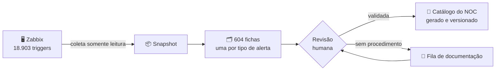

# 📊 Zabbix-Wiki — Status do Projeto

> **O que é esta página.** Acompanhamento do projeto de base de conhecimento
> dos alertas: em que etapa está, o que já dá para usar hoje e o que falta.
> Não é o catálogo em si — o catálogo é a página **Catálogo de Alertas — NOC**.
> **Atualizado em:** 06/09/2026 · **Base:** coleta de 05/09/2026, Zabbix 7.2.1
{.is-info}

## Por que este projeto existe

O Zabbix tem hoje **18.903 triggers** distribuídos em 78 hosts. O que cada
alerta significa, quem precisa ser acionado e em quanto tempo está espalhado
entre a cabeça de quem está de plantão, conversas de Teams e páginas de wiki
escritas em momentos diferentes.

Isso cobra o preço de três jeitos:

- quem entra no plantão demora para saber o que fazer com um alerta que nunca viu;
- o mesmo alerta vai para filas diferentes dependendo de quem atende;
- quando alguém sai do time, o procedimento sai junto.

O projeto liga **cada alerta do Zabbix a uma ficha** que diz o que ele significa,
o que verificar antes de agir, quem acionar, por qual canal e em quanto tempo.
A página do catálogo é **gerada** a partir dessas fichas — ninguém digita o
mesmo procedimento duas vezes, e a página não envelhece sozinha em relação ao
Zabbix.



> **A coleta nunca escreve no Zabbix.** O sistema só lê. Isso é garantido por
> código, não por disciplina: a lista de operações permitidas é fechada, e
> qualquer chamada fora dela é recusada.
{.is-info}

## Onde estamos

**Etapa atual: documentar o acervo.** A ferramenta está pronta e em uso desde
04/09. O que falta agora é conteúdo — escrever a ficha dos alertas que ainda
não têm procedimento.

| Indicador | Hoje |
| :--- | ---: |
| Regras operacionais documentadas | **59 de 85 — 69%** |
| Fichas validadas pelo time | **119** |
| Fichas em rascunho | 11 |
| Fichas ainda sem procedimento | 450 |
| Fichas marcadas como não aplicáveis (alerta de teste) | 24 |
| Procedimentos prontos para publicar | **103** |
| Alertas no escopo do NOC | 2.641 de 18.903 |

> **Por que existem dois percentuais.** Por **regra operacional** estamos em
> 69%; por **ficha**, em 20% (119 de 580). Os dois números estão certos e medem
> coisas diferentes. Uma regra agrupa alertas que se resolvem do mesmo jeito —
> os 277 alertas de "chamado aguardando cliente" do DeskManager, por exemplo,
> são **um** procedimento, mas 277 fichas. O percentual por regra mede
> *cobertura operacional*: quanto do que chega ao plantão já tem resposta
> escrita. O percentual por ficha mede *acervo*: quanto do catálogo inteiro foi
> revisado. **Para decidir prioridade, o número que importa é o de regras.**
{.is-info}

## O que já dá para usar hoje

O catálogo já está gerado e pronto para publicar: **103 procedimentos**,
organizados por cliente, cada um com descrição, causa provável, ação imediata,
quem acionar, canal e SLA.

| Cliente | Procedimentos | Alertas | Hosts |
| :--- | ---: | ---: | ---: |
| **Vibe Tecnologia** | 77 | 77 | 20 |
| **Chubb** | 14 | 24 | 3 |
| **Master Support** (interno) | 6 | 6 | 1 |
| **Votorantim** | 6 | 6 | 2 |

Além do catálogo, já funciona:

- **Interface web** para consultar e escrever ficha, rodando na máquina do
  operador, sem depender de servidor.
- **Matriz de acionamento por cliente** — o mesmo alerta técnico tem contato,
  fila e SLA diferentes conforme o dono do host, e o sistema trata isso.
- **O conhecimento que já existia foi importado**: catálogo do NOC, manual da
  Chubb, manual da Votorantim e a wiki de rede (acionamento de Embratel,
  Vellon/Interconnect e Oi).
- **Detecção de procedimento duplicado** — 27 das 85 regras cobriam os mesmos
  alertas de outra; sem isso, o mesmo procedimento seria escrito duas vezes.

## Etapas do projeto

| # | Etapa | Situação |
| :---: | :--- | :--- |
| 1 | Coleta somente leitura do Zabbix | ✅ Concluída |
| 2 | Modelo de ficha em 3 camadas (fato / sugestão / procedimento validado) | ✅ Concluída |
| 3 | Interface web de consulta e edição | ✅ Concluída |
| 4 | Agrupamento em regras operacionais (521 famílias → 85 regras) | ✅ Concluída |
| 5 | Escopo: separar o que é do NOC do que não é | ✅ Concluída |
| 6 | Importar o conhecimento já documentado | ✅ Concluída |
| 7 | Gerador do catálogo para o Wiki.js | ✅ Concluída |
| 8 | **Documentar o acervo restante** | 🔄 **Em andamento — etapa atual** |
| 9 | Publicar como fonte oficial e definir a rotina de atualização | ⬜ Depende da etapa 8 |

## O que falta

### 1. Decisões que dependem do time

Estes itens não são trabalho de código: são informação que só quem opera tem.
Enquanto não vierem, a ficha correspondente fica parada — ou fica com um valor
que eu deduzi.

| O que precisa ser decidido | Por que trava |
| :--- | :--- |
| **Roteamento do SAQ** | 4 fichas paradas em rascunho. Não existe nenhuma ficha validada desse cliente, então não há padrão de onde deduzir. |
| **Conferir 68 fichas com roteamento deduzido** | Foram aprovadas extrapolando o padrão dos manuais (44 da Vibe vão para Infraestrutura). Estão marcadas e são rastreáveis, mas ninguém confirmou uma a uma. |
| **Dono de 4 hosts sem prefixo de cliente** | `SRVCYBERARQ`, `SRV_INCONTROL_2026`, `Windows bob` e `test temp`. Somam-se a 59 fichas sem cliente identificado. |
| **Campos "A confirmar" da matriz de acionamento** | Falta telefone de sobreaviso; há contradição no manual da Chubb sobre quem reexecuta job do Control-M; e o deadline das 08:00 precisa ser confirmado. |
| **Tolerâncias** | Quanta perda de pacote em link é aceitável antes de abrir chamado, e o que conta como "pico curto" de CPU ou memória. |
| **Rotina de atualização** | Com que frequência rodar a coleta, e quem revisa ficha marcada como "precisa de revisão". |

### 2. Documentação — o grosso do trabalho

**353 fichas** sem procedimento nos clientes que atendemos:

| Cliente | Fichas sem procedimento |
| :--- | ---: |
| Vibe Tecnologia | 283 |
| Chubb | 41 |
| SAQ (pagamentos) | 22 |
| Master Support (interno) | 4 |
| Strada | 2 |
| A classificar (sem cliente definido) | 59 |

Fora dessa conta: **38 fichas** de Carguero, Hocta e Banpará — outro NOC atende,
e elas não entram no nosso catálogo. E 1 ficha da Votorantim que cobre 8.131
alertas da malha de Control-M do próprio cliente: são alertas que a Votorantim
resolve, e documentar do nosso lado só geraria ruído.

> **Este é o item que mais consome tempo, e é o que estou atacando agora.**
> Parte pode ser acelerada com IA escrevendo o rascunho técnico a partir do dado
> do Zabbix — o time revisa e aprova, em vez de escrever do zero. O briefing
> dessa automação já está escrito e testado. **Rascunho de IA nunca entra no
> catálogo:** só entra o que uma pessoa validou, porque numa página de plantão
> texto que parece procedimento é lido como procedimento.
{.is-info}

### 3. Ajustes técnicos

Pequenos, sem impacto na operação: corrigir 4 classificações erradas da
taxonomia, criar categoria de impressora, permitir editar pela interface as 12
fichas que não vêm do Zabbix, e tratar a chave dos jobs do Control-M, que muda
todo dia.

## ⚠️ Risco aberto encontrado durante o trabalho

> **Credenciais em texto claro dentro do Zabbix.** A chave AWS (host
> `Saq - AWS`, 57 triggers) e o `clientsecret`/`hmacsecret` do PIX (host
> `Saq - Pix`, 5 triggers) estão escritos na própria expressão do trigger.
> Qualquer conta com permissão de leitura na API do Zabbix consegue vê-las.
>
> **O que já foi feito:** as cópias locais do projeto foram redigidas e o caso
> está documentado. **O que falta, e não depende de mim:** rotacionar as
> credenciais na AWS e no PIX e substituí-las por macro secreta no Zabbix.
> Redigir a cópia local não desfaz a exposição na origem.
>
> Vale também levantar quem teve permissão de leitura na API nesse período.
{.is-warning}

## Como conferir

Os números desta página não são estimativa — saem de comando, em cima do
repositório:

```bash
python main.py status    # cobertura das fichas
python main.py scope     # o que o NOC vê e o que fica de fora
python main.py wiki      # regenera o catálogo, dizendo o que ficou de fora
```

Estado do código: 34 entregas registradas, 432 testes automatizados passando,
uma única dependência externa.

> **Esta página é escrita à mão** e reflete o estado em 06/09/2026. O
> **catálogo de alertas**, esse sim, é gerado: não edite a página do catálogo
> direto no Wiki.js — edite a ficha e gere de novo, senão ela passa a divergir
> do que o time aprovou.
{.is-warning}
